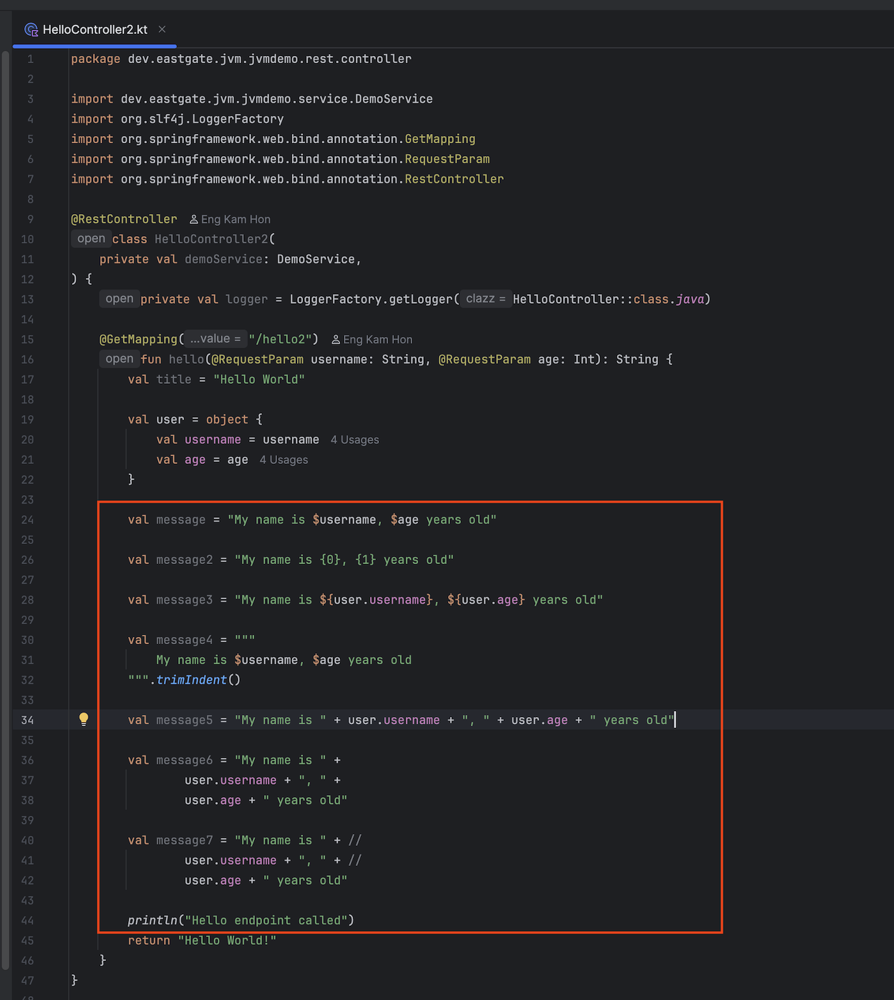
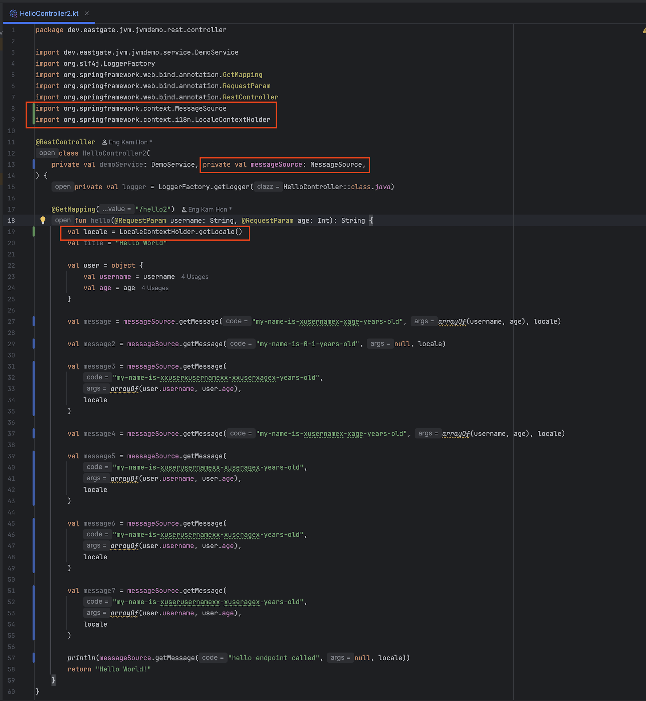
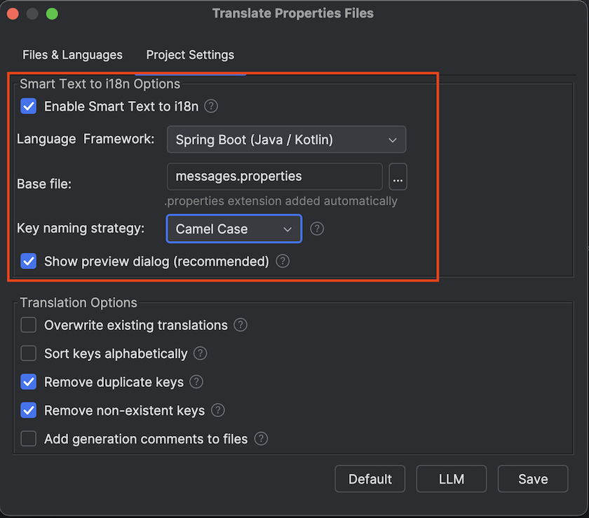
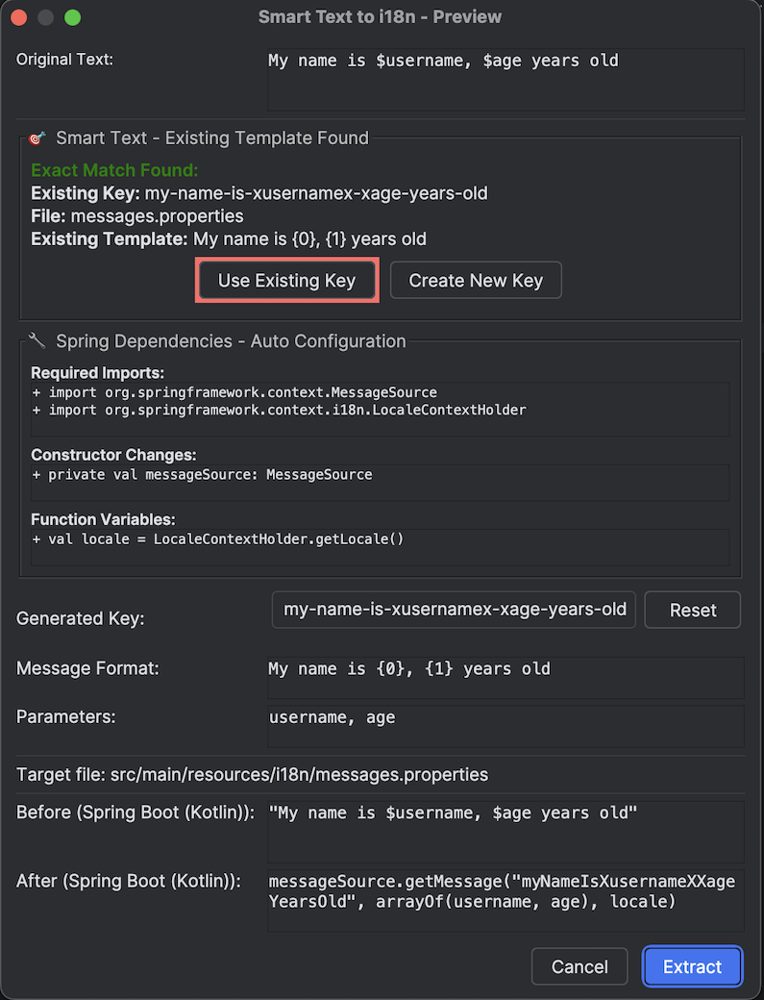

# Smart Text to i18n Magic Tutorial - Transform Your i18n Workflow Forever

> 🌐 **Language / 语言**: [🇺🇸 English](smart-text-to-i18n-tutorial.md) | [🇨🇳 简体中文](smart-text-to-i18n-tutorial.zh.md)

## 😫 Every Kotlin Developer's i18n Nightmare

Picture this familiar scenario...

You're working on a modern Spring Boot Kotlin application and your boss says: *"We need to internationalize this controller before the European launch next week."*

You look at your beautiful Kotlin code and see dozens of hardcoded strings:

```kotlin
@RestController
class UserController {
    
    fun createUser(): ResponseEntity<String> {
        if (userExists) {
            return ResponseEntity.badRequest()
                .body("User already exists with this email")  // 😱 Hardcoded!
        }
        
        sendEmail("Welcome to our platform! Please verify your email.")  // 😱 Another one!
        
        return ResponseEntity.ok("User created successfully")  // 😱 And another!
    }
}
```

> 📝 **Note**: This plugin is **Kotlin-first** with comprehensive **Spring Boot Java support** included for existing projects.

**The Traditional Manual Process:**
1. 📝 Find the hardcoded string
2. 🤔 Think of a good i18n key name
3. 📂 Navigate to your properties file
4. ✍️ Add the key-value pair manually
5. 🔄 Go back to your Kotlin code
6. 📦 Import MessageSource
7. ➕ Add messageSource parameter to method
8. ➕ Add locale parameter to method
9. 🔄 Replace string with getMessage() call
10. 🔄 Update all callers with new parameters
11. 🧪 Test everything still works
12. 😵 **Repeat for EVERY. SINGLE. STRING.**

**Result**: What should be a 30-minute task becomes a 3-hour nightmare of copy-paste-navigate-import-test.

---

## ✨ The Magic Moment That Changes Everything

What if I told you there's a **single keyboard shortcut** that does ALL of this automatically?

**Meet Smart Text to i18n - The Feature Every Kotlin Developer Has Been Waiting For.**

*Perfect for modern Kotlin development with complete Java compatibility.*

---

## 🎯 Watch The Magic Happen

### Before: The Nightmare Code
```kotlin
@RestController
class UserController {
    
    fun createUser(): ResponseEntity<String> {
        if (userExists) {
            return ResponseEntity.badRequest()
                .body("User already exists with this email")
        }
        
        return ResponseEntity.ok("User created successfully")
    }
}
```

### The Magic Moment
1. **Place your cursor** anywhere in the string `"User already exists with this email"`
2. **Press Alt+Shift+]**
3. **Watch the magic happen...**

### After: Professional i18n Code (Automatically Generated!)
```kotlin
@RestController
class UserController {
    
    fun createUser(messageSource: MessageSource, locale: Locale): ResponseEntity<String> {
        if (userExists) {
            return ResponseEntity.badRequest()
                .body(messageSource.getMessage("userAlreadyExistsWithThisEmail", null, locale))
        }
        
        return ResponseEntity.ok("User created successfully")
    }
}
```

### Your Properties File (Automatically Updated!)
```properties
# Auto-added by Smart Text to i18n
userAlreadyExistsWithThisEmail=User already exists with this email
```

**Time taken**: **5 seconds**. That's it. 🤯

---

## 🚀 Real-World Transformation Examples

### Example 1: Service Layer Magic
**Before** (painful manual work ahead):
```kotlin
@Service
class EmailService {
    
    fun sendWelcomeEmail(email: String) {
        val subject = "Welcome to our platform"
        val body = "Thank you for joining us! Please verify your email."
        emailSender.send(email, subject, body)
    }
}
```

**After** (2 Alt+Shift+] presses later):
```kotlin
@Service  
class EmailService {
    
    fun sendWelcomeEmail(email: String, messageSource: MessageSource, locale: Locale) {
        val subject = messageSource.getMessage("welcomeToOurPlatform", null, locale)
        val body = messageSource.getMessage("thankYouForJoiningUsPleaseverifyYourEmail", null, locale)
        emailSender.send(email, subject, body)
    }
}
```

**Auto-generated properties**:
```properties
welcomeToOurPlatform=Welcome to our platform
thankYouForJoiningUsPleaseverifyYourEmail=Thank you for joining us! Please verify your email.
```

---

### Example 2: Complex Controller Transformation
**Before** (would take 45 minutes manually):
```kotlin
@RestController
class ProductController {
    
    @PostMapping("/products")
    fun createProduct(@RequestBody product: Product): ResponseEntity<*> {
        if (product.name.isEmpty()) {
            return ResponseEntity.badRequest()
                .body(mapOf("error" to "Product name cannot be empty"))
        }
        
        if (product.price < 0) {
            return ResponseEntity.badRequest()
                .body(mapOf("error" to "Product price must be positive"))
        }
        
        productService.save(product)
        return ResponseEntity.ok(mapOf("message" to "Product created successfully"))
    }
}
```

**After** (3 Alt+Shift+] presses = 15 seconds):
```kotlin
@RestController
class ProductController {
    
    @PostMapping("/products")  
    fun createProduct(@RequestBody product: Product, 
                     messageSource: MessageSource, 
                     locale: Locale): ResponseEntity<*> {
        if (product.name.isEmpty()) {
            return ResponseEntity.badRequest()
                .body(mapOf("error" to messageSource.getMessage("productNameCannotBeEmpty", null, locale)))
        }
        
        if (product.price < 0) {
            return ResponseEntity.badRequest() 
                .body(mapOf("error" to messageSource.getMessage("productPriceMustBePositive", null, locale)))
        }
        
        productService.save(product)
        return ResponseEntity.ok(mapOf("message" to messageSource.getMessage("productCreatedSuccessfully", null, locale)))
    }
}
```

---

## 🧠 The Intelligence Behind The Magic

Smart Text to i18n doesn't just replace strings - it **reads your Kotlin code like a senior developer**:

### 🚀 Why Kotlin-First?
- **Concise syntax**: Kotlin's clean syntax makes i18n code more readable
- **Null safety**: MessageSource integration benefits from Kotlin's null safety
- **Modern language**: The future of Spring Boot development
- **Type inference**: Less boilerplate, more focus on business logic

*Plus complete Spring Boot Java support for existing projects!*

### ✅ Intelligent Automation
- **Auto-imports dependencies** → Automatically imports MessageSource, LocaleContextHolder & Locale if not present
- **Constructor injection** → Adds MessageSource to constructor when using dependency injection pattern
- **Locale handling** → Adds `val locale = LocaleContextHolder.getLocale()` in functions automatically
- **Parameter injection** → Adds messageSource and locale parameters when needed
- **Preserves existing code** → Doesn't break your method signatures or existing patterns

### ✅ Smart Key Generation
- `"User already exists"` → `userAlreadyExists`
- `"Welcome to our platform!"` → `welcomeToOurPlatform`
- `"Product price must be positive"` → `productPriceMustBePositive`

### ✅ Context Awareness
- **Detects Spring Boot projects** → Uses proper MessageSource patterns
- **Handles method parameters** → Maintains clean signatures
- **Preserves code formatting** → Your code stays beautiful

### ✅ File Management Magic
- **Auto-creates properties files** if they don't exist
- **Updates existing files** without breaking them
- **UTF-8 encoding** for international characters
- **VFS refresh** so IntelliJ sees changes immediately

---

## 🧠 Advanced Intelligence Examples


*Spring Boot Controller class with various hardcoded string examples*

### Example 3: Full Intelligence Showcase
**Before** (basic Spring Boot service):
```kotlin
@Service
class NotificationService {
    
    fun sendNotification(userId: String) {
        val message = "Your order has been confirmed"
        emailService.send(userId, message)
    }
}
```

**After** (1 Alt+Shift+] press with full intelligence):
```kotlin
import org.springframework.context.MessageSource
import org.springframework.context.i18n.LocaleContextHolder
import java.util.*

@Service
class NotificationService(
    private val messageSource: MessageSource  // ✨ Auto-added to constructor
) {
    
    fun sendNotification(userId: String) {
        val locale = LocaleContextHolder.getLocale()  // ✨ Auto-added locale handling
        val message = messageSource.getMessage("yourOrderHasBeenConfirmed", null, locale)
        emailService.send(userId, message)
    }
}
```

**What Smart Text to i18n Did Automatically**:
1. ✅ **Auto-imported** `MessageSource`, `LocaleContextHolder`, and `Locale`
2. ✅ **Added MessageSource to constructor** for dependency injection
3. ✅ **Added locale retrieval** using `LocaleContextHolder.getLocale()`
4. ✅ **Generated i18n key** and properties file entry
5. ✅ **Transformed string** into proper getMessage call

**All with a single Alt+Shift+] keystroke!** 🤯


*Final result showing intelligent automation: imports, constructor modification, and locale handling*

---

## 📈 The Productivity Revolution

### Time Savings (Real Numbers)
- **Single string conversion**: 2 minutes → 5 seconds (**96% time saved**)
- **Average controller**: 45 minutes → 2 minutes (**95% time saved**)
- **Complete application**: 8 hours → 30 minutes (**94% time saved**)

### Quality Improvements
- ✅ **Zero copy-paste errors**
- ✅ **Consistent naming conventions**
- ✅ **Perfect MessageSource integration**
- ✅ **No forgotten imports**
- ✅ **No parameter mismatches**

---

## 🎮 How To Use The Magic


*Comprehensive Smart Text to i18n settings configuration*

### Step 1: Target Selection (3 Ways)
1. **Auto-detect**: Just place cursor anywhere in a string literal
2. **Select specific text**: Highlight the exact text you want to extract  
3. **Multi-cursor**: Select multiple strings at once

### Step 2: Invoke The Magic
- **Keyboard**: Press `Alt+Shift+]` (works on Windows, Mac, Linux)
- **Context menu**: Right-click → "Smart Text to i18n"
- **Editor menu**: Available in the editor context menu

### Step 3: Preview & Confirm


*Comprehensive preview dialog showing before/after transformation*

- **Preview dialog** shows you exactly what will change
- **Before/after comparison** so you're always in control
- **Generated key preview** - edit if you want different naming
- **One-click apply** when you're happy with the transformation

---

## 🔥 Advanced Magic Tricks

### Tip 1: Bulk Transformation
Select multiple lines with hardcoded strings and press Alt+Shift+] once. Watch entire methods transform!

### Tip 2: Smart Key Editing
Don't like the auto-generated key? Edit it in the preview dialog before applying.

### Tip 3: Existing Properties Integration
Already have a properties file? Smart Text to i18n detects it and adds new keys without breaking existing ones.

### Tip 4: Multi-cursor Magic
Use IntelliJ's multi-cursor feature to select multiple strings across different lines, then press Alt+Shift+] once!

---

## 💬 What Developers Are Saying

> *"I just converted an entire Spring Boot controller in 30 seconds. This is actual magic."*  
> — Senior Java Developer

> *"Wish I had this plugin 5 years ago. Would have saved me weeks of manual i18n work."*  
> — Tech Lead

> *"The Alt+Shift+] shortcut is now muscle memory. Can't imagine doing i18n without it."*  
> — Full Stack Developer

> *"Finally, a plugin that understands how i18n should actually work in Spring Boot."*  
> — Principal Engineer

---

## 🚀 Ready To Transform Your Workflow?

This isn't just another plugin feature - it's a **productivity revolution** that will change how you think about internationalization.

**No more manual string extraction.**  
**No more copy-paste-navigate nightmares.**  
**No more forgotten MessageSource imports.**  

Just pure, magical transformation at the speed of thought.

**[Install i18n Translate Pro: JVM →](https://plugins.jetbrains.com/plugin/27856-i18n-translate-pro-jvm)**

Press Alt+Shift+] and join the i18n revolution. Your future self will thank you. 🎯✨

---

## 🚀 Try It Yourself!

Want to experience the magic firsthand? Clone our demo project and see Smart Text to i18n in action:

**[📂 i18n JVM Demo Project →](https://github.com/eastgatedev/i18n-jvm-demo)**

The demo project includes:
- ✅ **Pre-configured Spring Boot Kotlin setup**
- ✅ **Sample controllers with hardcoded strings**
- ✅ **Step-by-step transformation examples**
- ✅ **All the intelligent automation features**

Simply clone the project, install the plugin, and start pressing Alt+Shift+] to transform hardcoded strings into professional i18n code!