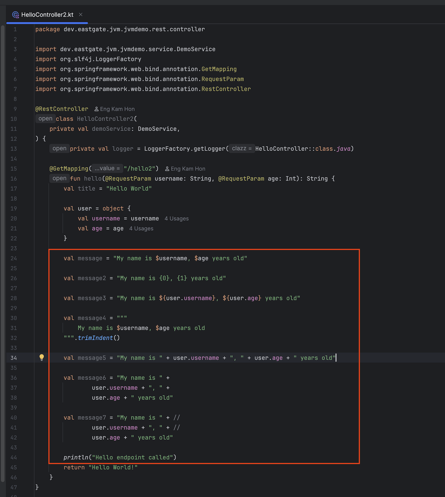
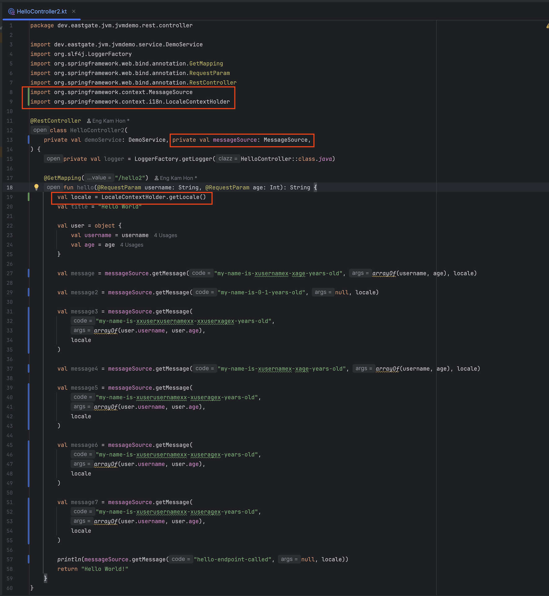
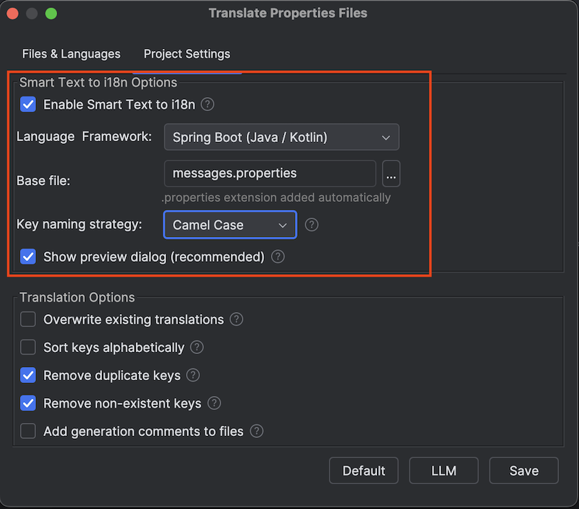
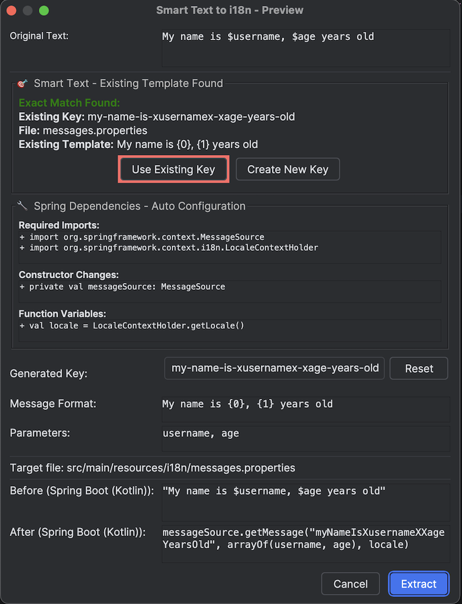

# 智能文本转 i18n 魔法教程 - 永远改变您的 i18n 工作流程

> 🌐 **Language / 语言**: [🇺🇸 English](smart-text-to-i18n-tutorial.md) | [🇨🇳 简体中文](smart-text-to-i18n-tutorial.zh.md)

## 😫 每个 Kotlin 开发者的 i18n 噩梦

想象一下这个熟悉的场景...

您正在开发一个现代的 Spring Boot Kotlin 应用程序，您的老板说：*"我们需要在下周欧洲发布之前对这个控制器进行国际化。"*

您查看您优美的 Kotlin 代码，发现几十个硬编码字符串：

```kotlin
@RestController
class UserController {
    
    fun createUser(): ResponseEntity<String> {
        if (userExists) {
            return ResponseEntity.badRequest()
                .body("User already exists with this email")  // 😱 硬编码！
        }
        
        sendEmail("Welcome to our platform! Please verify your email.")  // 😱 又一个！
        
        return ResponseEntity.ok("User created successfully")  // 😱 还有一个！
    }
}
```

> 📝 **注意**: 此插件**以 Kotlin 为优先**，为现有项目提供全面的 **Spring Boot Java 支持**。

**传统的手动过程：**
1. 📝 找到硬编码字符串
2. 🤔 想一个好的 i18n 键名
3. 📂 导航到您的属性文件
4. ✍️ 手动添加键值对
5. 🔄 返回到您的 Kotlin 代码
6. 📦 导入 MessageSource
7. ➕ 向方法添加 messageSource 参数
8. ➕ 向方法添加 locale 参数
9. 🔄 用 getMessage() 调用替换字符串
10. 🔄 使用新参数更新所有调用者
11. 🧪 测试一切仍然有效
12. 😵 **对每个字符串重复此过程**

**结果**: 本应 30 分钟的任务变成了 3 小时的复制-粘贴-导航-导入-测试噩梦。

---

## ✨ 改变一切的魔法时刻

如果我告诉您有一个**单一键盘快捷键**可以自动完成所有这些，您会怎么想？

**遇见智能文本转 i18n - 每个 Kotlin 开发者都在等待的功能。**

*完美适用于现代 Kotlin 开发，完全兼容 Java。*

---

## 🎯 观看魔法发生

### 之前：噩梦代码
```kotlin
@RestController
class UserController {
    
    fun createUser(): ResponseEntity<String> {
        if (userExists) {
            return ResponseEntity.badRequest()
                .body("User already exists with this email")
        }
        
        return ResponseEntity.ok("User created successfully")
    }
}
```

### 魔法时刻
1. **将光标放置**在字符串 `"User already exists with this email"` 的任何位置
2. **按 Alt+Shift+]**
3. **观看魔法发生...**

### 之后：专业的 i18n 代码（自动生成！）
```kotlin
@RestController
class UserController {
    
    fun createUser(messageSource: MessageSource, locale: Locale): ResponseEntity<String> {
        if (userExists) {
            return ResponseEntity.badRequest()
                .body(messageSource.getMessage("userAlreadyExistsWithThisEmail", null, locale))
        }
        
        return ResponseEntity.ok("User created successfully")
    }
}
```

### 您的属性文件（自动更新！）
```properties
# 由智能文本转 i18n 自动添加
userAlreadyExistsWithThisEmail=User already exists with this email
```

**耗时**: **5 秒**。就是这样。🤯

---

## 🚀 真实世界转换示例

### 示例 1：服务层魔法
**之前**（面临痛苦的手动工作）：
```java
@Service
public class EmailService {
    
    public void sendWelcomeEmail(String email) {
        String subject = "Welcome to our platform";
        String body = "Thank you for joining us! Please verify your email.";
        emailSender.send(email, subject, body);
    }
}
```

**之后**（2 次 Alt+Shift+] 按键后）：
```java
@Service  
public class EmailService {
    
    public void sendWelcomeEmail(String email, MessageSource messageSource, Locale locale) {
        String subject = messageSource.getMessage("welcomeToOurPlatform", null, locale);
        String body = messageSource.getMessage("thankYouForJoiningUsPleaseverifyYourEmail", null, locale);
        emailSender.send(email, subject, body);
    }
}
```

**自动生成的属性**：
```properties
welcomeToOurPlatform=Welcome to our platform
thankYouForJoiningUsPleaseverifyYourEmail=Thank you for joining us! Please verify your email.
```

---

### 示例 2：复杂控制器转换
**之前**（手动需要 45 分钟）：
```java
@RestController
public class ProductController {
    
    @PostMapping("/products")
    public ResponseEntity<?> createProduct(@RequestBody Product product) {
        if (product.getName().isEmpty()) {
            return ResponseEntity.badRequest()
                .body(Map.of("error", "Product name cannot be empty"));
        }
        
        if (product.getPrice() < 0) {
            return ResponseEntity.badRequest()
                .body(Map.of("error", "Product price must be positive"));
        }
        
        productService.save(product);
        return ResponseEntity.ok(Map.of("message", "Product created successfully"));
    }
}
```

**之后**（3 次 Alt+Shift+] 按键 = 15 秒）：
```java
@RestController
public class ProductController {
    
    @PostMapping("/products")  
    public ResponseEntity<?> createProduct(@RequestBody Product product, 
                                         MessageSource messageSource, 
                                         Locale locale) {
        if (product.getName().isEmpty()) {
            return ResponseEntity.badRequest()
                .body(Map.of("error", messageSource.getMessage("productNameCannotBeEmpty", null, locale)));
        }
        
        if (product.getPrice() < 0) {
            return ResponseEntity.badRequest() 
                .body(Map.of("error", messageSource.getMessage("productPriceMustBePositive", null, locale)));
        }
        
        productService.save(product);
        return ResponseEntity.ok(Map.of("message", messageSource.getMessage("productCreatedSuccessfully", null, locale)));
    }
}
```

---

## 🧠 魔法背后的智能

智能文本转 i18n 不仅仅是替换字符串 - 它**像高级开发者一样阅读您的代码**：

### ✅ 智能自动化
- **自动导入依赖** → 如果不存在，自动导入 MessageSource、LocaleContextHolder 和 Locale
- **构造函数注入** → 使用依赖注入模式时将 MessageSource 添加到构造函数
- **Locale 处理** → 在函数中自动添加 `val locale = LocaleContextHolder.getLocale()`
- **参数注入** → 需要时添加 messageSource 和 locale 参数
- **保留现有代码** → 不破坏您的方法签名或现有模式

### ✅ 智能键生成
- `"User already exists"` → `userAlreadyExists`
- `"Welcome to our platform!"` → `welcomeToOurPlatform`
- `"Product price must be positive"` → `productPriceMustBePositive`

### ✅ 上下文感知
- **检测 Spring Boot 项目** → 使用正确的 MessageSource 模式
- **处理方法参数** → 保持清洁的签名
- **保留代码格式** → 您的代码保持美观

### ✅ 文件管理魔法
- **自动创建属性文件**（如果不存在）
- **更新现有文件**而不破坏它们
- **UTF-8 编码**支持国际字符
- **VFS 刷新**使 IntelliJ 立即看到更改

---

## 🧠 高级智能示例


*带有各种硬编码字符串示例的 Spring Boot 控制器类*

### 示例 3：完整智能展示
**之前**（基本的 Spring Boot 服务）：
```kotlin
@Service
class NotificationService {
    
    fun sendNotification(userId: String) {
        val message = "Your order has been confirmed"
        emailService.send(userId, message)
    }
}
```

**之后**（1 次 Alt+Shift+] 按键，完整智能）：
```kotlin
import org.springframework.context.MessageSource
import org.springframework.context.i18n.LocaleContextHolder
import java.util.*

@Service
class NotificationService(
    private val messageSource: MessageSource  // ✨ 自动添加到构造函数
) {
    
    fun sendNotification(userId: String) {
        val locale = LocaleContextHolder.getLocale()  // ✨ 自动添加 locale 处理
        val message = messageSource.getMessage("yourOrderHasBeenConfirmed", null, locale)
        emailService.send(userId, message)
    }
}
```

**智能文本转 i18n 自动完成的工作**：
1. ✅ **自动导入** `MessageSource`、`LocaleContextHolder` 和 `Locale`
2. ✅ **将 MessageSource 添加到构造函数**用于依赖注入
3. ✅ **添加 locale 获取**使用 `LocaleContextHolder.getLocale()`
4. ✅ **生成 i18n 键**和属性文件条目
5. ✅ **转换字符串**为正确的 getMessage 调用

**所有这些只需一次 Alt+Shift+] 按键！** 🤯


*显示智能自动化的最终结果：导入、构造函数修改和 locale 处理*

---

## 📈 生产力革命

### 时间节省（真实数字）
- **单个字符串转换**: 2 分钟 → 5 秒（**节省 96% 时间**）
- **平均控制器**: 45 分钟 → 2 分钟（**节省 95% 时间**）
- **完整应用程序**: 8 小时 → 30 分钟（**节省 94% 时间**）

### 质量改进
- ✅ **零复制粘贴错误**
- ✅ **一致的命名约定**
- ✅ **完美的 MessageSource 集成**
- ✅ **不会忘记导入**
- ✅ **无参数不匹配**

---

## 🎮 如何使用魔法


*智能文本转 i18n 综合设置配置*

### 步骤 1：目标选择（3 种方式）
1. **自动检测**: 只需将光标放在字符串字面量的任何位置
2. **选择特定文本**: 突出显示您要提取的确切文本
3. **多光标**: 一次选择多个字符串

### 步骤 2：调用魔法
- **键盘**: 按 `Alt+Shift+]`（适用于 Windows、Mac、Linux）
- **上下文菜单**: 右键单击 → "智能文本转 i18n"
- **编辑器菜单**: 在编辑器上下文菜单中可用

### 步骤 3：预览和确认


*显示转换前后的综合预览对话框*

- **预览对话框**向您确切显示将更改的内容
- **前后比较**让您始终保持控制
- **生成的键预览** - 如果您想要不同的命名可以编辑
- **一键应用**当您对转换满意时

---

## 🔥 高级魔法技巧

### 技巧 1：批量转换
选择包含硬编码字符串的多行并按一次 Alt+Shift+]。观看整个方法转换！

### 技巧 2：智能键编辑
不喜欢自动生成的键？在应用之前在预览对话框中编辑它。

### 技巧 3：现有属性集成
已经有属性文件？智能文本转 i18n 会检测到它并添加新键而不破坏现有的键。

### 技巧 4：多光标魔法
使用 IntelliJ 的多光标功能选择不同行的多个字符串，然后按一次 Alt+Shift+]！

---

## 💬 开发者怎么说

> *"我刚刚在 30 秒内转换了整个 Spring Boot 控制器。这真是魔法。"*  
> — 高级 Java 开发者

> *"希望我 5 年前就有这个插件。会为我节省数周的手动 i18n 工作。"*  
> — 技术负责人

> *"Alt+Shift+] 快捷键现在是肌肉记忆。无法想象没有它做 i18n。"*  
> — 全栈开发者

> *"终于，一个真正理解 i18n 在 Spring Boot 中应该如何工作的插件。"*  
> — 首席工程师

---

## 🚀 准备好改变您的工作流程吗？

这不仅仅是另一个插件功能 - 它是一个**生产力革命**，将改变您对国际化的思考方式。

**不再需要手动字符串提取。**  
**不再需要复制-粘贴-导航噩梦。**  
**不再需要忘记 MessageSource 导入。**  

只有纯粹的、思维速度的魔法转换。

**[安装 i18n 翻译专业版：JVM →](https://plugins.jetbrains.com/plugin/27856-i18n-translate-pro-jvm)**

按 Alt+Shift+] 加入 i18n 革命。您未来的自己会感谢您的。🎯✨

---

## 🚀 亲自尝试！

想要亲身体验魔法？克隆我们的演示项目，看看智能文本转 i18n 的实际效果：

**[📂 i18n JVM 演示项目 →](https://github.com/eastgatedev/i18n-jvm-demo)**

演示项目包括：
- ✅ **预配置的 Spring Boot Kotlin 设置**
- ✅ **带有硬编码字符串的示例控制器**
- ✅ **逐步转换示例**
- ✅ **所有智能自动化功能**

只需克隆项目，安装插件，开始按 Alt+Shift+] 将硬编码字符串转换为专业的 i18n 代码！