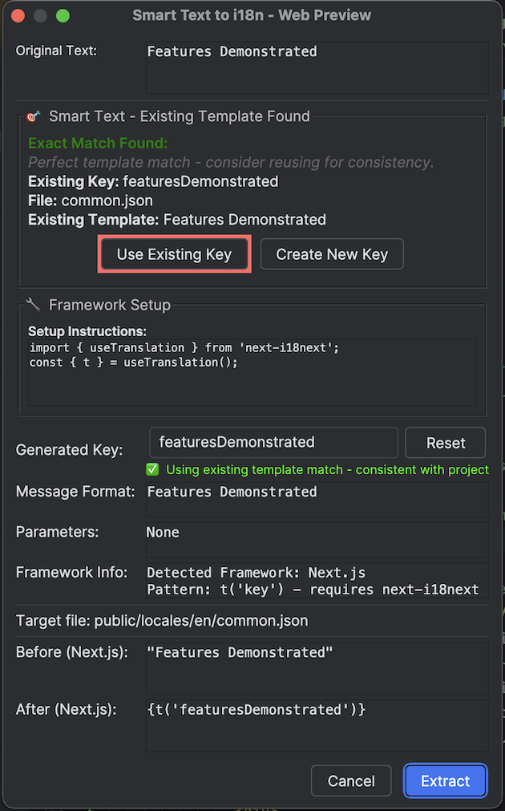
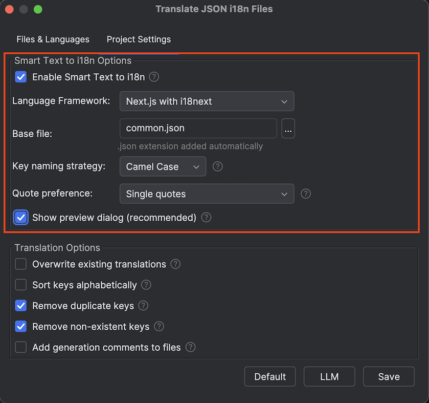

# Smart Text to i18n Magic Tutorial - Transform Your Frontend i18n Workflow Forever

> 🌐 **Language / 语言**: [🇺🇸 English](smart-text-to-i18n-tutorial.md) | [🇨🇳 简体中文](smart-text-to-i18n-tutorial.zh.md)

## 😫 Every Frontend Developer's i18n Nightmare

Picture this familiar scenario...

You're working on a modern React/Vue/Angular application and your product manager says: *"We need to internationalize this component before our global launch next week."*

You look at your beautiful TypeScript code and see dozens of hardcoded strings:

```tsx
// React component with hardcoded nightmare
export function FeatureSection() {
    const [itemCount, setItemCount] = useState(0);
    
    return (
        <div className="bg-white rounded-lg p-6">
            <h2 className="text-2xl font-semibold mb-4">
                🔢 Pluralization Demo               {/* 😱 Hardcoded! */}
            </h2>
            <p className="text-lg mb-2">
                Features Demonstrated:             {/* 😱 Another one! */}
            </p>
            <button className="px-3 py-1 bg-green-500 text-white rounded">
                Add Item                           {/* 😱 And another! */}
            </button>
        </div>
    );
}
```

> 📝 **Note**: This plugin supports **React**, **Vue**, **Angular**, and **Next.js** with intelligent framework detection and proper import handling.

**The Traditional Manual Process:**
1. 📝 Find the hardcoded string
2. 🤔 Think of a good i18n key name
3. 📂 Navigate to your JSON translation file
4. ✍️ Add the key-value pair manually
5. 🔄 Go back to your component code
6. 📦 Import useTranslation/i18n hook
7. ➕ Add translation hook to component
8. 🔄 Replace string with t() call
9. 🧪 Test everything still works
10. 🔄 Update all nested JSON structures
11. 😵 **Repeat for EVERY. SINGLE. STRING.**

**Result**: What should be a 30-minute task becomes a 3-hour nightmare of copy-paste-navigate-import-test.

---

## ✨ The Magic Moment That Changes Everything

What if I told you there's a **single keyboard shortcut** that does ALL of this automatically?

**Meet Smart Text to i18n - The Feature Every Frontend Developer Has Been Waiting For.**

*Perfect for modern React, Vue, Angular, and Next.js development with intelligent framework detection.*

---

## 🎯 Watch The Magic Happen

### Before: The Nightmare Code

**React/Next.js Example:**
```tsx
export function HomePage() {
    const [itemCount, setItemCount] = useState(0);
    
    return (
        <div className="container mx-auto px-4 py-8">
            <h1 className="text-4xl font-bold mb-4">
                Features Demonstrated:
            </h1>
            <div className="bg-blue-50 rounded p-4">
                <p className="text-lg mb-2">
                    🔢 Pluralization Demo
                </p>
                <button className="px-3 py-1 bg-green-500 text-white rounded">
                    Add Item
                </button>
            </div>
        </div>
    );
}
```

### The Magic Moment
1. **Place your cursor** anywhere in the string `"Features Demonstrated:"`
2. **Press Alt+Shift+]**
3. **Watch the magic happen...**

### After: Professional i18n Code (Automatically Generated!)

**React/Next.js with useTranslation:**
```tsx
import { useTranslation } from 'next-i18next';

export function HomePage() {
    const { t } = useTranslation('common');
    const [itemCount, setItemCount] = useState(0);
    
    return (
        <div className="container mx-auto px-4 py-8">
            <h1 className="text-4xl font-bold mb-4">
                {t('featuresDemonstrated')}
            </h1>
            <div className="bg-blue-50 rounded p-4">
                <p className="text-lg mb-2">
                    🔢 Pluralization Demo
                </p>
                <button className="px-3 py-1 bg-green-500 text-white rounded">
                    Add Item
                </button>
            </div>
        </div>
    );
}
```

### Your JSON File (Automatically Updated!)
```json
// public/locales/en/common.json
{
    "featuresDemonstrated": "Features Demonstrated:",
    // ... other keys
}
```

---

## 🚀 Framework-Specific Magic Examples

### React with react-i18next

**Before:**
```tsx
function WelcomeMessage() {
    return (
        <div>
            <h1>Welcome to our platform!</h1>
            <p>Please verify your email address.</p>
        </div>
    );
}
```

**After Alt+Shift+] magic:**
```tsx
import { useTranslation } from 'react-i18next';

function WelcomeMessage() {
    const { t } = useTranslation();
    
    return (
        <div>
            <h1>{t('welcomeToOurPlatform')}</h1>
            <p>{t('pleaseVerifyYourEmailAddress')}</p>
        </div>
    );
}
```

### Vue.js with vue-i18n

**Before:**
```vue
<template>
    <div class="greetings">
        <h1>{{ msg }}</h1>
        <h3>
            You've successfully created a project with Vite + Vue 3. What's next?
        </h3>
    </div>
</template>
```

**After Alt+Shift+] magic:**
```vue
<template>
    <div class="greetings">
        <h1>{{ msg }}</h1>
        <h3>
            {{ $t('youveSuccessfullyCreatedAProject') }}
        </h3>
    </div>
</template>
```

**Auto-generated JSON:**
```json
// src/locales/en.json
{
    "youveSuccessfullyCreatedAProject": "You've successfully created a project with Vite + Vue 3. What's next?"
}
```

### Angular with Angular i18n

**Before:**
```html
<div class="content">
    <h1>Pluralization Examples:</h1>
    <button (click)="addItem()">Add New Item</button>
</div>
```

**After Alt+Shift+] magic:**
```html
<div class="content">
    <h1>{{ 'pluralizationExamples' | translate }}</h1>
    <button (click)="addItem()">{{ 'addNewItem' | translate }}</button>
</div>
```

**Auto-generated JSON:**
```json
// src/assets/i18n/en.json
{
    "pluralizationExamples": "Pluralization Examples:",
    "addNewItem": "Add New Item"
}
```

### Next.js with next-intl

**Before:**
```tsx
export default function IntlDemo() {
    return (
        <div>
            <h2>🔧 Next.js + next-intl Demo</h2>
            <p>Architecture:</p>
        </div>
    );
}
```

**After Alt+Shift+] magic:**
```tsx
import { useTranslations } from 'next-intl';

export default function IntlDemo() {
    const t = useTranslations();
    
    return (
        <div>
            <h2>{t('nextjsNextIntlDemo')}</h2>
            <p>{t('architecture')}</p>
        </div>
    );
}
```

---

## 🎬 Step-by-Step Magic Breakdown

### Step 1: Position Your Cursor
Place your cursor **anywhere** within the hardcoded string:
```tsx
<h1>Features Demonstrated:</h1>
     ^cursor here (or anywhere in the string)
```

### Step 2: Invoke the Magic
Press **Alt+Shift+]** and watch the preview dialog appear instantly!

### Step 3: Review the Transformation
The plugin shows you:
- ✅ **Original Code**: Your current hardcoded string
- ✅ **Generated Key**: Intelligent camelCase key generation
- ✅ **New Code**: Framework-specific replacement with proper imports
- ✅ **File Updates**: JSON file structure with new key


*Comprehensive preview dialog showing before/after transformation with all the magic details*

### Step 4: Confirm the Magic
Click **"Apply"** and witness:
- 🎯 **Automatic Import Injection**: `import { useTranslation } from 'react-i18next'`
- 🎯 **Hook Addition**: `const { t } = useTranslation();`
- 🎯 **String Replacement**: `{t('featuresDemonstrated')}`
- 🎯 **JSON File Update**: Proper nested structure preservation

---

## 🧠 Intelligence Behind the Magic

### Framework Detection
The plugin automatically detects your project type:
- **React**: Detects `react` and `react-i18next` in package.json → Uses `useTranslation` hook
- **Next.js**: Detects `next` and `next-i18next` → Uses proper Next.js patterns
- **Vue**: Detects `vue` and `vue-i18n` → Uses `$t()` method
- **Angular**: Detects `@angular/core` → Uses `translate` pipe
- **Nuxt**: Detects `nuxt` → Uses Nuxt i18n composables

### Smart Import Handling
- **Missing Imports**: Automatically adds required import statements
- **Existing Imports**: Detects and reuses existing translation hooks
- **Hook Detection**: Adds translation hook if not present in component

### Intelligent Key Generation
```tsx
"Features Demonstrated:" → "featuresDemonstrated"
"You've successfully created" → "youveSuccessfullyCreated"
"🔢 Pluralization Demo" → "pluralizationDemo"
```

### JSON Structure Preservation
Maintains your existing JSON structure:
```json
{
    "homepage": {
        "title": "Welcome",
        "features": {
            "fast": "Lightning Fast"
        }
    },
    "newKey": "New Value"  // Added without breaking structure
}
```

---

## 🎯 Real-World Productivity Impact

### Time Savings Analysis
- **Manual Method**: 2-3 minutes per string × 50 strings = 2.5 hours
- **Smart Text Magic**: 5 seconds per string × 50 strings = 4 minutes
- **Time Saved**: ~2.4 hours per component (95% faster!)

### Error Reduction
- **❌ Manual Typos**: Key mismatches, import errors, syntax mistakes
- **✅ Magic Precision**: Perfect key generation, automatic imports, syntax validation

### Consistency Guarantee
- **❌ Manual Variation**: Different key naming styles across team
- **✅ Magic Standards**: Consistent camelCase, predictable patterns

---

## 🛠️ Framework-Specific Setup Requirements

### React/Next.js Projects
**Required Dependencies:**
```bash
npm install react-i18next i18next
# or for Next.js
npm install next-i18next
```

**File Structure:**
```
src/
  components/
    MyComponent.tsx     ← Your component files
public/
  locales/
    en/
      common.json       ← Translation files
    es/
      common.json
```

### Vue.js Projects
**Required Dependencies:**
```bash
npm install vue-i18n@9
```

**File Structure:**
```
src/
  components/
    HelloWorld.vue      ← Your component files
  locales/
    en.json            ← Translation files
    es.json
```

### Angular Projects
**Required Dependencies:**
```bash
ng add @angular/localize
npm install @ngx-translate/core @ngx-translate/http-loader
```

**File Structure:**
```
src/
  app/
    app.component.html  ← Your template files
  assets/
    i18n/
      en.json          ← Translation files
      es.json
```

### Plugin Configuration

**Configure Smart Text to i18n Settings:**
```bash
Right click JSON file → Project Settings → Smart Text to i18n
```


*Comprehensive Smart Text to i18n settings panel with framework-specific options*

Configure options like:
- **Key Generation Style**: camelCase, kebab-case, or snake_case
- **Framework Detection**: Override automatic detection
- **Import Style**: Choose preferred import patterns
- **File Handling**: JSON structure and formatting preferences

---

## 💡 Pro Tips for Maximum Magic

### 1. Select Text for Precision
Instead of just cursor placement, **select the exact text** you want to extract:
```tsx
<h1>Select this entire string for conversion</h1>
    ├─────────────────────────────────────┤  ← Selection
```

### 2. Batch Magic with Multiple Selections
Hold **Ctrl** (Cmd on Mac) and select multiple strings, then **Alt+Shift+]** once!

### 3. Smart Key Naming
The plugin generates intelligent keys, but you can customize them in the preview dialog:
- **Auto**: `youveSuccessfullyCreated`
- **Custom**: `welcome.projectCreated`

### 4. Preview Before Apply
Always review the preview dialog to ensure:
- ✅ Correct framework detection
- ✅ Proper import handling
- ✅ Expected key generation
- ✅ JSON file location

---

## 🔥 Advanced Magic Scenarios

### Nested Component Props
**Before:**
```tsx
<Button 
    variant="primary"
    onClick={() => alert("Operation completed successfully!")}
>
    Save Changes
</Button>
```

**After Magic:**
```tsx
<Button 
    variant="primary"
    onClick={() => alert(t('operationCompletedSuccessfully'))}
>
    {t('saveChanges')}
</Button>
```

### JSX Attributes
**Before:**
```tsx
<input 
    type="text" 
    placeholder="Enter your email address"
    aria-label="Email input field"
/>
```

**After Magic:**
```tsx
<input 
    type="text" 
    placeholder={t('enterYourEmailAddress')}
    aria-label={t('emailInputField')}
/>
```

### Template Literals
**Before:**
```tsx
const message = `Welcome ${userName}, you have ${count} new messages.`;
```

**After Magic (with variable support):**
```tsx
const message = t('welcomeUserMessages', { userName, count });
```

**Generated JSON with ICU syntax:**
```json
{
    "welcomeUserMessages": "Welcome {userName}, you have {count} new messages."
}
```

---

## 🚨 Common Scenarios & Solutions

### ❓ "Plugin doesn't detect my framework"
**Solution**: Ensure your package.json contains the framework dependencies:
```json
{
    "dependencies": {
        "react": "^18.0.0",
        "react-i18next": "^12.0.0"
    }
}
```

### ❓ "Imports not being added"
**Solution**: Check that your component is a functional component or class component with proper syntax.

### ❓ "JSON file not updating"
**Solution**: Ensure the translation file exists and has proper JSON syntax. The plugin creates it if missing.

### ❓ "Key already exists error"
**Solution**: The plugin detects existing keys and shows options to:
- Use existing key
- Create new unique key
- Replace existing value

---

## 🎊 The Revolutionary Result

### Before Smart Text to i18n
```tsx
// 😱 Hardcoded nightmare
export function FeatureDemo() {
    return (
        <div>
            <h1>Features Demonstrated:</h1>
            <p>🔢 Pluralization Demo</p>
            <button>Add Item</button>
            <span>Next.js + next-i18next Demo</span>
        </div>
    );
}
```

### After 30 Seconds of Alt+Shift+] Magic
```tsx
// ✨ Professional i18n perfection
import { useTranslation } from 'next-i18next';

export function FeatureDemo() {
    const { t } = useTranslation('common');
    
    return (
        <div>
            <h1>{t('featuresDemonstrated')}</h1>
            <p>{t('pluralizationDemo')}</p>
            <button>{t('addItem')}</button>
            <span>{t('nextjsNextI18nextDemo')}</span>
        </div>
    );
}
```

**Plus automatically generated JSON:**
```json
{
    "featuresDemonstrated": "Features Demonstrated:",
    "pluralizationDemo": "🔢 Pluralization Demo",
    "addItem": "Add Item",
    "nextjsNextI18nextDemo": "Next.js + next-i18next Demo"
}
```

---

## 🏆 Master the Magic Today

1. **Install** i18n Translate Pro: Web from JetBrains Marketplace
2. **Open** any React/Vue/Angular/Next.js project
3. **Find** a hardcoded string
4. **Press** Alt+Shift+]
5. **Watch** the magic transform your code
6. **Celebrate** saving hours of manual work!

---

## 🎯 Ready to Transform Your i18n Workflow?

**Stop** the copy-paste-navigate nightmare.
**Start** the Alt+Shift+] revolution.

*Your future self (and your deadline) will thank you.*

---

> 💡 **What's Next?** Once you've experienced the Smart Text to i18n magic, you'll never want to manually extract strings again. Check out our [Translation Guide](user-guide.md) to learn how to translate your extracted keys to 200+ languages with AI-powered precision!

> 🤝 **Need Help?** Join our community discussions or check our [FAQ](description.md) for common questions and advanced usage patterns.