# Neumorphism Theme Collection

> 🌐 **Language / 语言**: [🇺🇸 English](description.md) | [🇨🇳 简体中文](description.zh.md)

使用 **Neumorphism Theme Collection** 改变您的编码环境 - 专为每天编码 8 小时以上的开发者设计的专业主题，拒绝在美观设计和眼睛舒适度之间做出选择。

## 📦 安装插件

**[从 JetBrains Marketplace 安装 →](https://plugins.jetbrains.com/plugin/28485-neumorphism-theme-collection)**

## 为什么选择新拟态编码？

**您的眼睛值得比刺眼的扁平 UI 更好的体验。** 新拟态（柔和 UI 设计）使用温和的阴影和微妙的 3D 深度来创建视觉层次结构，而不会产生高对比度扁平设计的眼睛疲劳。经过长时间编码马拉松后，您会注意到差异：

- **柔和阴影取代刺眼线条** - 自然深度感知减少视觉疲劳
- **符合 WCAG AAA 标准** - 专业可访问性，不影响美观
- **触感深度无噪音** - 元素充满生机但不会分散代码注意力
- **8 小时以上舒适度测试** - 为真实开发者工作流程设计，而非 5 分钟演示

传统扁平主题使您的眼睛更努力地区分 UI 元素。新拟态的微妙立体感让您的大脑自然处理视觉层次结构，就像阅读设计精美的书籍，而不是高对比度的广告牌。

## 实际效果展示

### 🆓 免费主题（无试用限制，永久免费）

**🌊 Ocean Breeze（海洋微风）** - 平静的海洋蓝，适合专注的深度工作
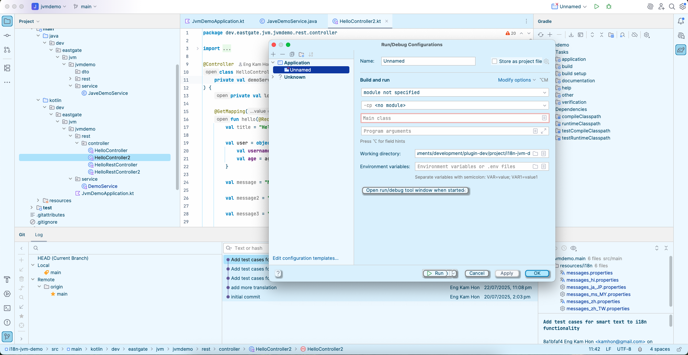

**🌟 Classic Plus（经典增强版）** - 增强的 IntelliJ 浅色主题，具有新拟态精致感
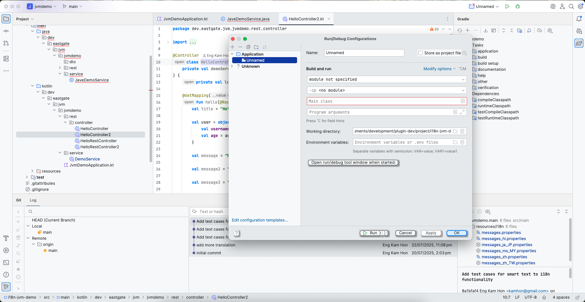

**🌌 Deep Space（深空）** - 宇宙深色主题，深紫色和午夜蓝
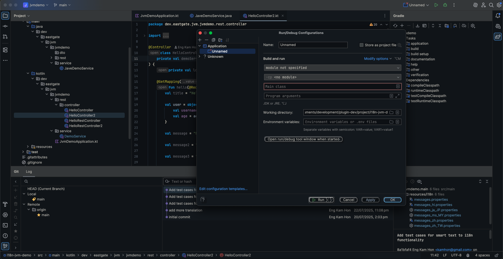

---

### 💎 高级主题（每款试用 30 分钟，$5 个人版 / $10 组织版永久拥有全部 8 款）

**❄️ Arctic Frost（北极冰霜）** - 清爽的白色和冰蓝色，最大清晰度
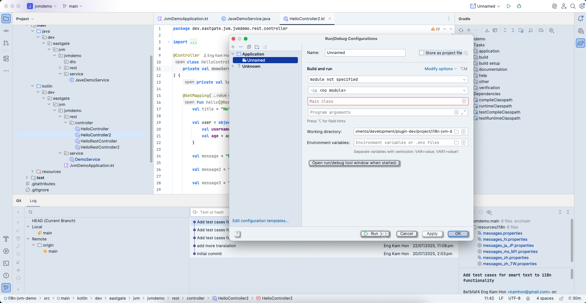

**🌸 Rose Gold（玫瑰金）** - 温暖优雅，减少蓝光曝光
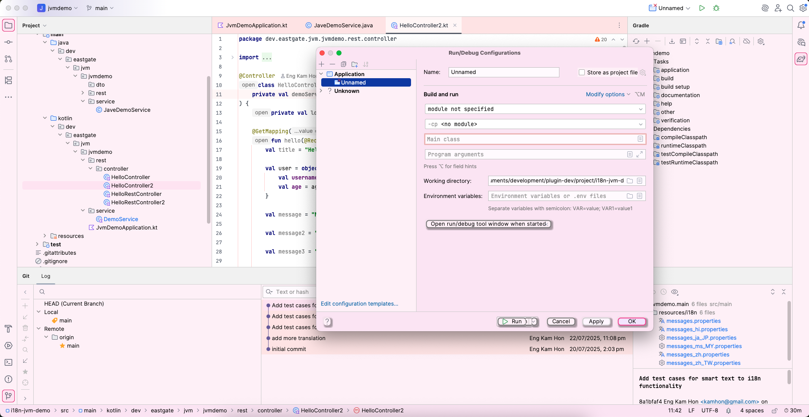

**🌲 Forest（森林）** - 自然绿色和大地色调，踏实编码
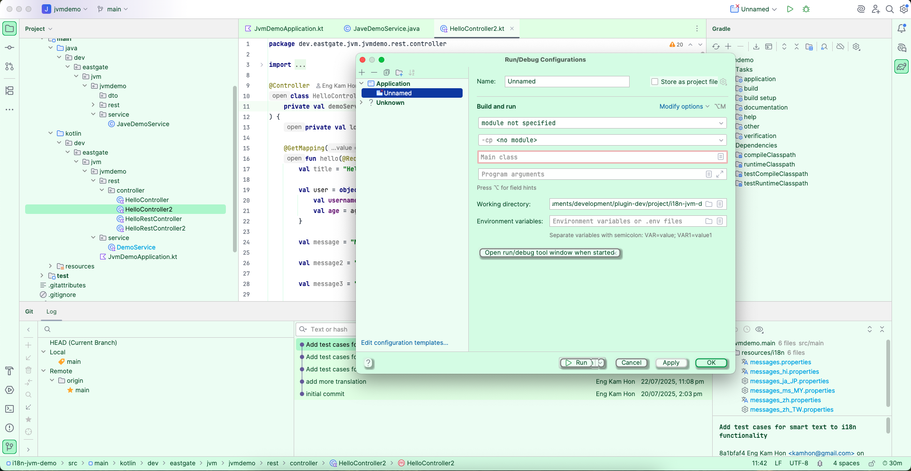

**💜 Lavender（薰衣草）** - 柔和的紫色，激发创造力和平衡
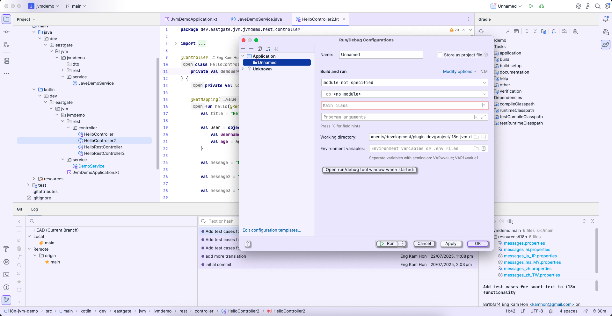

**🌙 Midnight（午夜）** - 真正的深色，深黑色，适合 OLED 完美体验
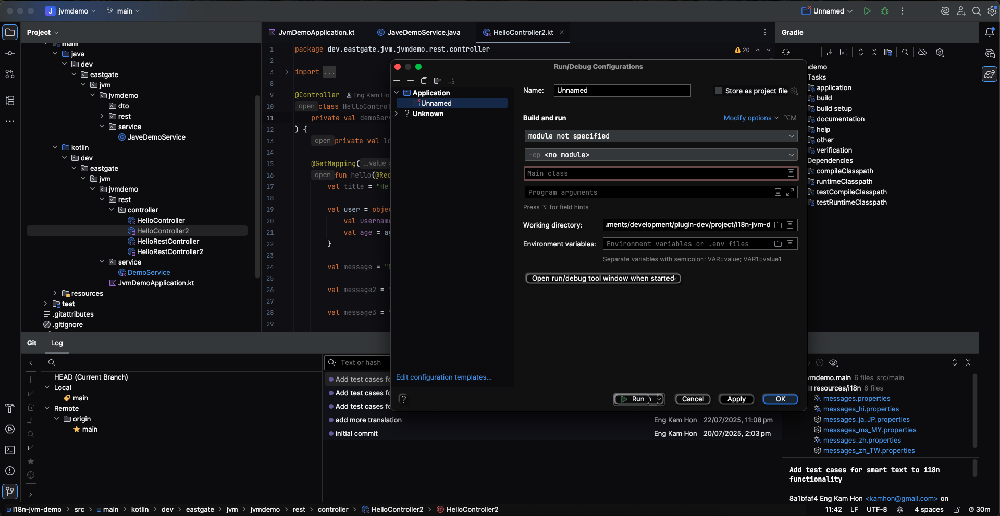

**🎵 Recording Studio（录音室）** - 专业深色，灵感来自音频工作站
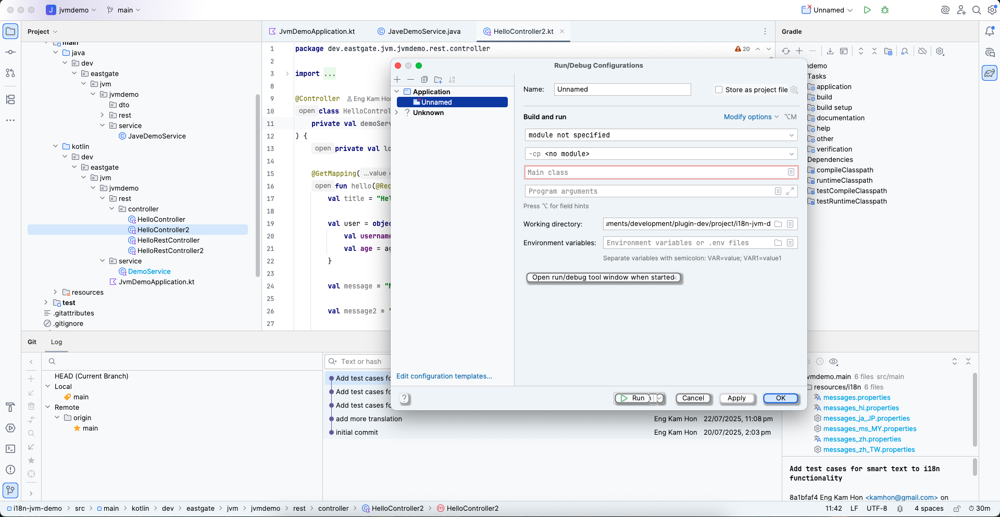

**🎸 Recording Studio Live（录音室现场版）** - 录音室主题的温暖强调色变体
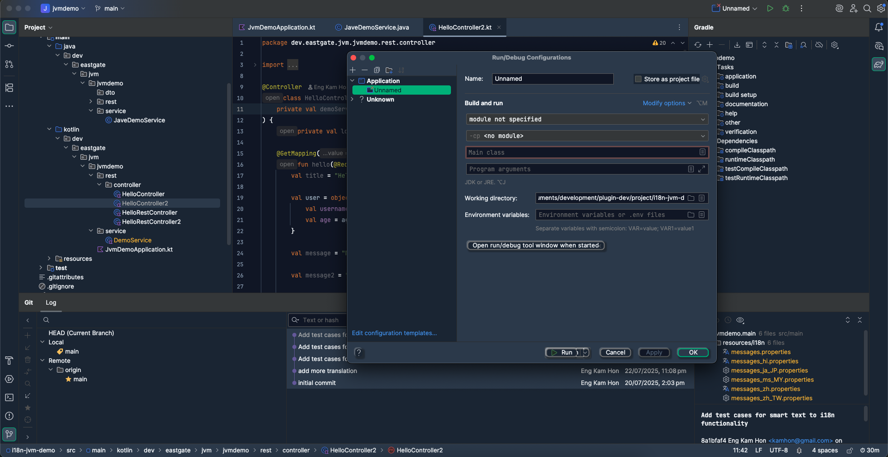

**🌅 Sunset（日落）** - 充满活力的橙色和珊瑚色，黄金时刻编码
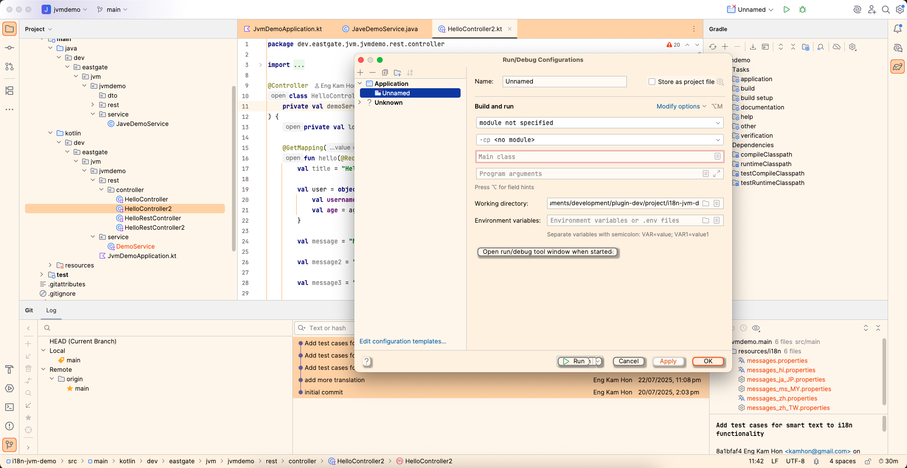

## 反订阅承诺

**$5（个人版）/ $10（组织版）一次性付费。就是这样。永久。**

无月费。无续订提醒。无"升级到 Pro+"追加销售。购买一次，永久拥有全部 8 款高级主题，包括未来更新。我们相信订阅疲劳是真实存在的，开发者工具应该尊重您的钱包和理智。

**您将获得：**
- 立即解锁全部 8 款高级主题
- 终身访问权，无到期时间
- 所有未来主题更新和改进
- 零续订费或意外收费
- 支持独立开发，无企业套路

**行业现实检查：**
- 流行的 IDE 订阅主题：$3-5/月 = $36-60/年
- 一杯高档咖啡：$5-6
- 此插件永久使用（个人版）：$5
- 此插件永久使用（组织版）：$10

## 先试后买（正确方式）

**每个主题 30 分钟静默发现：**

单独测试每个高级主题 30 分钟，零中断。无弹窗垃圾。无倒计时覆盖。不打扰工作流程。只在设置和工具窗口中有一个安静的计时器。

**工作原理：**
1. 安装插件 - 立即获得 3 款免费主题
2. 在设置中切换到任何高级主题
3. 安心编码 30 分钟
4. 计时器仅在设置/工具窗口中可见（从不在编辑器中）
5. 时间到后，无缝返回免费主题
6. 购买前免费试用全部 8 款高级主题

**试用理念：** 我们信任您像专业人士一样评估主题。您不需要激进的销售策略 - 只需要优质主题和诚实定价。

## 主要功能

- **11 款专业设计主题** - 3 款免费，8 款高级，涵盖浅色/深色/温暖/冷色美学
- **新拟态柔和阴影** - 温和的 3D 深度效果减少长时间编码时的眼睛疲劳
- **WCAG AAA 可访问性** - 每个主题都经过 7:1 对比度和色盲兼容性测试
- **静默发现试用** - 每个高级主题 30 分钟，零中断
- **即时主题切换** - 通过 IDE 设置或专用工具窗口更改主题
- **完整 IDE 覆盖** - 编辑器、UI 组件、工具窗口、对话框的一致设计
- **色觉缺陷支持** - 针对常见色盲类型测试
- **专业品质** - 无业余配色方案或不可读的语法高亮
- **一次性付费** - $5（个人版）/ $10（组织版）永久解锁全部 8 款高级主题，无订阅

## 适合以下开发者...

- 每天盯着代码 8 小时以上
- 因刺眼的扁平 UI 而感到眼睛疲劳
- 重视美学但不会牺牲可读性
- 厌倦订阅疲劳，想要终身访问权
- 想要专业主题但不想支付企业定价
- 欣赏尊重工作流程的设计
- 需要符合 WCAG 的主题以实现可访问性
- 拒绝在美观和功能之间做出选择

## 技术卓越

**符合 WCAG AAA 标准：**
- 所有文本符合 7:1 对比度标准
- 视力障碍开发者可读
- 针对红色盲、绿色盲、蓝色盲进行测试
- 专业可访问性，不影响美观

**新拟态优势：**
- 柔和的阴影创建自然深度，没有刺眼的对比度
- 与材料设计相比，视觉噪音减少
- 触感元素改善空间 UI 感知
- 温和的立体感减少扁平设计的眼睛疲劳

**平台支持：**
- IntelliJ IDEA 2025.1+
- Android Studio 2025.1+
- PyCharm 2025.1+
- WebStorm 2025.1+
- PhpStorm 2025.1+
- 所有 JetBrains IDE 2025.1+ 搭配 Java 17

## 开发者评价

**"终于，一个不会让我的眼睛感觉像在跑马拉松的主题。"**

**"试用系统很天才 - 没有弹窗垃圾，只有专业的评估时间。"**

**"终身访问 $5（个人版）/ $10（组织版）？在 2025 年？尊重。"**

**"Ocean Breeze 永久免费，比我试过的大多数付费主题都好。"**

**"新拟态确实适合编码 - 柔和的阴影，没有华而不实的干扰。"**

## 比较：免费 vs 高级

**免费主题（3 款）：**
- Ocean Breeze、Classic Plus、Deep Space
- 完整的新拟态设计和 WCAG 合规性
- 无试用限制或限制
- 终身访问，无附加条件

**高级主题（8 款，$5 个人版 / $10 组织版）：**
- Arctic Frost、Rose Gold、Forest、Lavender、Midnight、Recording Studio、Recording Studio Live、Sunset
- 与免费主题相同的质量和可访问性
- 额外的颜色美学和情绪选项
- 购买前每个主题可试用 30 分钟
- 一次付款永久解锁全部 8 款

**我们的理念：** 免费主题真正优秀，而非阉割版演示。高级主题提供美学多样性，而非功能升级。根据视觉偏好选择，而非人为限制。

## 60 秒内开始

1. **安装** - 从 JetBrains Marketplace 添加插件
2. **选择** - 从 3 款免费主题中选择或试用高级主题 30 分钟
3. **编码** - 享受新拟态设计，减少眼睛疲劳
4. **解锁** - $5（个人版）/ $10（组织版）一次性付费获得全部 8 款高级主题（可选，无压力）

**[立即安装 Neumorphism Theme Collection →](https://plugins.jetbrains.com/plugin/28485-neumorphism-theme-collection)**

## 支持与社区

- **技术支持：** eastgate3194@gmail.com
- **主题请求：** 通过电子邮件建议新的配色方案
- **错误报告：** 包括 IDE 版本、主题名称和复现步骤
- **功能创意：** 我们认真听取开发者反馈

**未来路线图：**
- 额外的主题变体和季节性系列
- 可自定义的阴影强度选项
- 社区请求的配色方案
- 与自定义图标包集成

今天就改变您的编码环境。在第一个 8 小时编码后，您的眼睛会感谢您。
