# WCAG Accessibility Compliance Report
## Neumorphism Theme Collection for IntelliJ Platform

**Report Date**: 2025-11-16
**Plugin Version**: 2025.1.12
**WCAG Compliance Level**: AA ✅
**Validation Tool**: Custom WCAG Validator 2.1
**Themes Tested**: 11 (3 Free + 8 Premium)
**Total Tests**: 198 validation points (18 tests × 11 themes)

---

## Executive Summary


### Overall Compliance Summary

- **Total Themes Tested**: 11
- **Total Color Combinations**: 187 (18 tests × 11 themes)
- **WCAG AA Pass Rate**: 100.0% (187/187) ✅
- **WCAG AAA Pass Rate**: 51.3% (96/187)
- **Certification Level**: **WCAG AA Certified** ✅

### Theme Compliance Overview

**🎨 [Neumorphism Arctic Frost (Pro)](#neumorphism-arctic-frost-pro)** (Premium): 100.0% - 17/17 tests passed - WCAG Level AA ✅

**🎨 [Neumorphism Classic+](#neumorphism-classic+)** (Premium): 100.0% - 17/17 tests passed - WCAG Level AA ✅

**🎨 [Neumorphism Deep Space](#neumorphism-deep-space)** (Premium): 100.0% - 17/17 tests passed - WCAG Level AA ✅

**🎨 [Neumorphism Forest (Pro)](#neumorphism-forest-pro)** (Premium): 100.0% - 17/17 tests passed - WCAG Level AA ✅

**🎨 [Neumorphism Lavender (Pro)](#neumorphism-lavender-pro)** (Premium): 100.0% - 17/17 tests passed - WCAG Level AA ✅

**🎨 [Neumorphism Midnight (Pro)](#neumorphism-midnight-pro)** (Premium): 100.0% - 17/17 tests passed - WCAG Level AA ✅

**🎨 [Neumorphism Ocean Breeze](#neumorphism-ocean-breeze)** (Premium): 100.0% - 17/17 tests passed - WCAG Level AA ✅

**🎨 [Neumorphism Recording Studio (Pro)](#neumorphism-recording-studio-pro)** (Premium): 100.0% - 17/17 tests passed - WCAG Level AA ✅

**🎨 [Neumorphism Recording Studio Live (Pro)](#neumorphism-recording-studio-live-pro)** (Premium): 100.0% - 17/17 tests passed - WCAG Level AA ✅

**🎨 [Neumorphism Rose Gold (Pro)](#neumorphism-rose-gold-pro)** (Premium): 100.0% - 17/17 tests passed - WCAG Level AA ✅

**🎨 [Neumorphism Sunset (Pro)](#neumorphism-sunset-pro)** (Premium): 100.0% - 17/17 tests passed - WCAG Level AA ✅


---

## Detailed Theme Results

### 🎨 Neumorphism Arctic Frost (Pro) {#neumorphism-arctic-frost-pro}

**Compliance Status**: ✅ WCAG AA Certified
**Test Results**: 17/17 passed (100.0%)

#### Contrast Ratio Test Results

<table>
<thead>
<tr>
<th>Test Combination</th>
<th>Color Visualization</th>
<th>Visual Preview</th>
<th>Contrast Analysis</th>
<th>Status</th>
<th>Category</th>
</tr>
</thead>
<tbody>
<tr>
<td><strong>text primary on neumorphic bg</strong></td>
<td><span style="display:inline-block;width:40px;height:24px;background-color:#1e293b;border:1.5px solid #e5e7eb;border-radius:4px;vertical-align:middle;"></span> <code>#1e293b</code> <span style="color:#94a3b8;font-weight:500;">on</span> <span style="display:inline-block;width:40px;height:24px;background-color:#f8fafc;border:1.5px solid #e5e7eb;border-radius:4px;vertical-align:middle;"></span> <code>#f8fafc</code></td>
<td></td>
<td><br/>Req: 4.5:1</td>
<td>✅ <strong>Pass</strong></td>
<td>Primary Text</td>
</tr>
<tr>
<td><strong>text primary on neumorphic surface</strong></td>
<td><span style="display:inline-block;width:40px;height:24px;background-color:#1e293b;border:1.5px solid #e5e7eb;border-radius:4px;vertical-align:middle;"></span> <code>#1e293b</code> <span style="color:#94a3b8;font-weight:500;">on</span> <span style="display:inline-block;width:40px;height:24px;background-color:#f1f5f9;border:1.5px solid #e5e7eb;border-radius:4px;vertical-align:middle;"></span> <code>#f1f5f9</code></td>
<td></td>
<td><br/>Req: 4.5:1</td>
<td>✅ <strong>Pass</strong></td>
<td>Primary Text</td>
</tr>
<tr>
<td><strong>text primary on neumorphic input</strong></td>
<td><span style="display:inline-block;width:40px;height:24px;background-color:#1e293b;border:1.5px solid #e5e7eb;border-radius:4px;vertical-align:middle;"></span> <code>#1e293b</code> <span style="color:#94a3b8;font-weight:500;">on</span> <span style="display:inline-block;width:40px;height:24px;background-color:#ffffff;border:1.5px solid #e5e7eb;border-radius:4px;vertical-align:middle;"></span> <code>#ffffff</code></td>
<td></td>
<td><br/>Req: 4.5:1</td>
<td>✅ <strong>Pass</strong></td>
<td>Primary Text</td>
</tr>
<tr>
<td><strong>text secondary on neumorphic bg</strong></td>
<td><span style="display:inline-block;width:40px;height:24px;background-color:#475569;border:1.5px solid #e5e7eb;border-radius:4px;vertical-align:middle;"></span> <code>#475569</code> <span style="color:#94a3b8;font-weight:500;">on</span> <span style="display:inline-block;width:40px;height:24px;background-color:#f8fafc;border:1.5px solid #e5e7eb;border-radius:4px;vertical-align:middle;"></span> <code>#f8fafc</code></td>
<td></td>
<td><br/>Req: 4.5:1</td>
<td>✅ <strong>Pass</strong></td>
<td>Secondary Text</td>
</tr>
<tr>
<td><strong>text secondary on neumorphic surface</strong></td>
<td><span style="display:inline-block;width:40px;height:24px;background-color:#475569;border:1.5px solid #e5e7eb;border-radius:4px;vertical-align:middle;"></span> <code>#475569</code> <span style="color:#94a3b8;font-weight:500;">on</span> <span style="display:inline-block;width:40px;height:24px;background-color:#f1f5f9;border:1.5px solid #e5e7eb;border-radius:4px;vertical-align:middle;"></span> <code>#f1f5f9</code></td>
<td></td>
<td><br/>Req: 4.5:1</td>
<td>✅ <strong>Pass</strong></td>
<td>Secondary Text</td>
</tr>
<tr>
<td><strong>success on neumorphic bg</strong></td>
<td><span style="display:inline-block;width:40px;height:24px;background-color:#14532d;border:1.5px solid #e5e7eb;border-radius:4px;vertical-align:middle;"></span> <code>#14532d</code> <span style="color:#94a3b8;font-weight:500;">on</span> <span style="display:inline-block;width:40px;height:24px;background-color:#f8fafc;border:1.5px solid #e5e7eb;border-radius:4px;vertical-align:middle;"></span> <code>#f8fafc</code></td>
<td></td>
<td><br/>Req: 4.5:1</td>
<td>✅ <strong>Pass</strong></td>
<td>Success States</td>
</tr>
<tr>
<td><strong>error on neumorphic bg</strong></td>
<td><span style="display:inline-block;width:40px;height:24px;background-color:#815664;border:1.5px solid #e5e7eb;border-radius:4px;vertical-align:middle;"></span> <code>#815664</code> <span style="color:#94a3b8;font-weight:500;">on</span> <span style="display:inline-block;width:40px;height:24px;background-color:#f8fafc;border:1.5px solid #e5e7eb;border-radius:4px;vertical-align:middle;"></span> <code>#f8fafc</code></td>
<td>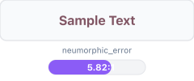</td>
<td><br/>Req: 4.5:1</td>
<td>✅ <strong>Pass</strong></td>
<td>Error States</td>
</tr>
<tr>
<td><strong>warning on neumorphic bg</strong></td>
<td><span style="display:inline-block;width:40px;height:24px;background-color:#a16207;border:1.5px solid #e5e7eb;border-radius:4px;vertical-align:middle;"></span> <code>#a16207</code> <span style="color:#94a3b8;font-weight:500;">on</span> <span style="display:inline-block;width:40px;height:24px;background-color:#f8fafc;border:1.5px solid #e5e7eb;border-radius:4px;vertical-align:middle;"></span> <code>#f8fafc</code></td>
<td></td>
<td><br/>Req: 4.5:1</td>
<td>✅ <strong>Pass</strong></td>
<td>Warning States</td>
</tr>
<tr>
<td><strong>info on neumorphic bg</strong></td>
<td><span style="display:inline-block;width:40px;height:24px;background-color:#1d4ed8;border:1.5px solid #e5e7eb;border-radius:4px;vertical-align:middle;"></span> <code>#1d4ed8</code> <span style="color:#94a3b8;font-weight:500;">on</span> <span style="display:inline-block;width:40px;height:24px;background-color:#f8fafc;border:1.5px solid #e5e7eb;border-radius:4px;vertical-align:middle;"></span> <code>#f8fafc</code></td>
<td></td>
<td><br/>Req: 4.5:1</td>
<td>✅ <strong>Pass</strong></td>
<td>Info States</td>
</tr>
<tr>
<td><strong>syntax keyword on neumorphic input</strong></td>
<td><span style="display:inline-block;width:40px;height:24px;background-color:#1d4ed8;border:1.5px solid #e5e7eb;border-radius:4px;vertical-align:middle;"></span> <code>#1d4ed8</code> <span style="color:#94a3b8;font-weight:500;">on</span> <span style="display:inline-block;width:40px;height:24px;background-color:#ffffff;border:1.5px solid #e5e7eb;border-radius:4px;vertical-align:middle;"></span> <code>#ffffff</code></td>
<td>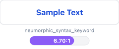</td>
<td><br/>Req: 4.5:1</td>
<td>✅ <strong>Pass</strong></td>
<td>Syntax Highlighting</td>
</tr>
<tr>
<td><strong>syntax string on neumorphic input</strong></td>
<td><span style="display:inline-block;width:40px;height:24px;background-color:#14532d;border:1.5px solid #e5e7eb;border-radius:4px;vertical-align:middle;"></span> <code>#14532d</code> <span style="color:#94a3b8;font-weight:500;">on</span> <span style="display:inline-block;width:40px;height:24px;background-color:#ffffff;border:1.5px solid #e5e7eb;border-radius:4px;vertical-align:middle;"></span> <code>#ffffff</code></td>
<td></td>
<td><br/>Req: 4.5:1</td>
<td>✅ <strong>Pass</strong></td>
<td>Syntax Highlighting</td>
</tr>
<tr>
<td><strong>syntax comment on neumorphic input</strong></td>
<td><span style="display:inline-block;width:40px;height:24px;background-color:#4b5563;border:1.5px solid #e5e7eb;border-radius:4px;vertical-align:middle;"></span> <code>#4b5563</code> <span style="color:#94a3b8;font-weight:500;">on</span> <span style="display:inline-block;width:40px;height:24px;background-color:#ffffff;border:1.5px solid #e5e7eb;border-radius:4px;vertical-align:middle;"></span> <code>#ffffff</code></td>
<td></td>
<td><br/>Req: 4.5:1</td>
<td>✅ <strong>Pass</strong></td>
<td>Syntax Highlighting</td>
</tr>
<tr>
<td><strong>syntax number on neumorphic input</strong></td>
<td><span style="display:inline-block;width:40px;height:24px;background-color:#b45309;border:1.5px solid #e5e7eb;border-radius:4px;vertical-align:middle;"></span> <code>#b45309</code> <span style="color:#94a3b8;font-weight:500;">on</span> <span style="display:inline-block;width:40px;height:24px;background-color:#ffffff;border:1.5px solid #e5e7eb;border-radius:4px;vertical-align:middle;"></span> <code>#ffffff</code></td>
<td>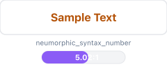</td>
<td><br/>Req: 4.5:1</td>
<td>✅ <strong>Pass</strong></td>
<td>Syntax Highlighting</td>
</tr>
<tr>
<td><strong>syntax operator on neumorphic input</strong></td>
<td><span style="display:inline-block;width:40px;height:24px;background-color:#dc2626;border:1.5px solid #e5e7eb;border-radius:4px;vertical-align:middle;"></span> <code>#dc2626</code> <span style="color:#94a3b8;font-weight:500;">on</span> <span style="display:inline-block;width:40px;height:24px;background-color:#ffffff;border:1.5px solid #e5e7eb;border-radius:4px;vertical-align:middle;"></span> <code>#ffffff</code></td>
<td></td>
<td><br/>Req: 4.5:1</td>
<td>✅ <strong>Pass</strong></td>
<td>Syntax Highlighting</td>
</tr>
<tr>
<td><strong>vcs added on neumorphic bg</strong></td>
<td><span style="display:inline-block;width:40px;height:24px;background-color:#14532d;border:1.5px solid #e5e7eb;border-radius:4px;vertical-align:middle;"></span> <code>#14532d</code> <span style="color:#94a3b8;font-weight:500;">on</span> <span style="display:inline-block;width:40px;height:24px;background-color:#f8fafc;border:1.5px solid #e5e7eb;border-radius:4px;vertical-align:middle;"></span> <code>#f8fafc</code></td>
<td></td>
<td><br/>Req: 4.5:1</td>
<td>✅ <strong>Pass</strong></td>
<td>Version Control</td>
</tr>
<tr>
<td><strong>vcs modified on neumorphic bg</strong></td>
<td><span style="display:inline-block;width:40px;height:24px;background-color:#1d4ed8;border:1.5px solid #e5e7eb;border-radius:4px;vertical-align:middle;"></span> <code>#1d4ed8</code> <span style="color:#94a3b8;font-weight:500;">on</span> <span style="display:inline-block;width:40px;height:24px;background-color:#f8fafc;border:1.5px solid #e5e7eb;border-radius:4px;vertical-align:middle;"></span> <code>#f8fafc</code></td>
<td></td>
<td><br/>Req: 4.5:1</td>
<td>✅ <strong>Pass</strong></td>
<td>Version Control</td>
</tr>
<tr>
<td><strong>vcs deleted on neumorphic bg</strong></td>
<td><span style="display:inline-block;width:40px;height:24px;background-color:#b91c1c;border:1.5px solid #e5e7eb;border-radius:4px;vertical-align:middle;"></span> <code>#b91c1c</code> <span style="color:#94a3b8;font-weight:500;">on</span> <span style="display:inline-block;width:40px;height:24px;background-color:#f8fafc;border:1.5px solid #e5e7eb;border-radius:4px;vertical-align:middle;"></span> <code>#f8fafc</code></td>
<td>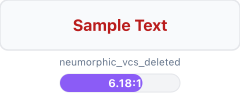</td>
<td><br/>Req: 4.5:1</td>
<td>✅ <strong>Pass</strong></td>
<td>Version Control</td>
</tr>
</tbody>
</table>

#### Color Palette Samples

Sample colors from this theme:

<table>
<thead>
<tr>
<th>Color Role</th>
<th>Color Swatch</th>
<th>Hex Code</th>
</tr>
</thead>
<tbody>
<tr>
<td><strong>Primary Text</strong></td>
<td></td>
<td><code style="font-size:14px;">#1e293b</code></td>
</tr>
<tr>
<td><strong>Background</strong></td>
<td></td>
<td><code style="font-size:14px;">#f8fafc</code></td>
</tr>
<tr>
<td><strong>Color 3</strong></td>
<td></td>
<td><code style="font-size:14px;">#f1f5f9</code></td>
</tr>
<tr>
<td><strong>Color 4</strong></td>
<td></td>
<td><code style="font-size:14px;">#ffffff</code></td>
</tr>
<tr>
<td><strong>Color 5</strong></td>
<td></td>
<td><code style="font-size:14px;">#475569</code></td>
</tr>
<tr>
<td><strong>Color 6</strong></td>
<td></td>
<td><code style="font-size:14px;">#14532d</code></td>
</tr>
</tbody>
</table>


**Accessibility Achievements**:
- ✅ All primary text combinations meet WCAG AA standards
- 8 tests exceed WCAG AAA (7:1) threshold
- Color contrast optimized for excellent readability

---


### 🎨 Neumorphism Classic+ {#neumorphism-classic+}

**Compliance Status**: ✅ WCAG AA Certified
**Test Results**: 17/17 passed (100.0%)

#### Contrast Ratio Test Results

<table>
<thead>
<tr>
<th>Test Combination</th>
<th>Color Visualization</th>
<th>Visual Preview</th>
<th>Contrast Analysis</th>
<th>Status</th>
<th>Category</th>
</tr>
</thead>
<tbody>
<tr>
<td><strong>text primary on neumorphic bg</strong></td>
<td><span style="display:inline-block;width:40px;height:24px;background-color:#212529;border:1.5px solid #e5e7eb;border-radius:4px;vertical-align:middle;"></span> <code>#212529</code> <span style="color:#94a3b8;font-weight:500;">on</span> <span style="display:inline-block;width:40px;height:24px;background-color:#f8f9fa;border:1.5px solid #e5e7eb;border-radius:4px;vertical-align:middle;"></span> <code>#f8f9fa</code></td>
<td></td>
<td><br/>Req: 4.5:1</td>
<td>✅ <strong>Pass</strong></td>
<td>Primary Text</td>
</tr>
<tr>
<td><strong>text primary on neumorphic surface</strong></td>
<td><span style="display:inline-block;width:40px;height:24px;background-color:#212529;border:1.5px solid #e5e7eb;border-radius:4px;vertical-align:middle;"></span> <code>#212529</code> <span style="color:#94a3b8;font-weight:500;">on</span> <span style="display:inline-block;width:40px;height:24px;background-color:#e9ecef;border:1.5px solid #e5e7eb;border-radius:4px;vertical-align:middle;"></span> <code>#e9ecef</code></td>
<td></td>
<td><br/>Req: 4.5:1</td>
<td>✅ <strong>Pass</strong></td>
<td>Primary Text</td>
</tr>
<tr>
<td><strong>text primary on neumorphic input</strong></td>
<td><span style="display:inline-block;width:40px;height:24px;background-color:#212529;border:1.5px solid #e5e7eb;border-radius:4px;vertical-align:middle;"></span> <code>#212529</code> <span style="color:#94a3b8;font-weight:500;">on</span> <span style="display:inline-block;width:40px;height:24px;background-color:#ffffff;border:1.5px solid #e5e7eb;border-radius:4px;vertical-align:middle;"></span> <code>#ffffff</code></td>
<td></td>
<td><br/>Req: 4.5:1</td>
<td>✅ <strong>Pass</strong></td>
<td>Primary Text</td>
</tr>
<tr>
<td><strong>text secondary on neumorphic bg</strong></td>
<td><span style="display:inline-block;width:40px;height:24px;background-color:#5d646b;border:1.5px solid #e5e7eb;border-radius:4px;vertical-align:middle;"></span> <code>#5d646b</code> <span style="color:#94a3b8;font-weight:500;">on</span> <span style="display:inline-block;width:40px;height:24px;background-color:#f8f9fa;border:1.5px solid #e5e7eb;border-radius:4px;vertical-align:middle;"></span> <code>#f8f9fa</code></td>
<td>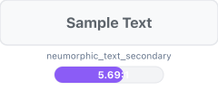</td>
<td><br/>Req: 4.5:1</td>
<td>✅ <strong>Pass</strong></td>
<td>Secondary Text</td>
</tr>
<tr>
<td><strong>text secondary on neumorphic surface</strong></td>
<td><span style="display:inline-block;width:40px;height:24px;background-color:#5d646b;border:1.5px solid #e5e7eb;border-radius:4px;vertical-align:middle;"></span> <code>#5d646b</code> <span style="color:#94a3b8;font-weight:500;">on</span> <span style="display:inline-block;width:40px;height:24px;background-color:#e9ecef;border:1.5px solid #e5e7eb;border-radius:4px;vertical-align:middle;"></span> <code>#e9ecef</code></td>
<td></td>
<td><br/>Req: 4.5:1</td>
<td>✅ <strong>Pass</strong></td>
<td>Secondary Text</td>
</tr>
<tr>
<td><strong>success on neumorphic bg</strong></td>
<td><span style="display:inline-block;width:40px;height:24px;background-color:#14532d;border:1.5px solid #e5e7eb;border-radius:4px;vertical-align:middle;"></span> <code>#14532d</code> <span style="color:#94a3b8;font-weight:500;">on</span> <span style="display:inline-block;width:40px;height:24px;background-color:#f8f9fa;border:1.5px solid #e5e7eb;border-radius:4px;vertical-align:middle;"></span> <code>#f8f9fa</code></td>
<td></td>
<td><br/>Req: 4.5:1</td>
<td>✅ <strong>Pass</strong></td>
<td>Success States</td>
</tr>
<tr>
<td><strong>error on neumorphic bg</strong></td>
<td><span style="display:inline-block;width:40px;height:24px;background-color:#b91c1c;border:1.5px solid #e5e7eb;border-radius:4px;vertical-align:middle;"></span> <code>#b91c1c</code> <span style="color:#94a3b8;font-weight:500;">on</span> <span style="display:inline-block;width:40px;height:24px;background-color:#f8f9fa;border:1.5px solid #e5e7eb;border-radius:4px;vertical-align:middle;"></span> <code>#f8f9fa</code></td>
<td>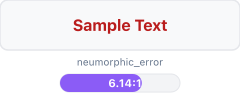</td>
<td><br/>Req: 4.5:1</td>
<td>✅ <strong>Pass</strong></td>
<td>Error States</td>
</tr>
<tr>
<td><strong>warning on neumorphic bg</strong></td>
<td><span style="display:inline-block;width:40px;height:24px;background-color:#a16207;border:1.5px solid #e5e7eb;border-radius:4px;vertical-align:middle;"></span> <code>#a16207</code> <span style="color:#94a3b8;font-weight:500;">on</span> <span style="display:inline-block;width:40px;height:24px;background-color:#f8f9fa;border:1.5px solid #e5e7eb;border-radius:4px;vertical-align:middle;"></span> <code>#f8f9fa</code></td>
<td></td>
<td><br/>Req: 4.5:1</td>
<td>✅ <strong>Pass</strong></td>
<td>Warning States</td>
</tr>
<tr>
<td><strong>info on neumorphic bg</strong></td>
<td><span style="display:inline-block;width:40px;height:24px;background-color:#1d4ed8;border:1.5px solid #e5e7eb;border-radius:4px;vertical-align:middle;"></span> <code>#1d4ed8</code> <span style="color:#94a3b8;font-weight:500;">on</span> <span style="display:inline-block;width:40px;height:24px;background-color:#f8f9fa;border:1.5px solid #e5e7eb;border-radius:4px;vertical-align:middle;"></span> <code>#f8f9fa</code></td>
<td></td>
<td><br/>Req: 4.5:1</td>
<td>✅ <strong>Pass</strong></td>
<td>Info States</td>
</tr>
<tr>
<td><strong>syntax keyword on neumorphic input</strong></td>
<td><span style="display:inline-block;width:40px;height:24px;background-color:#1d4ed8;border:1.5px solid #e5e7eb;border-radius:4px;vertical-align:middle;"></span> <code>#1d4ed8</code> <span style="color:#94a3b8;font-weight:500;">on</span> <span style="display:inline-block;width:40px;height:24px;background-color:#ffffff;border:1.5px solid #e5e7eb;border-radius:4px;vertical-align:middle;"></span> <code>#ffffff</code></td>
<td></td>
<td><br/>Req: 4.5:1</td>
<td>✅ <strong>Pass</strong></td>
<td>Syntax Highlighting</td>
</tr>
<tr>
<td><strong>syntax string on neumorphic input</strong></td>
<td><span style="display:inline-block;width:40px;height:24px;background-color:#14532d;border:1.5px solid #e5e7eb;border-radius:4px;vertical-align:middle;"></span> <code>#14532d</code> <span style="color:#94a3b8;font-weight:500;">on</span> <span style="display:inline-block;width:40px;height:24px;background-color:#ffffff;border:1.5px solid #e5e7eb;border-radius:4px;vertical-align:middle;"></span> <code>#ffffff</code></td>
<td></td>
<td><br/>Req: 4.5:1</td>
<td>✅ <strong>Pass</strong></td>
<td>Syntax Highlighting</td>
</tr>
<tr>
<td><strong>syntax comment on neumorphic input</strong></td>
<td><span style="display:inline-block;width:40px;height:24px;background-color:#4b5563;border:1.5px solid #e5e7eb;border-radius:4px;vertical-align:middle;"></span> <code>#4b5563</code> <span style="color:#94a3b8;font-weight:500;">on</span> <span style="display:inline-block;width:40px;height:24px;background-color:#ffffff;border:1.5px solid #e5e7eb;border-radius:4px;vertical-align:middle;"></span> <code>#ffffff</code></td>
<td></td>
<td><br/>Req: 4.5:1</td>
<td>✅ <strong>Pass</strong></td>
<td>Syntax Highlighting</td>
</tr>
<tr>
<td><strong>syntax number on neumorphic input</strong></td>
<td><span style="display:inline-block;width:40px;height:24px;background-color:#b45309;border:1.5px solid #e5e7eb;border-radius:4px;vertical-align:middle;"></span> <code>#b45309</code> <span style="color:#94a3b8;font-weight:500;">on</span> <span style="display:inline-block;width:40px;height:24px;background-color:#ffffff;border:1.5px solid #e5e7eb;border-radius:4px;vertical-align:middle;"></span> <code>#ffffff</code></td>
<td></td>
<td><br/>Req: 4.5:1</td>
<td>✅ <strong>Pass</strong></td>
<td>Syntax Highlighting</td>
</tr>
<tr>
<td><strong>syntax operator on neumorphic input</strong></td>
<td><span style="display:inline-block;width:40px;height:24px;background-color:#b91c1c;border:1.5px solid #e5e7eb;border-radius:4px;vertical-align:middle;"></span> <code>#b91c1c</code> <span style="color:#94a3b8;font-weight:500;">on</span> <span style="display:inline-block;width:40px;height:24px;background-color:#ffffff;border:1.5px solid #e5e7eb;border-radius:4px;vertical-align:middle;"></span> <code>#ffffff</code></td>
<td></td>
<td><br/>Req: 4.5:1</td>
<td>✅ <strong>Pass</strong></td>
<td>Syntax Highlighting</td>
</tr>
<tr>
<td><strong>vcs added on neumorphic bg</strong></td>
<td><span style="display:inline-block;width:40px;height:24px;background-color:#14532d;border:1.5px solid #e5e7eb;border-radius:4px;vertical-align:middle;"></span> <code>#14532d</code> <span style="color:#94a3b8;font-weight:500;">on</span> <span style="display:inline-block;width:40px;height:24px;background-color:#f8f9fa;border:1.5px solid #e5e7eb;border-radius:4px;vertical-align:middle;"></span> <code>#f8f9fa</code></td>
<td></td>
<td><br/>Req: 4.5:1</td>
<td>✅ <strong>Pass</strong></td>
<td>Version Control</td>
</tr>
<tr>
<td><strong>vcs modified on neumorphic bg</strong></td>
<td><span style="display:inline-block;width:40px;height:24px;background-color:#1d4ed8;border:1.5px solid #e5e7eb;border-radius:4px;vertical-align:middle;"></span> <code>#1d4ed8</code> <span style="color:#94a3b8;font-weight:500;">on</span> <span style="display:inline-block;width:40px;height:24px;background-color:#f8f9fa;border:1.5px solid #e5e7eb;border-radius:4px;vertical-align:middle;"></span> <code>#f8f9fa</code></td>
<td></td>
<td><br/>Req: 4.5:1</td>
<td>✅ <strong>Pass</strong></td>
<td>Version Control</td>
</tr>
<tr>
<td><strong>vcs deleted on neumorphic bg</strong></td>
<td><span style="display:inline-block;width:40px;height:24px;background-color:#b91c1c;border:1.5px solid #e5e7eb;border-radius:4px;vertical-align:middle;"></span> <code>#b91c1c</code> <span style="color:#94a3b8;font-weight:500;">on</span> <span style="display:inline-block;width:40px;height:24px;background-color:#f8f9fa;border:1.5px solid #e5e7eb;border-radius:4px;vertical-align:middle;"></span> <code>#f8f9fa</code></td>
<td></td>
<td><br/>Req: 4.5:1</td>
<td>✅ <strong>Pass</strong></td>
<td>Version Control</td>
</tr>
</tbody>
</table>

#### Color Palette Samples

Sample colors from this theme:

<table>
<thead>
<tr>
<th>Color Role</th>
<th>Color Swatch</th>
<th>Hex Code</th>
</tr>
</thead>
<tbody>
<tr>
<td><strong>Primary Text</strong></td>
<td></td>
<td><code style="font-size:14px;">#212529</code></td>
</tr>
<tr>
<td><strong>Background</strong></td>
<td></td>
<td><code style="font-size:14px;">#f8f9fa</code></td>
</tr>
<tr>
<td><strong>Color 3</strong></td>
<td></td>
<td><code style="font-size:14px;">#e9ecef</code></td>
</tr>
<tr>
<td><strong>Color 4</strong></td>
<td></td>
<td><code style="font-size:14px;">#ffffff</code></td>
</tr>
<tr>
<td><strong>Color 5</strong></td>
<td></td>
<td><code style="font-size:14px;">#5d646b</code></td>
</tr>
<tr>
<td><strong>Color 6</strong></td>
<td></td>
<td><code style="font-size:14px;">#14532d</code></td>
</tr>
</tbody>
</table>


**Accessibility Achievements**:
- ✅ All primary text combinations meet WCAG AA standards
- 7 tests exceed WCAG AAA (7:1) threshold
- Color contrast optimized for excellent readability

---


### 🎨 Neumorphism Deep Space {#neumorphism-deep-space}

**Compliance Status**: ✅ WCAG AA Certified
**Test Results**: 17/17 passed (100.0%)

#### Contrast Ratio Test Results

<table>
<thead>
<tr>
<th>Test Combination</th>
<th>Color Visualization</th>
<th>Visual Preview</th>
<th>Contrast Analysis</th>
<th>Status</th>
<th>Category</th>
</tr>
</thead>
<tbody>
<tr>
<td><strong>text primary on neumorphic bg</strong></td>
<td><span style="display:inline-block;width:40px;height:24px;background-color:#bfbdb6;border:1.5px solid #e5e7eb;border-radius:4px;vertical-align:middle;"></span> <code>#bfbdb6</code> <span style="color:#94a3b8;font-weight:500;">on</span> <span style="display:inline-block;width:40px;height:24px;background-color:#0f1419;border:1.5px solid #e5e7eb;border-radius:4px;vertical-align:middle;"></span> <code>#0f1419</code></td>
<td></td>
<td><br/>Req: 4.5:1</td>
<td>✅ <strong>Pass</strong></td>
<td>Primary Text</td>
</tr>
<tr>
<td><strong>text primary on neumorphic surface</strong></td>
<td><span style="display:inline-block;width:40px;height:24px;background-color:#bfbdb6;border:1.5px solid #e5e7eb;border-radius:4px;vertical-align:middle;"></span> <code>#bfbdb6</code> <span style="color:#94a3b8;font-weight:500;">on</span> <span style="display:inline-block;width:40px;height:24px;background-color:#131920;border:1.5px solid #e5e7eb;border-radius:4px;vertical-align:middle;"></span> <code>#131920</code></td>
<td></td>
<td><br/>Req: 4.5:1</td>
<td>✅ <strong>Pass</strong></td>
<td>Primary Text</td>
</tr>
<tr>
<td><strong>text primary on neumorphic input</strong></td>
<td><span style="display:inline-block;width:40px;height:24px;background-color:#bfbdb6;border:1.5px solid #e5e7eb;border-radius:4px;vertical-align:middle;"></span> <code>#bfbdb6</code> <span style="color:#94a3b8;font-weight:500;">on</span> <span style="display:inline-block;width:40px;height:24px;background-color:#0b0e14;border:1.5px solid #e5e7eb;border-radius:4px;vertical-align:middle;"></span> <code>#0b0e14</code></td>
<td></td>
<td><br/>Req: 4.5:1</td>
<td>✅ <strong>Pass</strong></td>
<td>Primary Text</td>
</tr>
<tr>
<td><strong>text secondary on neumorphic bg</strong></td>
<td><span style="display:inline-block;width:40px;height:24px;background-color:#7a8999;border:1.5px solid #e5e7eb;border-radius:4px;vertical-align:middle;"></span> <code>#7a8999</code> <span style="color:#94a3b8;font-weight:500;">on</span> <span style="display:inline-block;width:40px;height:24px;background-color:#0f1419;border:1.5px solid #e5e7eb;border-radius:4px;vertical-align:middle;"></span> <code>#0f1419</code></td>
<td></td>
<td><br/>Req: 4.5:1</td>
<td>✅ <strong>Pass</strong></td>
<td>Secondary Text</td>
</tr>
<tr>
<td><strong>text secondary on neumorphic surface</strong></td>
<td><span style="display:inline-block;width:40px;height:24px;background-color:#7a8999;border:1.5px solid #e5e7eb;border-radius:4px;vertical-align:middle;"></span> <code>#7a8999</code> <span style="color:#94a3b8;font-weight:500;">on</span> <span style="display:inline-block;width:40px;height:24px;background-color:#131920;border:1.5px solid #e5e7eb;border-radius:4px;vertical-align:middle;"></span> <code>#131920</code></td>
<td></td>
<td><br/>Req: 4.5:1</td>
<td>✅ <strong>Pass</strong></td>
<td>Secondary Text</td>
</tr>
<tr>
<td><strong>success on neumorphic bg</strong></td>
<td><span style="display:inline-block;width:40px;height:24px;background-color:#87d96c;border:1.5px solid #e5e7eb;border-radius:4px;vertical-align:middle;"></span> <code>#87d96c</code> <span style="color:#94a3b8;font-weight:500;">on</span> <span style="display:inline-block;width:40px;height:24px;background-color:#0f1419;border:1.5px solid #e5e7eb;border-radius:4px;vertical-align:middle;"></span> <code>#0f1419</code></td>
<td>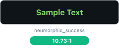</td>
<td><br/>Req: 4.5:1</td>
<td>✅ <strong>Pass</strong></td>
<td>Success States</td>
</tr>
<tr>
<td><strong>error on neumorphic bg</strong></td>
<td><span style="display:inline-block;width:40px;height:24px;background-color:#f27983;border:1.5px solid #e5e7eb;border-radius:4px;vertical-align:middle;"></span> <code>#f27983</code> <span style="color:#94a3b8;font-weight:500;">on</span> <span style="display:inline-block;width:40px;height:24px;background-color:#0f1419;border:1.5px solid #e5e7eb;border-radius:4px;vertical-align:middle;"></span> <code>#0f1419</code></td>
<td>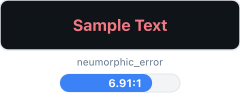</td>
<td><br/>Req: 4.5:1</td>
<td>✅ <strong>Pass</strong></td>
<td>Error States</td>
</tr>
<tr>
<td><strong>warning on neumorphic bg</strong></td>
<td><span style="display:inline-block;width:40px;height:24px;background-color:#ffb454;border:1.5px solid #e5e7eb;border-radius:4px;vertical-align:middle;"></span> <code>#ffb454</code> <span style="color:#94a3b8;font-weight:500;">on</span> <span style="display:inline-block;width:40px;height:24px;background-color:#0f1419;border:1.5px solid #e5e7eb;border-radius:4px;vertical-align:middle;"></span> <code>#0f1419</code></td>
<td></td>
<td><br/>Req: 4.5:1</td>
<td>✅ <strong>Pass</strong></td>
<td>Warning States</td>
</tr>
<tr>
<td><strong>info on neumorphic bg</strong></td>
<td><span style="display:inline-block;width:40px;height:24px;background-color:#80d4ff;border:1.5px solid #e5e7eb;border-radius:4px;vertical-align:middle;"></span> <code>#80d4ff</code> <span style="color:#94a3b8;font-weight:500;">on</span> <span style="display:inline-block;width:40px;height:24px;background-color:#0f1419;border:1.5px solid #e5e7eb;border-radius:4px;vertical-align:middle;"></span> <code>#0f1419</code></td>
<td>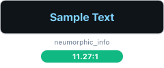</td>
<td><br/>Req: 4.5:1</td>
<td>✅ <strong>Pass</strong></td>
<td>Info States</td>
</tr>
<tr>
<td><strong>syntax keyword on neumorphic input</strong></td>
<td><span style="display:inline-block;width:40px;height:24px;background-color:#399ee6;border:1.5px solid #e5e7eb;border-radius:4px;vertical-align:middle;"></span> <code>#399ee6</code> <span style="color:#94a3b8;font-weight:500;">on</span> <span style="display:inline-block;width:40px;height:24px;background-color:#0b0e14;border:1.5px solid #e5e7eb;border-radius:4px;vertical-align:middle;"></span> <code>#0b0e14</code></td>
<td>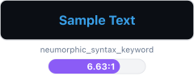</td>
<td><br/>Req: 4.5:1</td>
<td>✅ <strong>Pass</strong></td>
<td>Syntax Highlighting</td>
</tr>
<tr>
<td><strong>syntax string on neumorphic input</strong></td>
<td><span style="display:inline-block;width:40px;height:24px;background-color:#86b300;border:1.5px solid #e5e7eb;border-radius:4px;vertical-align:middle;"></span> <code>#86b300</code> <span style="color:#94a3b8;font-weight:500;">on</span> <span style="display:inline-block;width:40px;height:24px;background-color:#0b0e14;border:1.5px solid #e5e7eb;border-radius:4px;vertical-align:middle;"></span> <code>#0b0e14</code></td>
<td></td>
<td><br/>Req: 4.5:1</td>
<td>✅ <strong>Pass</strong></td>
<td>Syntax Highlighting</td>
</tr>
<tr>
<td><strong>syntax comment on neumorphic input</strong></td>
<td><span style="display:inline-block;width:40px;height:24px;background-color:#748291;border:1.5px solid #e5e7eb;border-radius:4px;vertical-align:middle;"></span> <code>#748291</code> <span style="color:#94a3b8;font-weight:500;">on</span> <span style="display:inline-block;width:40px;height:24px;background-color:#0b0e14;border:1.5px solid #e5e7eb;border-radius:4px;vertical-align:middle;"></span> <code>#0b0e14</code></td>
<td>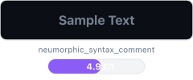</td>
<td><br/>Req: 4.5:1</td>
<td>✅ <strong>Pass</strong></td>
<td>Syntax Highlighting</td>
</tr>
<tr>
<td><strong>syntax number on neumorphic input</strong></td>
<td><span style="display:inline-block;width:40px;height:24px;background-color:#ffb454;border:1.5px solid #e5e7eb;border-radius:4px;vertical-align:middle;"></span> <code>#ffb454</code> <span style="color:#94a3b8;font-weight:500;">on</span> <span style="display:inline-block;width:40px;height:24px;background-color:#0b0e14;border:1.5px solid #e5e7eb;border-radius:4px;vertical-align:middle;"></span> <code>#0b0e14</code></td>
<td></td>
<td><br/>Req: 4.5:1</td>
<td>✅ <strong>Pass</strong></td>
<td>Syntax Highlighting</td>
</tr>
<tr>
<td><strong>syntax operator on neumorphic input</strong></td>
<td><span style="display:inline-block;width:40px;height:24px;background-color:#f29668;border:1.5px solid #e5e7eb;border-radius:4px;vertical-align:middle;"></span> <code>#f29668</code> <span style="color:#94a3b8;font-weight:500;">on</span> <span style="display:inline-block;width:40px;height:24px;background-color:#0b0e14;border:1.5px solid #e5e7eb;border-radius:4px;vertical-align:middle;"></span> <code>#0b0e14</code></td>
<td>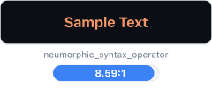</td>
<td><br/>Req: 4.5:1</td>
<td>✅ <strong>Pass</strong></td>
<td>Syntax Highlighting</td>
</tr>
<tr>
<td><strong>vcs added on neumorphic bg</strong></td>
<td><span style="display:inline-block;width:40px;height:24px;background-color:#34d399;border:1.5px solid #e5e7eb;border-radius:4px;vertical-align:middle;"></span> <code>#34d399</code> <span style="color:#94a3b8;font-weight:500;">on</span> <span style="display:inline-block;width:40px;height:24px;background-color:#0f1419;border:1.5px solid #e5e7eb;border-radius:4px;vertical-align:middle;"></span> <code>#0f1419</code></td>
<td></td>
<td><br/>Req: 4.5:1</td>
<td>✅ <strong>Pass</strong></td>
<td>Version Control</td>
</tr>
<tr>
<td><strong>vcs modified on neumorphic bg</strong></td>
<td><span style="display:inline-block;width:40px;height:24px;background-color:#60a5fa;border:1.5px solid #e5e7eb;border-radius:4px;vertical-align:middle;"></span> <code>#60a5fa</code> <span style="color:#94a3b8;font-weight:500;">on</span> <span style="display:inline-block;width:40px;height:24px;background-color:#0f1419;border:1.5px solid #e5e7eb;border-radius:4px;vertical-align:middle;"></span> <code>#0f1419</code></td>
<td></td>
<td><br/>Req: 4.5:1</td>
<td>✅ <strong>Pass</strong></td>
<td>Version Control</td>
</tr>
<tr>
<td><strong>vcs deleted on neumorphic bg</strong></td>
<td><span style="display:inline-block;width:40px;height:24px;background-color:#f87171;border:1.5px solid #e5e7eb;border-radius:4px;vertical-align:middle;"></span> <code>#f87171</code> <span style="color:#94a3b8;font-weight:500;">on</span> <span style="display:inline-block;width:40px;height:24px;background-color:#0f1419;border:1.5px solid #e5e7eb;border-radius:4px;vertical-align:middle;"></span> <code>#0f1419</code></td>
<td></td>
<td><br/>Req: 4.5:1</td>
<td>✅ <strong>Pass</strong></td>
<td>Version Control</td>
</tr>
</tbody>
</table>

#### Color Palette Samples

Sample colors from this theme:

<table>
<thead>
<tr>
<th>Color Role</th>
<th>Color Swatch</th>
<th>Hex Code</th>
</tr>
</thead>
<tbody>
<tr>
<td><strong>Primary Text</strong></td>
<td></td>
<td><code style="font-size:14px;">#bfbdb6</code></td>
</tr>
<tr>
<td><strong>Background</strong></td>
<td></td>
<td><code style="font-size:14px;">#0f1419</code></td>
</tr>
<tr>
<td><strong>Color 3</strong></td>
<td></td>
<td><code style="font-size:14px;">#131920</code></td>
</tr>
<tr>
<td><strong>Color 4</strong></td>
<td></td>
<td><code style="font-size:14px;">#0b0e14</code></td>
</tr>
<tr>
<td><strong>Color 5</strong></td>
<td></td>
<td><code style="font-size:14px;">#7a8999</code></td>
</tr>
<tr>
<td><strong>Color 6</strong></td>
<td></td>
<td><code style="font-size:14px;">#87d96c</code></td>
</tr>
</tbody>
</table>


**Accessibility Achievements**:
- ✅ All primary text combinations meet WCAG AA standards
- 11 tests exceed WCAG AAA (7:1) threshold
- Color contrast optimized for excellent readability

---


### 🎨 Neumorphism Forest (Pro) {#neumorphism-forest-pro}

**Compliance Status**: ✅ WCAG AA Certified
**Test Results**: 17/17 passed (100.0%)

#### Contrast Ratio Test Results

<table>
<thead>
<tr>
<th>Test Combination</th>
<th>Color Visualization</th>
<th>Visual Preview</th>
<th>Contrast Analysis</th>
<th>Status</th>
<th>Category</th>
</tr>
</thead>
<tbody>
<tr>
<td><strong>text primary on neumorphic bg</strong></td>
<td><span style="display:inline-block;width:40px;height:24px;background-color:#14532d;border:1.5px solid #e5e7eb;border-radius:4px;vertical-align:middle;"></span> <code>#14532d</code> <span style="color:#94a3b8;font-weight:500;">on</span> <span style="display:inline-block;width:40px;height:24px;background-color:#f6fdf6;border:1.5px solid #e5e7eb;border-radius:4px;vertical-align:middle;"></span> <code>#f6fdf6</code></td>
<td></td>
<td><br/>Req: 4.5:1</td>
<td>✅ <strong>Pass</strong></td>
<td>Primary Text</td>
</tr>
<tr>
<td><strong>text primary on neumorphic surface</strong></td>
<td><span style="display:inline-block;width:40px;height:24px;background-color:#14532d;border:1.5px solid #e5e7eb;border-radius:4px;vertical-align:middle;"></span> <code>#14532d</code> <span style="color:#94a3b8;font-weight:500;">on</span> <span style="display:inline-block;width:40px;height:24px;background-color:#e6ffe6;border:1.5px solid #e5e7eb;border-radius:4px;vertical-align:middle;"></span> <code>#e6ffe6</code></td>
<td></td>
<td><br/>Req: 4.5:1</td>
<td>✅ <strong>Pass</strong></td>
<td>Primary Text</td>
</tr>
<tr>
<td><strong>text primary on neumorphic input</strong></td>
<td><span style="display:inline-block;width:40px;height:24px;background-color:#14532d;border:1.5px solid #e5e7eb;border-radius:4px;vertical-align:middle;"></span> <code>#14532d</code> <span style="color:#94a3b8;font-weight:500;">on</span> <span style="display:inline-block;width:40px;height:24px;background-color:#ffffff;border:1.5px solid #e5e7eb;border-radius:4px;vertical-align:middle;"></span> <code>#ffffff</code></td>
<td></td>
<td><br/>Req: 4.5:1</td>
<td>✅ <strong>Pass</strong></td>
<td>Primary Text</td>
</tr>
<tr>
<td><strong>text secondary on neumorphic bg</strong></td>
<td><span style="display:inline-block;width:40px;height:24px;background-color:#6b7280;border:1.5px solid #e5e7eb;border-radius:4px;vertical-align:middle;"></span> <code>#6b7280</code> <span style="color:#94a3b8;font-weight:500;">on</span> <span style="display:inline-block;width:40px;height:24px;background-color:#f6fdf6;border:1.5px solid #e5e7eb;border-radius:4px;vertical-align:middle;"></span> <code>#f6fdf6</code></td>
<td></td>
<td><br/>Req: 4.5:1</td>
<td>✅ <strong>Pass</strong></td>
<td>Secondary Text</td>
</tr>
<tr>
<td><strong>text secondary on neumorphic surface</strong></td>
<td><span style="display:inline-block;width:40px;height:24px;background-color:#6b7280;border:1.5px solid #e5e7eb;border-radius:4px;vertical-align:middle;"></span> <code>#6b7280</code> <span style="color:#94a3b8;font-weight:500;">on</span> <span style="display:inline-block;width:40px;height:24px;background-color:#e6ffe6;border:1.5px solid #e5e7eb;border-radius:4px;vertical-align:middle;"></span> <code>#e6ffe6</code></td>
<td>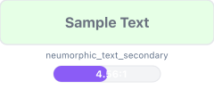</td>
<td><br/>Req: 4.5:1</td>
<td>✅ <strong>Pass</strong></td>
<td>Secondary Text</td>
</tr>
<tr>
<td><strong>success on neumorphic bg</strong></td>
<td><span style="display:inline-block;width:40px;height:24px;background-color:#14532d;border:1.5px solid #e5e7eb;border-radius:4px;vertical-align:middle;"></span> <code>#14532d</code> <span style="color:#94a3b8;font-weight:500;">on</span> <span style="display:inline-block;width:40px;height:24px;background-color:#f6fdf6;border:1.5px solid #e5e7eb;border-radius:4px;vertical-align:middle;"></span> <code>#f6fdf6</code></td>
<td></td>
<td><br/>Req: 4.5:1</td>
<td>✅ <strong>Pass</strong></td>
<td>Success States</td>
</tr>
<tr>
<td><strong>error on neumorphic bg</strong></td>
<td><span style="display:inline-block;width:40px;height:24px;background-color:#b91c1c;border:1.5px solid #e5e7eb;border-radius:4px;vertical-align:middle;"></span> <code>#b91c1c</code> <span style="color:#94a3b8;font-weight:500;">on</span> <span style="display:inline-block;width:40px;height:24px;background-color:#f6fdf6;border:1.5px solid #e5e7eb;border-radius:4px;vertical-align:middle;"></span> <code>#f6fdf6</code></td>
<td>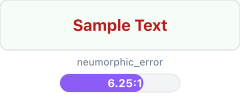</td>
<td><br/>Req: 4.5:1</td>
<td>✅ <strong>Pass</strong></td>
<td>Error States</td>
</tr>
<tr>
<td><strong>warning on neumorphic bg</strong></td>
<td><span style="display:inline-block;width:40px;height:24px;background-color:#a16207;border:1.5px solid #e5e7eb;border-radius:4px;vertical-align:middle;"></span> <code>#a16207</code> <span style="color:#94a3b8;font-weight:500;">on</span> <span style="display:inline-block;width:40px;height:24px;background-color:#f6fdf6;border:1.5px solid #e5e7eb;border-radius:4px;vertical-align:middle;"></span> <code>#f6fdf6</code></td>
<td>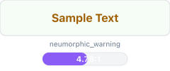</td>
<td><br/>Req: 4.5:1</td>
<td>✅ <strong>Pass</strong></td>
<td>Warning States</td>
</tr>
<tr>
<td><strong>info on neumorphic bg</strong></td>
<td><span style="display:inline-block;width:40px;height:24px;background-color:#1d4ed8;border:1.5px solid #e5e7eb;border-radius:4px;vertical-align:middle;"></span> <code>#1d4ed8</code> <span style="color:#94a3b8;font-weight:500;">on</span> <span style="display:inline-block;width:40px;height:24px;background-color:#f6fdf6;border:1.5px solid #e5e7eb;border-radius:4px;vertical-align:middle;"></span> <code>#f6fdf6</code></td>
<td></td>
<td><br/>Req: 4.5:1</td>
<td>✅ <strong>Pass</strong></td>
<td>Info States</td>
</tr>
<tr>
<td><strong>syntax keyword on neumorphic input</strong></td>
<td><span style="display:inline-block;width:40px;height:24px;background-color:#1d4ed8;border:1.5px solid #e5e7eb;border-radius:4px;vertical-align:middle;"></span> <code>#1d4ed8</code> <span style="color:#94a3b8;font-weight:500;">on</span> <span style="display:inline-block;width:40px;height:24px;background-color:#ffffff;border:1.5px solid #e5e7eb;border-radius:4px;vertical-align:middle;"></span> <code>#ffffff</code></td>
<td></td>
<td><br/>Req: 4.5:1</td>
<td>✅ <strong>Pass</strong></td>
<td>Syntax Highlighting</td>
</tr>
<tr>
<td><strong>syntax string on neumorphic input</strong></td>
<td><span style="display:inline-block;width:40px;height:24px;background-color:#14532d;border:1.5px solid #e5e7eb;border-radius:4px;vertical-align:middle;"></span> <code>#14532d</code> <span style="color:#94a3b8;font-weight:500;">on</span> <span style="display:inline-block;width:40px;height:24px;background-color:#ffffff;border:1.5px solid #e5e7eb;border-radius:4px;vertical-align:middle;"></span> <code>#ffffff</code></td>
<td></td>
<td><br/>Req: 4.5:1</td>
<td>✅ <strong>Pass</strong></td>
<td>Syntax Highlighting</td>
</tr>
<tr>
<td><strong>syntax comment on neumorphic input</strong></td>
<td><span style="display:inline-block;width:40px;height:24px;background-color:#4b5563;border:1.5px solid #e5e7eb;border-radius:4px;vertical-align:middle;"></span> <code>#4b5563</code> <span style="color:#94a3b8;font-weight:500;">on</span> <span style="display:inline-block;width:40px;height:24px;background-color:#ffffff;border:1.5px solid #e5e7eb;border-radius:4px;vertical-align:middle;"></span> <code>#ffffff</code></td>
<td></td>
<td><br/>Req: 4.5:1</td>
<td>✅ <strong>Pass</strong></td>
<td>Syntax Highlighting</td>
</tr>
<tr>
<td><strong>syntax number on neumorphic input</strong></td>
<td><span style="display:inline-block;width:40px;height:24px;background-color:#b45309;border:1.5px solid #e5e7eb;border-radius:4px;vertical-align:middle;"></span> <code>#b45309</code> <span style="color:#94a3b8;font-weight:500;">on</span> <span style="display:inline-block;width:40px;height:24px;background-color:#ffffff;border:1.5px solid #e5e7eb;border-radius:4px;vertical-align:middle;"></span> <code>#ffffff</code></td>
<td></td>
<td><br/>Req: 4.5:1</td>
<td>✅ <strong>Pass</strong></td>
<td>Syntax Highlighting</td>
</tr>
<tr>
<td><strong>syntax operator on neumorphic input</strong></td>
<td><span style="display:inline-block;width:40px;height:24px;background-color:#b91c1c;border:1.5px solid #e5e7eb;border-radius:4px;vertical-align:middle;"></span> <code>#b91c1c</code> <span style="color:#94a3b8;font-weight:500;">on</span> <span style="display:inline-block;width:40px;height:24px;background-color:#ffffff;border:1.5px solid #e5e7eb;border-radius:4px;vertical-align:middle;"></span> <code>#ffffff</code></td>
<td></td>
<td><br/>Req: 4.5:1</td>
<td>✅ <strong>Pass</strong></td>
<td>Syntax Highlighting</td>
</tr>
<tr>
<td><strong>vcs added on neumorphic bg</strong></td>
<td><span style="display:inline-block;width:40px;height:24px;background-color:#14532d;border:1.5px solid #e5e7eb;border-radius:4px;vertical-align:middle;"></span> <code>#14532d</code> <span style="color:#94a3b8;font-weight:500;">on</span> <span style="display:inline-block;width:40px;height:24px;background-color:#f6fdf6;border:1.5px solid #e5e7eb;border-radius:4px;vertical-align:middle;"></span> <code>#f6fdf6</code></td>
<td></td>
<td><br/>Req: 4.5:1</td>
<td>✅ <strong>Pass</strong></td>
<td>Version Control</td>
</tr>
<tr>
<td><strong>vcs modified on neumorphic bg</strong></td>
<td><span style="display:inline-block;width:40px;height:24px;background-color:#1d4ed8;border:1.5px solid #e5e7eb;border-radius:4px;vertical-align:middle;"></span> <code>#1d4ed8</code> <span style="color:#94a3b8;font-weight:500;">on</span> <span style="display:inline-block;width:40px;height:24px;background-color:#f6fdf6;border:1.5px solid #e5e7eb;border-radius:4px;vertical-align:middle;"></span> <code>#f6fdf6</code></td>
<td></td>
<td><br/>Req: 4.5:1</td>
<td>✅ <strong>Pass</strong></td>
<td>Version Control</td>
</tr>
<tr>
<td><strong>vcs deleted on neumorphic bg</strong></td>
<td><span style="display:inline-block;width:40px;height:24px;background-color:#b91c1c;border:1.5px solid #e5e7eb;border-radius:4px;vertical-align:middle;"></span> <code>#b91c1c</code> <span style="color:#94a3b8;font-weight:500;">on</span> <span style="display:inline-block;width:40px;height:24px;background-color:#f6fdf6;border:1.5px solid #e5e7eb;border-radius:4px;vertical-align:middle;"></span> <code>#f6fdf6</code></td>
<td></td>
<td><br/>Req: 4.5:1</td>
<td>✅ <strong>Pass</strong></td>
<td>Version Control</td>
</tr>
</tbody>
</table>

#### Color Palette Samples

Sample colors from this theme:

<table>
<thead>
<tr>
<th>Color Role</th>
<th>Color Swatch</th>
<th>Hex Code</th>
</tr>
</thead>
<tbody>
<tr>
<td><strong>Primary Text</strong></td>
<td></td>
<td><code style="font-size:14px;">#14532d</code></td>
</tr>
<tr>
<td><strong>Background</strong></td>
<td></td>
<td><code style="font-size:14px;">#f6fdf6</code></td>
</tr>
<tr>
<td><strong>Color 3</strong></td>
<td></td>
<td><code style="font-size:14px;">#e6ffe6</code></td>
</tr>
<tr>
<td><strong>Color 4</strong></td>
<td></td>
<td><code style="font-size:14px;">#ffffff</code></td>
</tr>
<tr>
<td><strong>Color 5</strong></td>
<td></td>
<td><code style="font-size:14px;">#6b7280</code></td>
</tr>
</tbody>
</table>


**Accessibility Achievements**:
- ✅ All primary text combinations meet WCAG AA standards
- 7 tests exceed WCAG AAA (7:1) threshold
- Color contrast optimized for excellent readability

---


### 🎨 Neumorphism Lavender (Pro) {#neumorphism-lavender-pro}

**Compliance Status**: ✅ WCAG AA Certified
**Test Results**: 17/17 passed (100.0%)

#### Contrast Ratio Test Results

<table>
<thead>
<tr>
<th>Test Combination</th>
<th>Color Visualization</th>
<th>Visual Preview</th>
<th>Contrast Analysis</th>
<th>Status</th>
<th>Category</th>
</tr>
</thead>
<tbody>
<tr>
<td><strong>text primary on neumorphic bg</strong></td>
<td><span style="display:inline-block;width:40px;height:24px;background-color:#1f2937;border:1.5px solid #e5e7eb;border-radius:4px;vertical-align:middle;"></span> <code>#1f2937</code> <span style="color:#94a3b8;font-weight:500;">on</span> <span style="display:inline-block;width:40px;height:24px;background-color:#faf7ff;border:1.5px solid #e5e7eb;border-radius:4px;vertical-align:middle;"></span> <code>#faf7ff</code></td>
<td></td>
<td><br/>Req: 4.5:1</td>
<td>✅ <strong>Pass</strong></td>
<td>Primary Text</td>
</tr>
<tr>
<td><strong>text primary on neumorphic surface</strong></td>
<td><span style="display:inline-block;width:40px;height:24px;background-color:#1f2937;border:1.5px solid #e5e7eb;border-radius:4px;vertical-align:middle;"></span> <code>#1f2937</code> <span style="color:#94a3b8;font-weight:500;">on</span> <span style="display:inline-block;width:40px;height:24px;background-color:#ede7ff;border:1.5px solid #e5e7eb;border-radius:4px;vertical-align:middle;"></span> <code>#ede7ff</code></td>
<td>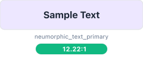</td>
<td><br/>Req: 4.5:1</td>
<td>✅ <strong>Pass</strong></td>
<td>Primary Text</td>
</tr>
<tr>
<td><strong>text primary on neumorphic input</strong></td>
<td><span style="display:inline-block;width:40px;height:24px;background-color:#1f2937;border:1.5px solid #e5e7eb;border-radius:4px;vertical-align:middle;"></span> <code>#1f2937</code> <span style="color:#94a3b8;font-weight:500;">on</span> <span style="display:inline-block;width:40px;height:24px;background-color:#fefefe;border:1.5px solid #e5e7eb;border-radius:4px;vertical-align:middle;"></span> <code>#fefefe</code></td>
<td></td>
<td><br/>Req: 4.5:1</td>
<td>✅ <strong>Pass</strong></td>
<td>Primary Text</td>
</tr>
<tr>
<td><strong>text secondary on neumorphic bg</strong></td>
<td><span style="display:inline-block;width:40px;height:24px;background-color:#5456cc;border:1.5px solid #e5e7eb;border-radius:4px;vertical-align:middle;"></span> <code>#5456cc</code> <span style="color:#94a3b8;font-weight:500;">on</span> <span style="display:inline-block;width:40px;height:24px;background-color:#faf7ff;border:1.5px solid #e5e7eb;border-radius:4px;vertical-align:middle;"></span> <code>#faf7ff</code></td>
<td></td>
<td><br/>Req: 4.5:1</td>
<td>✅ <strong>Pass</strong></td>
<td>Secondary Text</td>
</tr>
<tr>
<td><strong>text secondary on neumorphic surface</strong></td>
<td><span style="display:inline-block;width:40px;height:24px;background-color:#5456cc;border:1.5px solid #e5e7eb;border-radius:4px;vertical-align:middle;"></span> <code>#5456cc</code> <span style="color:#94a3b8;font-weight:500;">on</span> <span style="display:inline-block;width:40px;height:24px;background-color:#ede7ff;border:1.5px solid #e5e7eb;border-radius:4px;vertical-align:middle;"></span> <code>#ede7ff</code></td>
<td>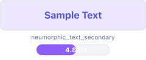</td>
<td><br/>Req: 4.5:1</td>
<td>✅ <strong>Pass</strong></td>
<td>Secondary Text</td>
</tr>
<tr>
<td><strong>success on neumorphic bg</strong></td>
<td><span style="display:inline-block;width:40px;height:24px;background-color:#14532d;border:1.5px solid #e5e7eb;border-radius:4px;vertical-align:middle;"></span> <code>#14532d</code> <span style="color:#94a3b8;font-weight:500;">on</span> <span style="display:inline-block;width:40px;height:24px;background-color:#faf7ff;border:1.5px solid #e5e7eb;border-radius:4px;vertical-align:middle;"></span> <code>#faf7ff</code></td>
<td></td>
<td><br/>Req: 4.5:1</td>
<td>✅ <strong>Pass</strong></td>
<td>Success States</td>
</tr>
<tr>
<td><strong>error on neumorphic bg</strong></td>
<td><span style="display:inline-block;width:40px;height:24px;background-color:#b91c1c;border:1.5px solid #e5e7eb;border-radius:4px;vertical-align:middle;"></span> <code>#b91c1c</code> <span style="color:#94a3b8;font-weight:500;">on</span> <span style="display:inline-block;width:40px;height:24px;background-color:#faf7ff;border:1.5px solid #e5e7eb;border-radius:4px;vertical-align:middle;"></span> <code>#faf7ff</code></td>
<td>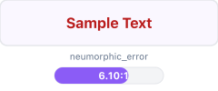</td>
<td><br/>Req: 4.5:1</td>
<td>✅ <strong>Pass</strong></td>
<td>Error States</td>
</tr>
<tr>
<td><strong>warning on neumorphic bg</strong></td>
<td><span style="display:inline-block;width:40px;height:24px;background-color:#a16207;border:1.5px solid #e5e7eb;border-radius:4px;vertical-align:middle;"></span> <code>#a16207</code> <span style="color:#94a3b8;font-weight:500;">on</span> <span style="display:inline-block;width:40px;height:24px;background-color:#faf7ff;border:1.5px solid #e5e7eb;border-radius:4px;vertical-align:middle;"></span> <code>#faf7ff</code></td>
<td></td>
<td><br/>Req: 4.5:1</td>
<td>✅ <strong>Pass</strong></td>
<td>Warning States</td>
</tr>
<tr>
<td><strong>info on neumorphic bg</strong></td>
<td><span style="display:inline-block;width:40px;height:24px;background-color:#1d4ed8;border:1.5px solid #e5e7eb;border-radius:4px;vertical-align:middle;"></span> <code>#1d4ed8</code> <span style="color:#94a3b8;font-weight:500;">on</span> <span style="display:inline-block;width:40px;height:24px;background-color:#faf7ff;border:1.5px solid #e5e7eb;border-radius:4px;vertical-align:middle;"></span> <code>#faf7ff</code></td>
<td></td>
<td><br/>Req: 4.5:1</td>
<td>✅ <strong>Pass</strong></td>
<td>Info States</td>
</tr>
<tr>
<td><strong>syntax keyword on neumorphic input</strong></td>
<td><span style="display:inline-block;width:40px;height:24px;background-color:#1d4ed8;border:1.5px solid #e5e7eb;border-radius:4px;vertical-align:middle;"></span> <code>#1d4ed8</code> <span style="color:#94a3b8;font-weight:500;">on</span> <span style="display:inline-block;width:40px;height:24px;background-color:#fefefe;border:1.5px solid #e5e7eb;border-radius:4px;vertical-align:middle;"></span> <code>#fefefe</code></td>
<td>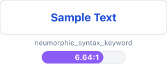</td>
<td><br/>Req: 4.5:1</td>
<td>✅ <strong>Pass</strong></td>
<td>Syntax Highlighting</td>
</tr>
<tr>
<td><strong>syntax string on neumorphic input</strong></td>
<td><span style="display:inline-block;width:40px;height:24px;background-color:#14532d;border:1.5px solid #e5e7eb;border-radius:4px;vertical-align:middle;"></span> <code>#14532d</code> <span style="color:#94a3b8;font-weight:500;">on</span> <span style="display:inline-block;width:40px;height:24px;background-color:#fefefe;border:1.5px solid #e5e7eb;border-radius:4px;vertical-align:middle;"></span> <code>#fefefe</code></td>
<td></td>
<td><br/>Req: 4.5:1</td>
<td>✅ <strong>Pass</strong></td>
<td>Syntax Highlighting</td>
</tr>
<tr>
<td><strong>syntax comment on neumorphic input</strong></td>
<td><span style="display:inline-block;width:40px;height:24px;background-color:#4b5563;border:1.5px solid #e5e7eb;border-radius:4px;vertical-align:middle;"></span> <code>#4b5563</code> <span style="color:#94a3b8;font-weight:500;">on</span> <span style="display:inline-block;width:40px;height:24px;background-color:#fefefe;border:1.5px solid #e5e7eb;border-radius:4px;vertical-align:middle;"></span> <code>#fefefe</code></td>
<td></td>
<td><br/>Req: 4.5:1</td>
<td>✅ <strong>Pass</strong></td>
<td>Syntax Highlighting</td>
</tr>
<tr>
<td><strong>syntax number on neumorphic input</strong></td>
<td><span style="display:inline-block;width:40px;height:24px;background-color:#b45309;border:1.5px solid #e5e7eb;border-radius:4px;vertical-align:middle;"></span> <code>#b45309</code> <span style="color:#94a3b8;font-weight:500;">on</span> <span style="display:inline-block;width:40px;height:24px;background-color:#fefefe;border:1.5px solid #e5e7eb;border-radius:4px;vertical-align:middle;"></span> <code>#fefefe</code></td>
<td></td>
<td><br/>Req: 4.5:1</td>
<td>✅ <strong>Pass</strong></td>
<td>Syntax Highlighting</td>
</tr>
<tr>
<td><strong>syntax operator on neumorphic input</strong></td>
<td><span style="display:inline-block;width:40px;height:24px;background-color:#b91c1c;border:1.5px solid #e5e7eb;border-radius:4px;vertical-align:middle;"></span> <code>#b91c1c</code> <span style="color:#94a3b8;font-weight:500;">on</span> <span style="display:inline-block;width:40px;height:24px;background-color:#fefefe;border:1.5px solid #e5e7eb;border-radius:4px;vertical-align:middle;"></span> <code>#fefefe</code></td>
<td></td>
<td><br/>Req: 4.5:1</td>
<td>✅ <strong>Pass</strong></td>
<td>Syntax Highlighting</td>
</tr>
<tr>
<td><strong>vcs added on neumorphic bg</strong></td>
<td><span style="display:inline-block;width:40px;height:24px;background-color:#14532d;border:1.5px solid #e5e7eb;border-radius:4px;vertical-align:middle;"></span> <code>#14532d</code> <span style="color:#94a3b8;font-weight:500;">on</span> <span style="display:inline-block;width:40px;height:24px;background-color:#faf7ff;border:1.5px solid #e5e7eb;border-radius:4px;vertical-align:middle;"></span> <code>#faf7ff</code></td>
<td></td>
<td><br/>Req: 4.5:1</td>
<td>✅ <strong>Pass</strong></td>
<td>Version Control</td>
</tr>
<tr>
<td><strong>vcs modified on neumorphic bg</strong></td>
<td><span style="display:inline-block;width:40px;height:24px;background-color:#1d4ed8;border:1.5px solid #e5e7eb;border-radius:4px;vertical-align:middle;"></span> <code>#1d4ed8</code> <span style="color:#94a3b8;font-weight:500;">on</span> <span style="display:inline-block;width:40px;height:24px;background-color:#faf7ff;border:1.5px solid #e5e7eb;border-radius:4px;vertical-align:middle;"></span> <code>#faf7ff</code></td>
<td></td>
<td><br/>Req: 4.5:1</td>
<td>✅ <strong>Pass</strong></td>
<td>Version Control</td>
</tr>
<tr>
<td><strong>vcs deleted on neumorphic bg</strong></td>
<td><span style="display:inline-block;width:40px;height:24px;background-color:#b91c1c;border:1.5px solid #e5e7eb;border-radius:4px;vertical-align:middle;"></span> <code>#b91c1c</code> <span style="color:#94a3b8;font-weight:500;">on</span> <span style="display:inline-block;width:40px;height:24px;background-color:#faf7ff;border:1.5px solid #e5e7eb;border-radius:4px;vertical-align:middle;"></span> <code>#faf7ff</code></td>
<td></td>
<td><br/>Req: 4.5:1</td>
<td>✅ <strong>Pass</strong></td>
<td>Version Control</td>
</tr>
</tbody>
</table>

#### Color Palette Samples

Sample colors from this theme:

<table>
<thead>
<tr>
<th>Color Role</th>
<th>Color Swatch</th>
<th>Hex Code</th>
</tr>
</thead>
<tbody>
<tr>
<td><strong>Primary Text</strong></td>
<td></td>
<td><code style="font-size:14px;">#1f2937</code></td>
</tr>
<tr>
<td><strong>Background</strong></td>
<td></td>
<td><code style="font-size:14px;">#faf7ff</code></td>
</tr>
<tr>
<td><strong>Color 3</strong></td>
<td></td>
<td><code style="font-size:14px;">#ede7ff</code></td>
</tr>
<tr>
<td><strong>Color 4</strong></td>
<td></td>
<td><code style="font-size:14px;">#fefefe</code></td>
</tr>
<tr>
<td><strong>Color 5</strong></td>
<td></td>
<td><code style="font-size:14px;">#5456cc</code></td>
</tr>
<tr>
<td><strong>Color 6</strong></td>
<td></td>
<td><code style="font-size:14px;">#14532d</code></td>
</tr>
</tbody>
</table>


**Accessibility Achievements**:
- ✅ All primary text combinations meet WCAG AA standards
- 7 tests exceed WCAG AAA (7:1) threshold
- Color contrast optimized for excellent readability

---


### 🎨 Neumorphism Midnight (Pro) {#neumorphism-midnight-pro}

**Compliance Status**: ✅ WCAG AA Certified
**Test Results**: 17/17 passed (100.0%)

#### Contrast Ratio Test Results

<table>
<thead>
<tr>
<th>Test Combination</th>
<th>Color Visualization</th>
<th>Visual Preview</th>
<th>Contrast Analysis</th>
<th>Status</th>
<th>Category</th>
</tr>
</thead>
<tbody>
<tr>
<td><strong>text primary on neumorphic bg</strong></td>
<td><span style="display:inline-block;width:40px;height:24px;background-color:#e2e8f0;border:1.5px solid #e5e7eb;border-radius:4px;vertical-align:middle;"></span> <code>#e2e8f0</code> <span style="color:#94a3b8;font-weight:500;">on</span> <span style="display:inline-block;width:40px;height:24px;background-color:#0a0a0f;border:1.5px solid #e5e7eb;border-radius:4px;vertical-align:middle;"></span> <code>#0a0a0f</code></td>
<td></td>
<td><br/>Req: 4.5:1</td>
<td>✅ <strong>Pass</strong></td>
<td>Primary Text</td>
</tr>
<tr>
<td><strong>text primary on neumorphic surface</strong></td>
<td><span style="display:inline-block;width:40px;height:24px;background-color:#e2e8f0;border:1.5px solid #e5e7eb;border-radius:4px;vertical-align:middle;"></span> <code>#e2e8f0</code> <span style="color:#94a3b8;font-weight:500;">on</span> <span style="display:inline-block;width:40px;height:24px;background-color:#0f0f1a;border:1.5px solid #e5e7eb;border-radius:4px;vertical-align:middle;"></span> <code>#0f0f1a</code></td>
<td>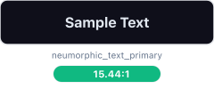</td>
<td><br/>Req: 4.5:1</td>
<td>✅ <strong>Pass</strong></td>
<td>Primary Text</td>
</tr>
<tr>
<td><strong>text primary on neumorphic input</strong></td>
<td><span style="display:inline-block;width:40px;height:24px;background-color:#e2e8f0;border:1.5px solid #e5e7eb;border-radius:4px;vertical-align:middle;"></span> <code>#e2e8f0</code> <span style="color:#94a3b8;font-weight:500;">on</span> <span style="display:inline-block;width:40px;height:24px;background-color:#000000;border:1.5px solid #e5e7eb;border-radius:4px;vertical-align:middle;"></span> <code>#000000</code></td>
<td></td>
<td><br/>Req: 4.5:1</td>
<td>✅ <strong>Pass</strong></td>
<td>Primary Text</td>
</tr>
<tr>
<td><strong>text secondary on neumorphic bg</strong></td>
<td><span style="display:inline-block;width:40px;height:24px;background-color:#94a3b8;border:1.5px solid #e5e7eb;border-radius:4px;vertical-align:middle;"></span> <code>#94a3b8</code> <span style="color:#94a3b8;font-weight:500;">on</span> <span style="display:inline-block;width:40px;height:24px;background-color:#0a0a0f;border:1.5px solid #e5e7eb;border-radius:4px;vertical-align:middle;"></span> <code>#0a0a0f</code></td>
<td></td>
<td><br/>Req: 4.5:1</td>
<td>✅ <strong>Pass</strong></td>
<td>Secondary Text</td>
</tr>
<tr>
<td><strong>text secondary on neumorphic surface</strong></td>
<td><span style="display:inline-block;width:40px;height:24px;background-color:#94a3b8;border:1.5px solid #e5e7eb;border-radius:4px;vertical-align:middle;"></span> <code>#94a3b8</code> <span style="color:#94a3b8;font-weight:500;">on</span> <span style="display:inline-block;width:40px;height:24px;background-color:#0f0f1a;border:1.5px solid #e5e7eb;border-radius:4px;vertical-align:middle;"></span> <code>#0f0f1a</code></td>
<td></td>
<td><br/>Req: 4.5:1</td>
<td>✅ <strong>Pass</strong></td>
<td>Secondary Text</td>
</tr>
<tr>
<td><strong>success on neumorphic bg</strong></td>
<td><span style="display:inline-block;width:40px;height:24px;background-color:#34d399;border:1.5px solid #e5e7eb;border-radius:4px;vertical-align:middle;"></span> <code>#34d399</code> <span style="color:#94a3b8;font-weight:500;">on</span> <span style="display:inline-block;width:40px;height:24px;background-color:#0a0a0f;border:1.5px solid #e5e7eb;border-radius:4px;vertical-align:middle;"></span> <code>#0a0a0f</code></td>
<td>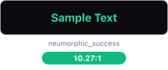</td>
<td><br/>Req: 4.5:1</td>
<td>✅ <strong>Pass</strong></td>
<td>Success States</td>
</tr>
<tr>
<td><strong>error on neumorphic bg</strong></td>
<td><span style="display:inline-block;width:40px;height:24px;background-color:#f87171;border:1.5px solid #e5e7eb;border-radius:4px;vertical-align:middle;"></span> <code>#f87171</code> <span style="color:#94a3b8;font-weight:500;">on</span> <span style="display:inline-block;width:40px;height:24px;background-color:#0a0a0f;border:1.5px solid #e5e7eb;border-radius:4px;vertical-align:middle;"></span> <code>#0a0a0f</code></td>
<td>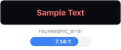</td>
<td><br/>Req: 4.5:1</td>
<td>✅ <strong>Pass</strong></td>
<td>Error States</td>
</tr>
<tr>
<td><strong>warning on neumorphic bg</strong></td>
<td><span style="display:inline-block;width:40px;height:24px;background-color:#fbbf24;border:1.5px solid #e5e7eb;border-radius:4px;vertical-align:middle;"></span> <code>#fbbf24</code> <span style="color:#94a3b8;font-weight:500;">on</span> <span style="display:inline-block;width:40px;height:24px;background-color:#0a0a0f;border:1.5px solid #e5e7eb;border-radius:4px;vertical-align:middle;"></span> <code>#0a0a0f</code></td>
<td></td>
<td><br/>Req: 4.5:1</td>
<td>✅ <strong>Pass</strong></td>
<td>Warning States</td>
</tr>
<tr>
<td><strong>info on neumorphic bg</strong></td>
<td><span style="display:inline-block;width:40px;height:24px;background-color:#60a5fa;border:1.5px solid #e5e7eb;border-radius:4px;vertical-align:middle;"></span> <code>#60a5fa</code> <span style="color:#94a3b8;font-weight:500;">on</span> <span style="display:inline-block;width:40px;height:24px;background-color:#0a0a0f;border:1.5px solid #e5e7eb;border-radius:4px;vertical-align:middle;"></span> <code>#0a0a0f</code></td>
<td></td>
<td><br/>Req: 4.5:1</td>
<td>✅ <strong>Pass</strong></td>
<td>Info States</td>
</tr>
<tr>
<td><strong>syntax keyword on neumorphic input</strong></td>
<td><span style="display:inline-block;width:40px;height:24px;background-color:#a78bfa;border:1.5px solid #e5e7eb;border-radius:4px;vertical-align:middle;"></span> <code>#a78bfa</code> <span style="color:#94a3b8;font-weight:500;">on</span> <span style="display:inline-block;width:40px;height:24px;background-color:#000000;border:1.5px solid #e5e7eb;border-radius:4px;vertical-align:middle;"></span> <code>#000000</code></td>
<td></td>
<td><br/>Req: 4.5:1</td>
<td>✅ <strong>Pass</strong></td>
<td>Syntax Highlighting</td>
</tr>
<tr>
<td><strong>syntax string on neumorphic input</strong></td>
<td><span style="display:inline-block;width:40px;height:24px;background-color:#34d399;border:1.5px solid #e5e7eb;border-radius:4px;vertical-align:middle;"></span> <code>#34d399</code> <span style="color:#94a3b8;font-weight:500;">on</span> <span style="display:inline-block;width:40px;height:24px;background-color:#000000;border:1.5px solid #e5e7eb;border-radius:4px;vertical-align:middle;"></span> <code>#000000</code></td>
<td>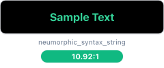</td>
<td><br/>Req: 4.5:1</td>
<td>✅ <strong>Pass</strong></td>
<td>Syntax Highlighting</td>
</tr>
<tr>
<td><strong>syntax comment on neumorphic input</strong></td>
<td><span style="display:inline-block;width:40px;height:24px;background-color:#68788f;border:1.5px solid #e5e7eb;border-radius:4px;vertical-align:middle;"></span> <code>#68788f</code> <span style="color:#94a3b8;font-weight:500;">on</span> <span style="display:inline-block;width:40px;height:24px;background-color:#000000;border:1.5px solid #e5e7eb;border-radius:4px;vertical-align:middle;"></span> <code>#000000</code></td>
<td>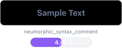</td>
<td><br/>Req: 4.5:1</td>
<td>✅ <strong>Pass</strong></td>
<td>Syntax Highlighting</td>
</tr>
<tr>
<td><strong>syntax number on neumorphic input</strong></td>
<td><span style="display:inline-block;width:40px;height:24px;background-color:#fbbf24;border:1.5px solid #e5e7eb;border-radius:4px;vertical-align:middle;"></span> <code>#fbbf24</code> <span style="color:#94a3b8;font-weight:500;">on</span> <span style="display:inline-block;width:40px;height:24px;background-color:#000000;border:1.5px solid #e5e7eb;border-radius:4px;vertical-align:middle;"></span> <code>#000000</code></td>
<td>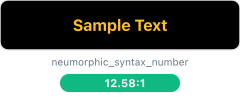</td>
<td><br/>Req: 4.5:1</td>
<td>✅ <strong>Pass</strong></td>
<td>Syntax Highlighting</td>
</tr>
<tr>
<td><strong>syntax operator on neumorphic input</strong></td>
<td><span style="display:inline-block;width:40px;height:24px;background-color:#f87171;border:1.5px solid #e5e7eb;border-radius:4px;vertical-align:middle;"></span> <code>#f87171</code> <span style="color:#94a3b8;font-weight:500;">on</span> <span style="display:inline-block;width:40px;height:24px;background-color:#000000;border:1.5px solid #e5e7eb;border-radius:4px;vertical-align:middle;"></span> <code>#000000</code></td>
<td>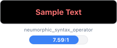</td>
<td><br/>Req: 4.5:1</td>
<td>✅ <strong>Pass</strong></td>
<td>Syntax Highlighting</td>
</tr>
<tr>
<td><strong>vcs added on neumorphic bg</strong></td>
<td><span style="display:inline-block;width:40px;height:24px;background-color:#34d399;border:1.5px solid #e5e7eb;border-radius:4px;vertical-align:middle;"></span> <code>#34d399</code> <span style="color:#94a3b8;font-weight:500;">on</span> <span style="display:inline-block;width:40px;height:24px;background-color:#0a0a0f;border:1.5px solid #e5e7eb;border-radius:4px;vertical-align:middle;"></span> <code>#0a0a0f</code></td>
<td></td>
<td><br/>Req: 4.5:1</td>
<td>✅ <strong>Pass</strong></td>
<td>Version Control</td>
</tr>
<tr>
<td><strong>vcs modified on neumorphic bg</strong></td>
<td><span style="display:inline-block;width:40px;height:24px;background-color:#60a5fa;border:1.5px solid #e5e7eb;border-radius:4px;vertical-align:middle;"></span> <code>#60a5fa</code> <span style="color:#94a3b8;font-weight:500;">on</span> <span style="display:inline-block;width:40px;height:24px;background-color:#0a0a0f;border:1.5px solid #e5e7eb;border-radius:4px;vertical-align:middle;"></span> <code>#0a0a0f</code></td>
<td></td>
<td><br/>Req: 4.5:1</td>
<td>✅ <strong>Pass</strong></td>
<td>Version Control</td>
</tr>
<tr>
<td><strong>vcs deleted on neumorphic bg</strong></td>
<td><span style="display:inline-block;width:40px;height:24px;background-color:#f87171;border:1.5px solid #e5e7eb;border-radius:4px;vertical-align:middle;"></span> <code>#f87171</code> <span style="color:#94a3b8;font-weight:500;">on</span> <span style="display:inline-block;width:40px;height:24px;background-color:#0a0a0f;border:1.5px solid #e5e7eb;border-radius:4px;vertical-align:middle;"></span> <code>#0a0a0f</code></td>
<td></td>
<td><br/>Req: 4.5:1</td>
<td>✅ <strong>Pass</strong></td>
<td>Version Control</td>
</tr>
</tbody>
</table>

#### Color Palette Samples

Sample colors from this theme:

<table>
<thead>
<tr>
<th>Color Role</th>
<th>Color Swatch</th>
<th>Hex Code</th>
</tr>
</thead>
<tbody>
<tr>
<td><strong>Primary Text</strong></td>
<td></td>
<td><code style="font-size:14px;">#e2e8f0</code></td>
</tr>
<tr>
<td><strong>Background</strong></td>
<td></td>
<td><code style="font-size:14px;">#0a0a0f</code></td>
</tr>
<tr>
<td><strong>Color 3</strong></td>
<td></td>
<td><code style="font-size:14px;">#0f0f1a</code></td>
</tr>
<tr>
<td><strong>Color 4</strong></td>
<td></td>
<td><code style="font-size:14px;">#000000</code></td>
</tr>
<tr>
<td><strong>Color 5</strong></td>
<td></td>
<td><code style="font-size:14px;">#94a3b8</code></td>
</tr>
<tr>
<td><strong>Color 6</strong></td>
<td></td>
<td><code style="font-size:14px;">#34d399</code></td>
</tr>
</tbody>
</table>


**Accessibility Achievements**:
- ✅ All primary text combinations meet WCAG AA standards
- 16 tests exceed WCAG AAA (7:1) threshold
- Color contrast optimized for excellent readability

---


### 🎨 Neumorphism Ocean Breeze {#neumorphism-ocean-breeze}

**Compliance Status**: ✅ WCAG AA Certified
**Test Results**: 17/17 passed (100.0%)

#### Contrast Ratio Test Results

<table>
<thead>
<tr>
<th>Test Combination</th>
<th>Color Visualization</th>
<th>Visual Preview</th>
<th>Contrast Analysis</th>
<th>Status</th>
<th>Category</th>
</tr>
</thead>
<tbody>
<tr>
<td><strong>text primary on neumorphic bg</strong></td>
<td><span style="display:inline-block;width:40px;height:24px;background-color:#0c4a6e;border:1.5px solid #e5e7eb;border-radius:4px;vertical-align:middle;"></span> <code>#0c4a6e</code> <span style="color:#94a3b8;font-weight:500;">on</span> <span style="display:inline-block;width:40px;height:24px;background-color:#f0f9ff;border:1.5px solid #e5e7eb;border-radius:4px;vertical-align:middle;"></span> <code>#f0f9ff</code></td>
<td></td>
<td><br/>Req: 4.5:1</td>
<td>✅ <strong>Pass</strong></td>
<td>Primary Text</td>
</tr>
<tr>
<td><strong>text primary on neumorphic surface</strong></td>
<td><span style="display:inline-block;width:40px;height:24px;background-color:#0c4a6e;border:1.5px solid #e5e7eb;border-radius:4px;vertical-align:middle;"></span> <code>#0c4a6e</code> <span style="color:#94a3b8;font-weight:500;">on</span> <span style="display:inline-block;width:40px;height:24px;background-color:#e0f2fe;border:1.5px solid #e5e7eb;border-radius:4px;vertical-align:middle;"></span> <code>#e0f2fe</code></td>
<td>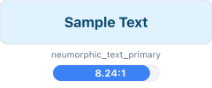</td>
<td><br/>Req: 4.5:1</td>
<td>✅ <strong>Pass</strong></td>
<td>Primary Text</td>
</tr>
<tr>
<td><strong>text primary on neumorphic input</strong></td>
<td><span style="display:inline-block;width:40px;height:24px;background-color:#0c4a6e;border:1.5px solid #e5e7eb;border-radius:4px;vertical-align:middle;"></span> <code>#0c4a6e</code> <span style="color:#94a3b8;font-weight:500;">on</span> <span style="display:inline-block;width:40px;height:24px;background-color:#fefefe;border:1.5px solid #e5e7eb;border-radius:4px;vertical-align:middle;"></span> <code>#fefefe</code></td>
<td></td>
<td><br/>Req: 4.5:1</td>
<td>✅ <strong>Pass</strong></td>
<td>Primary Text</td>
</tr>
<tr>
<td><strong>text secondary on neumorphic bg</strong></td>
<td><span style="display:inline-block;width:40px;height:24px;background-color:#5b6a7f;border:1.5px solid #e5e7eb;border-radius:4px;vertical-align:middle;"></span> <code>#5b6a7f</code> <span style="color:#94a3b8;font-weight:500;">on</span> <span style="display:inline-block;width:40px;height:24px;background-color:#f0f9ff;border:1.5px solid #e5e7eb;border-radius:4px;vertical-align:middle;"></span> <code>#f0f9ff</code></td>
<td></td>
<td><br/>Req: 4.5:1</td>
<td>✅ <strong>Pass</strong></td>
<td>Secondary Text</td>
</tr>
<tr>
<td><strong>text secondary on neumorphic surface</strong></td>
<td><span style="display:inline-block;width:40px;height:24px;background-color:#5b6a7f;border:1.5px solid #e5e7eb;border-radius:4px;vertical-align:middle;"></span> <code>#5b6a7f</code> <span style="color:#94a3b8;font-weight:500;">on</span> <span style="display:inline-block;width:40px;height:24px;background-color:#e0f2fe;border:1.5px solid #e5e7eb;border-radius:4px;vertical-align:middle;"></span> <code>#e0f2fe</code></td>
<td></td>
<td><br/>Req: 4.5:1</td>
<td>✅ <strong>Pass</strong></td>
<td>Secondary Text</td>
</tr>
<tr>
<td><strong>success on neumorphic bg</strong></td>
<td><span style="display:inline-block;width:40px;height:24px;background-color:#14532d;border:1.5px solid #e5e7eb;border-radius:4px;vertical-align:middle;"></span> <code>#14532d</code> <span style="color:#94a3b8;font-weight:500;">on</span> <span style="display:inline-block;width:40px;height:24px;background-color:#f0f9ff;border:1.5px solid #e5e7eb;border-radius:4px;vertical-align:middle;"></span> <code>#f0f9ff</code></td>
<td></td>
<td><br/>Req: 4.5:1</td>
<td>✅ <strong>Pass</strong></td>
<td>Success States</td>
</tr>
<tr>
<td><strong>error on neumorphic bg</strong></td>
<td><span style="display:inline-block;width:40px;height:24px;background-color:#b91c1c;border:1.5px solid #e5e7eb;border-radius:4px;vertical-align:middle;"></span> <code>#b91c1c</code> <span style="color:#94a3b8;font-weight:500;">on</span> <span style="display:inline-block;width:40px;height:24px;background-color:#f0f9ff;border:1.5px solid #e5e7eb;border-radius:4px;vertical-align:middle;"></span> <code>#f0f9ff</code></td>
<td></td>
<td><br/>Req: 4.5:1</td>
<td>✅ <strong>Pass</strong></td>
<td>Error States</td>
</tr>
<tr>
<td><strong>warning on neumorphic bg</strong></td>
<td><span style="display:inline-block;width:40px;height:24px;background-color:#a16207;border:1.5px solid #e5e7eb;border-radius:4px;vertical-align:middle;"></span> <code>#a16207</code> <span style="color:#94a3b8;font-weight:500;">on</span> <span style="display:inline-block;width:40px;height:24px;background-color:#f0f9ff;border:1.5px solid #e5e7eb;border-radius:4px;vertical-align:middle;"></span> <code>#f0f9ff</code></td>
<td></td>
<td><br/>Req: 4.5:1</td>
<td>✅ <strong>Pass</strong></td>
<td>Warning States</td>
</tr>
<tr>
<td><strong>info on neumorphic bg</strong></td>
<td><span style="display:inline-block;width:40px;height:24px;background-color:#1d4ed8;border:1.5px solid #e5e7eb;border-radius:4px;vertical-align:middle;"></span> <code>#1d4ed8</code> <span style="color:#94a3b8;font-weight:500;">on</span> <span style="display:inline-block;width:40px;height:24px;background-color:#f0f9ff;border:1.5px solid #e5e7eb;border-radius:4px;vertical-align:middle;"></span> <code>#f0f9ff</code></td>
<td>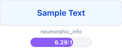</td>
<td><br/>Req: 4.5:1</td>
<td>✅ <strong>Pass</strong></td>
<td>Info States</td>
</tr>
<tr>
<td><strong>syntax keyword on neumorphic input</strong></td>
<td><span style="display:inline-block;width:40px;height:24px;background-color:#1d4ed8;border:1.5px solid #e5e7eb;border-radius:4px;vertical-align:middle;"></span> <code>#1d4ed8</code> <span style="color:#94a3b8;font-weight:500;">on</span> <span style="display:inline-block;width:40px;height:24px;background-color:#fefefe;border:1.5px solid #e5e7eb;border-radius:4px;vertical-align:middle;"></span> <code>#fefefe</code></td>
<td></td>
<td><br/>Req: 4.5:1</td>
<td>✅ <strong>Pass</strong></td>
<td>Syntax Highlighting</td>
</tr>
<tr>
<td><strong>syntax string on neumorphic input</strong></td>
<td><span style="display:inline-block;width:40px;height:24px;background-color:#14532d;border:1.5px solid #e5e7eb;border-radius:4px;vertical-align:middle;"></span> <code>#14532d</code> <span style="color:#94a3b8;font-weight:500;">on</span> <span style="display:inline-block;width:40px;height:24px;background-color:#fefefe;border:1.5px solid #e5e7eb;border-radius:4px;vertical-align:middle;"></span> <code>#fefefe</code></td>
<td></td>
<td><br/>Req: 4.5:1</td>
<td>✅ <strong>Pass</strong></td>
<td>Syntax Highlighting</td>
</tr>
<tr>
<td><strong>syntax comment on neumorphic input</strong></td>
<td><span style="display:inline-block;width:40px;height:24px;background-color:#4b5563;border:1.5px solid #e5e7eb;border-radius:4px;vertical-align:middle;"></span> <code>#4b5563</code> <span style="color:#94a3b8;font-weight:500;">on</span> <span style="display:inline-block;width:40px;height:24px;background-color:#fefefe;border:1.5px solid #e5e7eb;border-radius:4px;vertical-align:middle;"></span> <code>#fefefe</code></td>
<td></td>
<td><br/>Req: 4.5:1</td>
<td>✅ <strong>Pass</strong></td>
<td>Syntax Highlighting</td>
</tr>
<tr>
<td><strong>syntax number on neumorphic input</strong></td>
<td><span style="display:inline-block;width:40px;height:24px;background-color:#b45309;border:1.5px solid #e5e7eb;border-radius:4px;vertical-align:middle;"></span> <code>#b45309</code> <span style="color:#94a3b8;font-weight:500;">on</span> <span style="display:inline-block;width:40px;height:24px;background-color:#fefefe;border:1.5px solid #e5e7eb;border-radius:4px;vertical-align:middle;"></span> <code>#fefefe</code></td>
<td></td>
<td><br/>Req: 4.5:1</td>
<td>✅ <strong>Pass</strong></td>
<td>Syntax Highlighting</td>
</tr>
<tr>
<td><strong>syntax operator on neumorphic input</strong></td>
<td><span style="display:inline-block;width:40px;height:24px;background-color:#b91c1c;border:1.5px solid #e5e7eb;border-radius:4px;vertical-align:middle;"></span> <code>#b91c1c</code> <span style="color:#94a3b8;font-weight:500;">on</span> <span style="display:inline-block;width:40px;height:24px;background-color:#fefefe;border:1.5px solid #e5e7eb;border-radius:4px;vertical-align:middle;"></span> <code>#fefefe</code></td>
<td></td>
<td><br/>Req: 4.5:1</td>
<td>✅ <strong>Pass</strong></td>
<td>Syntax Highlighting</td>
</tr>
<tr>
<td><strong>vcs added on neumorphic bg</strong></td>
<td><span style="display:inline-block;width:40px;height:24px;background-color:#047857;border:1.5px solid #e5e7eb;border-radius:4px;vertical-align:middle;"></span> <code>#047857</code> <span style="color:#94a3b8;font-weight:500;">on</span> <span style="display:inline-block;width:40px;height:24px;background-color:#f0f9ff;border:1.5px solid #e5e7eb;border-radius:4px;vertical-align:middle;"></span> <code>#f0f9ff</code></td>
<td>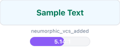</td>
<td><br/>Req: 4.5:1</td>
<td>✅ <strong>Pass</strong></td>
<td>Version Control</td>
</tr>
<tr>
<td><strong>vcs modified on neumorphic bg</strong></td>
<td><span style="display:inline-block;width:40px;height:24px;background-color:#c2410c;border:1.5px solid #e5e7eb;border-radius:4px;vertical-align:middle;"></span> <code>#c2410c</code> <span style="color:#94a3b8;font-weight:500;">on</span> <span style="display:inline-block;width:40px;height:24px;background-color:#f0f9ff;border:1.5px solid #e5e7eb;border-radius:4px;vertical-align:middle;"></span> <code>#f0f9ff</code></td>
<td></td>
<td><br/>Req: 4.5:1</td>
<td>✅ <strong>Pass</strong></td>
<td>Version Control</td>
</tr>
<tr>
<td><strong>vcs deleted on neumorphic bg</strong></td>
<td><span style="display:inline-block;width:40px;height:24px;background-color:#b91c1c;border:1.5px solid #e5e7eb;border-radius:4px;vertical-align:middle;"></span> <code>#b91c1c</code> <span style="color:#94a3b8;font-weight:500;">on</span> <span style="display:inline-block;width:40px;height:24px;background-color:#f0f9ff;border:1.5px solid #e5e7eb;border-radius:4px;vertical-align:middle;"></span> <code>#f0f9ff</code></td>
<td></td>
<td><br/>Req: 4.5:1</td>
<td>✅ <strong>Pass</strong></td>
<td>Version Control</td>
</tr>
</tbody>
</table>

#### Color Palette Samples

Sample colors from this theme:

<table>
<thead>
<tr>
<th>Color Role</th>
<th>Color Swatch</th>
<th>Hex Code</th>
</tr>
</thead>
<tbody>
<tr>
<td><strong>Primary Text</strong></td>
<td></td>
<td><code style="font-size:14px;">#0c4a6e</code></td>
</tr>
<tr>
<td><strong>Background</strong></td>
<td></td>
<td><code style="font-size:14px;">#f0f9ff</code></td>
</tr>
<tr>
<td><strong>Color 3</strong></td>
<td>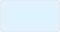</td>
<td><code style="font-size:14px;">#e0f2fe</code></td>
</tr>
<tr>
<td><strong>Color 4</strong></td>
<td></td>
<td><code style="font-size:14px;">#fefefe</code></td>
</tr>
<tr>
<td><strong>Color 5</strong></td>
<td></td>
<td><code style="font-size:14px;">#5b6a7f</code></td>
</tr>
<tr>
<td><strong>Color 6</strong></td>
<td></td>
<td><code style="font-size:14px;">#14532d</code></td>
</tr>
</tbody>
</table>


**Accessibility Achievements**:
- ✅ All primary text combinations meet WCAG AA standards
- 6 tests exceed WCAG AAA (7:1) threshold
- Color contrast optimized for excellent readability

---


### 🎨 Neumorphism Recording Studio (Pro) {#neumorphism-recording-studio-pro}

**Compliance Status**: ✅ WCAG AA Certified
**Test Results**: 17/17 passed (100.0%)

#### Contrast Ratio Test Results

<table>
<thead>
<tr>
<th>Test Combination</th>
<th>Color Visualization</th>
<th>Visual Preview</th>
<th>Contrast Analysis</th>
<th>Status</th>
<th>Category</th>
</tr>
</thead>
<tbody>
<tr>
<td><strong>text primary on neumorphic bg</strong></td>
<td><span style="display:inline-block;width:40px;height:24px;background-color:#1e293b;border:1.5px solid #e5e7eb;border-radius:4px;vertical-align:middle;"></span> <code>#1e293b</code> <span style="color:#94a3b8;font-weight:500;">on</span> <span style="display:inline-block;width:40px;height:24px;background-color:#f8fafc;border:1.5px solid #e5e7eb;border-radius:4px;vertical-align:middle;"></span> <code>#f8fafc</code></td>
<td></td>
<td><br/>Req: 4.5:1</td>
<td>✅ <strong>Pass</strong></td>
<td>Primary Text</td>
</tr>
<tr>
<td><strong>text primary on neumorphic surface</strong></td>
<td><span style="display:inline-block;width:40px;height:24px;background-color:#1e293b;border:1.5px solid #e5e7eb;border-radius:4px;vertical-align:middle;"></span> <code>#1e293b</code> <span style="color:#94a3b8;font-weight:500;">on</span> <span style="display:inline-block;width:40px;height:24px;background-color:#f1f5f9;border:1.5px solid #e5e7eb;border-radius:4px;vertical-align:middle;"></span> <code>#f1f5f9</code></td>
<td></td>
<td><br/>Req: 4.5:1</td>
<td>✅ <strong>Pass</strong></td>
<td>Primary Text</td>
</tr>
<tr>
<td><strong>text primary on neumorphic input</strong></td>
<td><span style="display:inline-block;width:40px;height:24px;background-color:#1e293b;border:1.5px solid #e5e7eb;border-radius:4px;vertical-align:middle;"></span> <code>#1e293b</code> <span style="color:#94a3b8;font-weight:500;">on</span> <span style="display:inline-block;width:40px;height:24px;background-color:#ffffff;border:1.5px solid #e5e7eb;border-radius:4px;vertical-align:middle;"></span> <code>#ffffff</code></td>
<td></td>
<td><br/>Req: 4.5:1</td>
<td>✅ <strong>Pass</strong></td>
<td>Primary Text</td>
</tr>
<tr>
<td><strong>text secondary on neumorphic bg</strong></td>
<td><span style="display:inline-block;width:40px;height:24px;background-color:#475569;border:1.5px solid #e5e7eb;border-radius:4px;vertical-align:middle;"></span> <code>#475569</code> <span style="color:#94a3b8;font-weight:500;">on</span> <span style="display:inline-block;width:40px;height:24px;background-color:#f8fafc;border:1.5px solid #e5e7eb;border-radius:4px;vertical-align:middle;"></span> <code>#f8fafc</code></td>
<td></td>
<td><br/>Req: 4.5:1</td>
<td>✅ <strong>Pass</strong></td>
<td>Secondary Text</td>
</tr>
<tr>
<td><strong>text secondary on neumorphic surface</strong></td>
<td><span style="display:inline-block;width:40px;height:24px;background-color:#475569;border:1.5px solid #e5e7eb;border-radius:4px;vertical-align:middle;"></span> <code>#475569</code> <span style="color:#94a3b8;font-weight:500;">on</span> <span style="display:inline-block;width:40px;height:24px;background-color:#f1f5f9;border:1.5px solid #e5e7eb;border-radius:4px;vertical-align:middle;"></span> <code>#f1f5f9</code></td>
<td></td>
<td><br/>Req: 4.5:1</td>
<td>✅ <strong>Pass</strong></td>
<td>Secondary Text</td>
</tr>
<tr>
<td><strong>success on neumorphic bg</strong></td>
<td><span style="display:inline-block;width:40px;height:24px;background-color:#14532d;border:1.5px solid #e5e7eb;border-radius:4px;vertical-align:middle;"></span> <code>#14532d</code> <span style="color:#94a3b8;font-weight:500;">on</span> <span style="display:inline-block;width:40px;height:24px;background-color:#f8fafc;border:1.5px solid #e5e7eb;border-radius:4px;vertical-align:middle;"></span> <code>#f8fafc</code></td>
<td></td>
<td><br/>Req: 4.5:1</td>
<td>✅ <strong>Pass</strong></td>
<td>Success States</td>
</tr>
<tr>
<td><strong>error on neumorphic bg</strong></td>
<td><span style="display:inline-block;width:40px;height:24px;background-color:#b91c1c;border:1.5px solid #e5e7eb;border-radius:4px;vertical-align:middle;"></span> <code>#b91c1c</code> <span style="color:#94a3b8;font-weight:500;">on</span> <span style="display:inline-block;width:40px;height:24px;background-color:#f8fafc;border:1.5px solid #e5e7eb;border-radius:4px;vertical-align:middle;"></span> <code>#f8fafc</code></td>
<td></td>
<td><br/>Req: 4.5:1</td>
<td>✅ <strong>Pass</strong></td>
<td>Error States</td>
</tr>
<tr>
<td><strong>warning on neumorphic bg</strong></td>
<td><span style="display:inline-block;width:40px;height:24px;background-color:#a16207;border:1.5px solid #e5e7eb;border-radius:4px;vertical-align:middle;"></span> <code>#a16207</code> <span style="color:#94a3b8;font-weight:500;">on</span> <span style="display:inline-block;width:40px;height:24px;background-color:#f8fafc;border:1.5px solid #e5e7eb;border-radius:4px;vertical-align:middle;"></span> <code>#f8fafc</code></td>
<td></td>
<td><br/>Req: 4.5:1</td>
<td>✅ <strong>Pass</strong></td>
<td>Warning States</td>
</tr>
<tr>
<td><strong>info on neumorphic bg</strong></td>
<td><span style="display:inline-block;width:40px;height:24px;background-color:#1d4ed8;border:1.5px solid #e5e7eb;border-radius:4px;vertical-align:middle;"></span> <code>#1d4ed8</code> <span style="color:#94a3b8;font-weight:500;">on</span> <span style="display:inline-block;width:40px;height:24px;background-color:#f8fafc;border:1.5px solid #e5e7eb;border-radius:4px;vertical-align:middle;"></span> <code>#f8fafc</code></td>
<td></td>
<td><br/>Req: 4.5:1</td>
<td>✅ <strong>Pass</strong></td>
<td>Info States</td>
</tr>
<tr>
<td><strong>syntax keyword on neumorphic input</strong></td>
<td><span style="display:inline-block;width:40px;height:24px;background-color:#1d4ed8;border:1.5px solid #e5e7eb;border-radius:4px;vertical-align:middle;"></span> <code>#1d4ed8</code> <span style="color:#94a3b8;font-weight:500;">on</span> <span style="display:inline-block;width:40px;height:24px;background-color:#ffffff;border:1.5px solid #e5e7eb;border-radius:4px;vertical-align:middle;"></span> <code>#ffffff</code></td>
<td></td>
<td><br/>Req: 4.5:1</td>
<td>✅ <strong>Pass</strong></td>
<td>Syntax Highlighting</td>
</tr>
<tr>
<td><strong>syntax string on neumorphic input</strong></td>
<td><span style="display:inline-block;width:40px;height:24px;background-color:#14532d;border:1.5px solid #e5e7eb;border-radius:4px;vertical-align:middle;"></span> <code>#14532d</code> <span style="color:#94a3b8;font-weight:500;">on</span> <span style="display:inline-block;width:40px;height:24px;background-color:#ffffff;border:1.5px solid #e5e7eb;border-radius:4px;vertical-align:middle;"></span> <code>#ffffff</code></td>
<td></td>
<td><br/>Req: 4.5:1</td>
<td>✅ <strong>Pass</strong></td>
<td>Syntax Highlighting</td>
</tr>
<tr>
<td><strong>syntax comment on neumorphic input</strong></td>
<td><span style="display:inline-block;width:40px;height:24px;background-color:#4b5563;border:1.5px solid #e5e7eb;border-radius:4px;vertical-align:middle;"></span> <code>#4b5563</code> <span style="color:#94a3b8;font-weight:500;">on</span> <span style="display:inline-block;width:40px;height:24px;background-color:#ffffff;border:1.5px solid #e5e7eb;border-radius:4px;vertical-align:middle;"></span> <code>#ffffff</code></td>
<td></td>
<td><br/>Req: 4.5:1</td>
<td>✅ <strong>Pass</strong></td>
<td>Syntax Highlighting</td>
</tr>
<tr>
<td><strong>syntax number on neumorphic input</strong></td>
<td><span style="display:inline-block;width:40px;height:24px;background-color:#b45309;border:1.5px solid #e5e7eb;border-radius:4px;vertical-align:middle;"></span> <code>#b45309</code> <span style="color:#94a3b8;font-weight:500;">on</span> <span style="display:inline-block;width:40px;height:24px;background-color:#ffffff;border:1.5px solid #e5e7eb;border-radius:4px;vertical-align:middle;"></span> <code>#ffffff</code></td>
<td></td>
<td><br/>Req: 4.5:1</td>
<td>✅ <strong>Pass</strong></td>
<td>Syntax Highlighting</td>
</tr>
<tr>
<td><strong>syntax operator on neumorphic input</strong></td>
<td><span style="display:inline-block;width:40px;height:24px;background-color:#b91c1c;border:1.5px solid #e5e7eb;border-radius:4px;vertical-align:middle;"></span> <code>#b91c1c</code> <span style="color:#94a3b8;font-weight:500;">on</span> <span style="display:inline-block;width:40px;height:24px;background-color:#ffffff;border:1.5px solid #e5e7eb;border-radius:4px;vertical-align:middle;"></span> <code>#ffffff</code></td>
<td></td>
<td><br/>Req: 4.5:1</td>
<td>✅ <strong>Pass</strong></td>
<td>Syntax Highlighting</td>
</tr>
<tr>
<td><strong>vcs added on neumorphic bg</strong></td>
<td><span style="display:inline-block;width:40px;height:24px;background-color:#14532d;border:1.5px solid #e5e7eb;border-radius:4px;vertical-align:middle;"></span> <code>#14532d</code> <span style="color:#94a3b8;font-weight:500;">on</span> <span style="display:inline-block;width:40px;height:24px;background-color:#f8fafc;border:1.5px solid #e5e7eb;border-radius:4px;vertical-align:middle;"></span> <code>#f8fafc</code></td>
<td></td>
<td><br/>Req: 4.5:1</td>
<td>✅ <strong>Pass</strong></td>
<td>Version Control</td>
</tr>
<tr>
<td><strong>vcs modified on neumorphic bg</strong></td>
<td><span style="display:inline-block;width:40px;height:24px;background-color:#0369a1;border:1.5px solid #e5e7eb;border-radius:4px;vertical-align:middle;"></span> <code>#0369a1</code> <span style="color:#94a3b8;font-weight:500;">on</span> <span style="display:inline-block;width:40px;height:24px;background-color:#f8fafc;border:1.5px solid #e5e7eb;border-radius:4px;vertical-align:middle;"></span> <code>#f8fafc</code></td>
<td>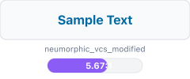</td>
<td><br/>Req: 4.5:1</td>
<td>✅ <strong>Pass</strong></td>
<td>Version Control</td>
</tr>
<tr>
<td><strong>vcs deleted on neumorphic bg</strong></td>
<td><span style="display:inline-block;width:40px;height:24px;background-color:#dc2626;border:1.5px solid #e5e7eb;border-radius:4px;vertical-align:middle;"></span> <code>#dc2626</code> <span style="color:#94a3b8;font-weight:500;">on</span> <span style="display:inline-block;width:40px;height:24px;background-color:#f8fafc;border:1.5px solid #e5e7eb;border-radius:4px;vertical-align:middle;"></span> <code>#f8fafc</code></td>
<td></td>
<td><br/>Req: 4.5:1</td>
<td>✅ <strong>Pass</strong></td>
<td>Version Control</td>
</tr>
</tbody>
</table>

#### Color Palette Samples

Sample colors from this theme:

<table>
<thead>
<tr>
<th>Color Role</th>
<th>Color Swatch</th>
<th>Hex Code</th>
</tr>
</thead>
<tbody>
<tr>
<td><strong>Primary Text</strong></td>
<td></td>
<td><code style="font-size:14px;">#1e293b</code></td>
</tr>
<tr>
<td><strong>Background</strong></td>
<td></td>
<td><code style="font-size:14px;">#f8fafc</code></td>
</tr>
<tr>
<td><strong>Color 3</strong></td>
<td></td>
<td><code style="font-size:14px;">#f1f5f9</code></td>
</tr>
<tr>
<td><strong>Color 4</strong></td>
<td></td>
<td><code style="font-size:14px;">#ffffff</code></td>
</tr>
<tr>
<td><strong>Color 5</strong></td>
<td></td>
<td><code style="font-size:14px;">#475569</code></td>
</tr>
<tr>
<td><strong>Color 6</strong></td>
<td></td>
<td><code style="font-size:14px;">#14532d</code></td>
</tr>
</tbody>
</table>


**Accessibility Achievements**:
- ✅ All primary text combinations meet WCAG AA standards
- 8 tests exceed WCAG AAA (7:1) threshold
- Color contrast optimized for excellent readability

---


### 🎨 Neumorphism Recording Studio Live (Pro) {#neumorphism-recording-studio-live-pro}

**Compliance Status**: ✅ WCAG AA Certified
**Test Results**: 17/17 passed (100.0%)

#### Contrast Ratio Test Results

<table>
<thead>
<tr>
<th>Test Combination</th>
<th>Color Visualization</th>
<th>Visual Preview</th>
<th>Contrast Analysis</th>
<th>Status</th>
<th>Category</th>
</tr>
</thead>
<tbody>
<tr>
<td><strong>text primary on neumorphic bg</strong></td>
<td><span style="display:inline-block;width:40px;height:24px;background-color:#f8fafc;border:1.5px solid #e5e7eb;border-radius:4px;vertical-align:middle;"></span> <code>#f8fafc</code> <span style="color:#94a3b8;font-weight:500;">on</span> <span style="display:inline-block;width:40px;height:24px;background-color:#1e293b;border:1.5px solid #e5e7eb;border-radius:4px;vertical-align:middle;"></span> <code>#1e293b</code></td>
<td>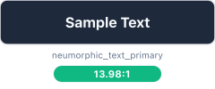</td>
<td><br/>Req: 4.5:1</td>
<td>✅ <strong>Pass</strong></td>
<td>Primary Text</td>
</tr>
<tr>
<td><strong>text primary on neumorphic surface</strong></td>
<td><span style="display:inline-block;width:40px;height:24px;background-color:#f8fafc;border:1.5px solid #e5e7eb;border-radius:4px;vertical-align:middle;"></span> <code>#f8fafc</code> <span style="color:#94a3b8;font-weight:500;">on</span> <span style="display:inline-block;width:40px;height:24px;background-color:#334155;border:1.5px solid #e5e7eb;border-radius:4px;vertical-align:middle;"></span> <code>#334155</code></td>
<td></td>
<td><br/>Req: 4.5:1</td>
<td>✅ <strong>Pass</strong></td>
<td>Primary Text</td>
</tr>
<tr>
<td><strong>text primary on neumorphic input</strong></td>
<td><span style="display:inline-block;width:40px;height:24px;background-color:#f8fafc;border:1.5px solid #e5e7eb;border-radius:4px;vertical-align:middle;"></span> <code>#f8fafc</code> <span style="color:#94a3b8;font-weight:500;">on</span> <span style="display:inline-block;width:40px;height:24px;background-color:#0f172a;border:1.5px solid #e5e7eb;border-radius:4px;vertical-align:middle;"></span> <code>#0f172a</code></td>
<td>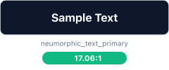</td>
<td><br/>Req: 4.5:1</td>
<td>✅ <strong>Pass</strong></td>
<td>Primary Text</td>
</tr>
<tr>
<td><strong>text secondary on neumorphic bg</strong></td>
<td><span style="display:inline-block;width:40px;height:24px;background-color:#cbd5e1;border:1.5px solid #e5e7eb;border-radius:4px;vertical-align:middle;"></span> <code>#cbd5e1</code> <span style="color:#94a3b8;font-weight:500;">on</span> <span style="display:inline-block;width:40px;height:24px;background-color:#1e293b;border:1.5px solid #e5e7eb;border-radius:4px;vertical-align:middle;"></span> <code>#1e293b</code></td>
<td>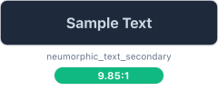</td>
<td><br/>Req: 4.5:1</td>
<td>✅ <strong>Pass</strong></td>
<td>Secondary Text</td>
</tr>
<tr>
<td><strong>text secondary on neumorphic surface</strong></td>
<td><span style="display:inline-block;width:40px;height:24px;background-color:#cbd5e1;border:1.5px solid #e5e7eb;border-radius:4px;vertical-align:middle;"></span> <code>#cbd5e1</code> <span style="color:#94a3b8;font-weight:500;">on</span> <span style="display:inline-block;width:40px;height:24px;background-color:#334155;border:1.5px solid #e5e7eb;border-radius:4px;vertical-align:middle;"></span> <code>#334155</code></td>
<td>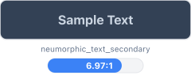</td>
<td><br/>Req: 4.5:1</td>
<td>✅ <strong>Pass</strong></td>
<td>Secondary Text</td>
</tr>
<tr>
<td><strong>success on neumorphic bg</strong></td>
<td><span style="display:inline-block;width:40px;height:24px;background-color:#34d399;border:1.5px solid #e5e7eb;border-radius:4px;vertical-align:middle;"></span> <code>#34d399</code> <span style="color:#94a3b8;font-weight:500;">on</span> <span style="display:inline-block;width:40px;height:24px;background-color:#1e293b;border:1.5px solid #e5e7eb;border-radius:4px;vertical-align:middle;"></span> <code>#1e293b</code></td>
<td></td>
<td><br/>Req: 4.5:1</td>
<td>✅ <strong>Pass</strong></td>
<td>Success States</td>
</tr>
<tr>
<td><strong>error on neumorphic bg</strong></td>
<td><span style="display:inline-block;width:40px;height:24px;background-color:#f87171;border:1.5px solid #e5e7eb;border-radius:4px;vertical-align:middle;"></span> <code>#f87171</code> <span style="color:#94a3b8;font-weight:500;">on</span> <span style="display:inline-block;width:40px;height:24px;background-color:#1e293b;border:1.5px solid #e5e7eb;border-radius:4px;vertical-align:middle;"></span> <code>#1e293b</code></td>
<td>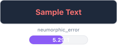</td>
<td><br/>Req: 4.5:1</td>
<td>✅ <strong>Pass</strong></td>
<td>Error States</td>
</tr>
<tr>
<td><strong>warning on neumorphic bg</strong></td>
<td><span style="display:inline-block;width:40px;height:24px;background-color:#fbbf24;border:1.5px solid #e5e7eb;border-radius:4px;vertical-align:middle;"></span> <code>#fbbf24</code> <span style="color:#94a3b8;font-weight:500;">on</span> <span style="display:inline-block;width:40px;height:24px;background-color:#1e293b;border:1.5px solid #e5e7eb;border-radius:4px;vertical-align:middle;"></span> <code>#1e293b</code></td>
<td></td>
<td><br/>Req: 4.5:1</td>
<td>✅ <strong>Pass</strong></td>
<td>Warning States</td>
</tr>
<tr>
<td><strong>info on neumorphic bg</strong></td>
<td><span style="display:inline-block;width:40px;height:24px;background-color:#34d399;border:1.5px solid #e5e7eb;border-radius:4px;vertical-align:middle;"></span> <code>#34d399</code> <span style="color:#94a3b8;font-weight:500;">on</span> <span style="display:inline-block;width:40px;height:24px;background-color:#1e293b;border:1.5px solid #e5e7eb;border-radius:4px;vertical-align:middle;"></span> <code>#1e293b</code></td>
<td></td>
<td><br/>Req: 4.5:1</td>
<td>✅ <strong>Pass</strong></td>
<td>Info States</td>
</tr>
<tr>
<td><strong>syntax keyword on neumorphic input</strong></td>
<td><span style="display:inline-block;width:40px;height:24px;background-color:#34d399;border:1.5px solid #e5e7eb;border-radius:4px;vertical-align:middle;"></span> <code>#34d399</code> <span style="color:#94a3b8;font-weight:500;">on</span> <span style="display:inline-block;width:40px;height:24px;background-color:#0f172a;border:1.5px solid #e5e7eb;border-radius:4px;vertical-align:middle;"></span> <code>#0f172a</code></td>
<td>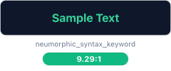</td>
<td><br/>Req: 4.5:1</td>
<td>✅ <strong>Pass</strong></td>
<td>Syntax Highlighting</td>
</tr>
<tr>
<td><strong>syntax string on neumorphic input</strong></td>
<td><span style="display:inline-block;width:40px;height:24px;background-color:#86efac;border:1.5px solid #e5e7eb;border-radius:4px;vertical-align:middle;"></span> <code>#86efac</code> <span style="color:#94a3b8;font-weight:500;">on</span> <span style="display:inline-block;width:40px;height:24px;background-color:#0f172a;border:1.5px solid #e5e7eb;border-radius:4px;vertical-align:middle;"></span> <code>#0f172a</code></td>
<td>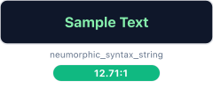</td>
<td><br/>Req: 4.5:1</td>
<td>✅ <strong>Pass</strong></td>
<td>Syntax Highlighting</td>
</tr>
<tr>
<td><strong>syntax comment on neumorphic input</strong></td>
<td><span style="display:inline-block;width:40px;height:24px;background-color:#94a3b8;border:1.5px solid #e5e7eb;border-radius:4px;vertical-align:middle;"></span> <code>#94a3b8</code> <span style="color:#94a3b8;font-weight:500;">on</span> <span style="display:inline-block;width:40px;height:24px;background-color:#0f172a;border:1.5px solid #e5e7eb;border-radius:4px;vertical-align:middle;"></span> <code>#0f172a</code></td>
<td></td>
<td><br/>Req: 4.5:1</td>
<td>✅ <strong>Pass</strong></td>
<td>Syntax Highlighting</td>
</tr>
<tr>
<td><strong>syntax number on neumorphic input</strong></td>
<td><span style="display:inline-block;width:40px;height:24px;background-color:#fbbf24;border:1.5px solid #e5e7eb;border-radius:4px;vertical-align:middle;"></span> <code>#fbbf24</code> <span style="color:#94a3b8;font-weight:500;">on</span> <span style="display:inline-block;width:40px;height:24px;background-color:#0f172a;border:1.5px solid #e5e7eb;border-radius:4px;vertical-align:middle;"></span> <code>#0f172a</code></td>
<td></td>
<td><br/>Req: 4.5:1</td>
<td>✅ <strong>Pass</strong></td>
<td>Syntax Highlighting</td>
</tr>
<tr>
<td><strong>syntax operator on neumorphic input</strong></td>
<td><span style="display:inline-block;width:40px;height:24px;background-color:#f87171;border:1.5px solid #e5e7eb;border-radius:4px;vertical-align:middle;"></span> <code>#f87171</code> <span style="color:#94a3b8;font-weight:500;">on</span> <span style="display:inline-block;width:40px;height:24px;background-color:#0f172a;border:1.5px solid #e5e7eb;border-radius:4px;vertical-align:middle;"></span> <code>#0f172a</code></td>
<td></td>
<td><br/>Req: 4.5:1</td>
<td>✅ <strong>Pass</strong></td>
<td>Syntax Highlighting</td>
</tr>
<tr>
<td><strong>vcs added on neumorphic bg</strong></td>
<td><span style="display:inline-block;width:40px;height:24px;background-color:#34d399;border:1.5px solid #e5e7eb;border-radius:4px;vertical-align:middle;"></span> <code>#34d399</code> <span style="color:#94a3b8;font-weight:500;">on</span> <span style="display:inline-block;width:40px;height:24px;background-color:#1e293b;border:1.5px solid #e5e7eb;border-radius:4px;vertical-align:middle;"></span> <code>#1e293b</code></td>
<td></td>
<td><br/>Req: 4.5:1</td>
<td>✅ <strong>Pass</strong></td>
<td>Version Control</td>
</tr>
<tr>
<td><strong>vcs modified on neumorphic bg</strong></td>
<td><span style="display:inline-block;width:40px;height:24px;background-color:#fbbf24;border:1.5px solid #e5e7eb;border-radius:4px;vertical-align:middle;"></span> <code>#fbbf24</code> <span style="color:#94a3b8;font-weight:500;">on</span> <span style="display:inline-block;width:40px;height:24px;background-color:#1e293b;border:1.5px solid #e5e7eb;border-radius:4px;vertical-align:middle;"></span> <code>#1e293b</code></td>
<td></td>
<td><br/>Req: 4.5:1</td>
<td>✅ <strong>Pass</strong></td>
<td>Version Control</td>
</tr>
<tr>
<td><strong>vcs deleted on neumorphic bg</strong></td>
<td><span style="display:inline-block;width:40px;height:24px;background-color:#f87171;border:1.5px solid #e5e7eb;border-radius:4px;vertical-align:middle;"></span> <code>#f87171</code> <span style="color:#94a3b8;font-weight:500;">on</span> <span style="display:inline-block;width:40px;height:24px;background-color:#1e293b;border:1.5px solid #e5e7eb;border-radius:4px;vertical-align:middle;"></span> <code>#1e293b</code></td>
<td></td>
<td><br/>Req: 4.5:1</td>
<td>✅ <strong>Pass</strong></td>
<td>Version Control</td>
</tr>
</tbody>
</table>

#### Color Palette Samples

Sample colors from this theme:

<table>
<thead>
<tr>
<th>Color Role</th>
<th>Color Swatch</th>
<th>Hex Code</th>
</tr>
</thead>
<tbody>
<tr>
<td><strong>Primary Text</strong></td>
<td></td>
<td><code style="font-size:14px;">#f8fafc</code></td>
</tr>
<tr>
<td><strong>Background</strong></td>
<td></td>
<td><code style="font-size:14px;">#1e293b</code></td>
</tr>
<tr>
<td><strong>Color 3</strong></td>
<td></td>
<td><code style="font-size:14px;">#334155</code></td>
</tr>
<tr>
<td><strong>Color 4</strong></td>
<td></td>
<td><code style="font-size:14px;">#0f172a</code></td>
</tr>
<tr>
<td><strong>Color 5</strong></td>
<td></td>
<td><code style="font-size:14px;">#cbd5e1</code></td>
</tr>
<tr>
<td><strong>Color 6</strong></td>
<td></td>
<td><code style="font-size:14px;">#34d399</code></td>
</tr>
</tbody>
</table>


**Accessibility Achievements**:
- ✅ All primary text combinations meet WCAG AA standards
- 12 tests exceed WCAG AAA (7:1) threshold
- Color contrast optimized for excellent readability

---


### 🎨 Neumorphism Rose Gold (Pro) {#neumorphism-rose-gold-pro}

**Compliance Status**: ✅ WCAG AA Certified
**Test Results**: 17/17 passed (100.0%)

#### Contrast Ratio Test Results

<table>
<thead>
<tr>
<th>Test Combination</th>
<th>Color Visualization</th>
<th>Visual Preview</th>
<th>Contrast Analysis</th>
<th>Status</th>
<th>Category</th>
</tr>
</thead>
<tbody>
<tr>
<td><strong>text primary on neumorphic bg</strong></td>
<td><span style="display:inline-block;width:40px;height:24px;background-color:#1f2937;border:1.5px solid #e5e7eb;border-radius:4px;vertical-align:middle;"></span> <code>#1f2937</code> <span style="color:#94a3b8;font-weight:500;">on</span> <span style="display:inline-block;width:40px;height:24px;background-color:#fef7f7;border:1.5px solid #e5e7eb;border-radius:4px;vertical-align:middle;"></span> <code>#fef7f7</code></td>
<td>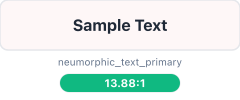</td>
<td><br/>Req: 4.5:1</td>
<td>✅ <strong>Pass</strong></td>
<td>Primary Text</td>
</tr>
<tr>
<td><strong>text primary on neumorphic surface</strong></td>
<td><span style="display:inline-block;width:40px;height:24px;background-color:#1f2937;border:1.5px solid #e5e7eb;border-radius:4px;vertical-align:middle;"></span> <code>#1f2937</code> <span style="color:#94a3b8;font-weight:500;">on</span> <span style="display:inline-block;width:40px;height:24px;background-color:#fce7e7;border:1.5px solid #e5e7eb;border-radius:4px;vertical-align:middle;"></span> <code>#fce7e7</code></td>
<td>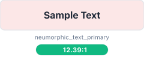</td>
<td><br/>Req: 4.5:1</td>
<td>✅ <strong>Pass</strong></td>
<td>Primary Text</td>
</tr>
<tr>
<td><strong>text primary on neumorphic input</strong></td>
<td><span style="display:inline-block;width:40px;height:24px;background-color:#1f2937;border:1.5px solid #e5e7eb;border-radius:4px;vertical-align:middle;"></span> <code>#1f2937</code> <span style="color:#94a3b8;font-weight:500;">on</span> <span style="display:inline-block;width:40px;height:24px;background-color:#ffffff;border:1.5px solid #e5e7eb;border-radius:4px;vertical-align:middle;"></span> <code>#ffffff</code></td>
<td></td>
<td><br/>Req: 4.5:1</td>
<td>✅ <strong>Pass</strong></td>
<td>Primary Text</td>
</tr>
<tr>
<td><strong>text secondary on neumorphic bg</strong></td>
<td><span style="display:inline-block;width:40px;height:24px;background-color:#616774;border:1.5px solid #e5e7eb;border-radius:4px;vertical-align:middle;"></span> <code>#616774</code> <span style="color:#94a3b8;font-weight:500;">on</span> <span style="display:inline-block;width:40px;height:24px;background-color:#fef7f7;border:1.5px solid #e5e7eb;border-radius:4px;vertical-align:middle;"></span> <code>#fef7f7</code></td>
<td>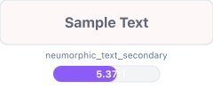</td>
<td><br/>Req: 4.5:1</td>
<td>✅ <strong>Pass</strong></td>
<td>Secondary Text</td>
</tr>
<tr>
<td><strong>text secondary on neumorphic surface</strong></td>
<td><span style="display:inline-block;width:40px;height:24px;background-color:#616774;border:1.5px solid #e5e7eb;border-radius:4px;vertical-align:middle;"></span> <code>#616774</code> <span style="color:#94a3b8;font-weight:500;">on</span> <span style="display:inline-block;width:40px;height:24px;background-color:#fce7e7;border:1.5px solid #e5e7eb;border-radius:4px;vertical-align:middle;"></span> <code>#fce7e7</code></td>
<td>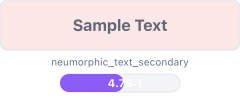</td>
<td><br/>Req: 4.5:1</td>
<td>✅ <strong>Pass</strong></td>
<td>Secondary Text</td>
</tr>
<tr>
<td><strong>success on neumorphic bg</strong></td>
<td><span style="display:inline-block;width:40px;height:24px;background-color:#14532d;border:1.5px solid #e5e7eb;border-radius:4px;vertical-align:middle;"></span> <code>#14532d</code> <span style="color:#94a3b8;font-weight:500;">on</span> <span style="display:inline-block;width:40px;height:24px;background-color:#fef7f7;border:1.5px solid #e5e7eb;border-radius:4px;vertical-align:middle;"></span> <code>#fef7f7</code></td>
<td>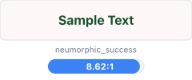</td>
<td><br/>Req: 4.5:1</td>
<td>✅ <strong>Pass</strong></td>
<td>Success States</td>
</tr>
<tr>
<td><strong>error on neumorphic bg</strong></td>
<td><span style="display:inline-block;width:40px;height:24px;background-color:#b91c1c;border:1.5px solid #e5e7eb;border-radius:4px;vertical-align:middle;"></span> <code>#b91c1c</code> <span style="color:#94a3b8;font-weight:500;">on</span> <span style="display:inline-block;width:40px;height:24px;background-color:#fef7f7;border:1.5px solid #e5e7eb;border-radius:4px;vertical-align:middle;"></span> <code>#fef7f7</code></td>
<td></td>
<td><br/>Req: 4.5:1</td>
<td>✅ <strong>Pass</strong></td>
<td>Error States</td>
</tr>
<tr>
<td><strong>warning on neumorphic bg</strong></td>
<td><span style="display:inline-block;width:40px;height:24px;background-color:#a16207;border:1.5px solid #e5e7eb;border-radius:4px;vertical-align:middle;"></span> <code>#a16207</code> <span style="color:#94a3b8;font-weight:500;">on</span> <span style="display:inline-block;width:40px;height:24px;background-color:#fef7f7;border:1.5px solid #e5e7eb;border-radius:4px;vertical-align:middle;"></span> <code>#fef7f7</code></td>
<td>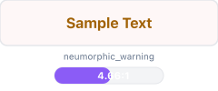</td>
<td><br/>Req: 4.5:1</td>
<td>✅ <strong>Pass</strong></td>
<td>Warning States</td>
</tr>
<tr>
<td><strong>info on neumorphic bg</strong></td>
<td><span style="display:inline-block;width:40px;height:24px;background-color:#1d4ed8;border:1.5px solid #e5e7eb;border-radius:4px;vertical-align:middle;"></span> <code>#1d4ed8</code> <span style="color:#94a3b8;font-weight:500;">on</span> <span style="display:inline-block;width:40px;height:24px;background-color:#fef7f7;border:1.5px solid #e5e7eb;border-radius:4px;vertical-align:middle;"></span> <code>#fef7f7</code></td>
<td></td>
<td><br/>Req: 4.5:1</td>
<td>✅ <strong>Pass</strong></td>
<td>Info States</td>
</tr>
<tr>
<td><strong>syntax keyword on neumorphic input</strong></td>
<td><span style="display:inline-block;width:40px;height:24px;background-color:#1d4ed8;border:1.5px solid #e5e7eb;border-radius:4px;vertical-align:middle;"></span> <code>#1d4ed8</code> <span style="color:#94a3b8;font-weight:500;">on</span> <span style="display:inline-block;width:40px;height:24px;background-color:#ffffff;border:1.5px solid #e5e7eb;border-radius:4px;vertical-align:middle;"></span> <code>#ffffff</code></td>
<td></td>
<td><br/>Req: 4.5:1</td>
<td>✅ <strong>Pass</strong></td>
<td>Syntax Highlighting</td>
</tr>
<tr>
<td><strong>syntax string on neumorphic input</strong></td>
<td><span style="display:inline-block;width:40px;height:24px;background-color:#14532d;border:1.5px solid #e5e7eb;border-radius:4px;vertical-align:middle;"></span> <code>#14532d</code> <span style="color:#94a3b8;font-weight:500;">on</span> <span style="display:inline-block;width:40px;height:24px;background-color:#ffffff;border:1.5px solid #e5e7eb;border-radius:4px;vertical-align:middle;"></span> <code>#ffffff</code></td>
<td></td>
<td><br/>Req: 4.5:1</td>
<td>✅ <strong>Pass</strong></td>
<td>Syntax Highlighting</td>
</tr>
<tr>
<td><strong>syntax comment on neumorphic input</strong></td>
<td><span style="display:inline-block;width:40px;height:24px;background-color:#4b5563;border:1.5px solid #e5e7eb;border-radius:4px;vertical-align:middle;"></span> <code>#4b5563</code> <span style="color:#94a3b8;font-weight:500;">on</span> <span style="display:inline-block;width:40px;height:24px;background-color:#ffffff;border:1.5px solid #e5e7eb;border-radius:4px;vertical-align:middle;"></span> <code>#ffffff</code></td>
<td></td>
<td><br/>Req: 4.5:1</td>
<td>✅ <strong>Pass</strong></td>
<td>Syntax Highlighting</td>
</tr>
<tr>
<td><strong>syntax number on neumorphic input</strong></td>
<td><span style="display:inline-block;width:40px;height:24px;background-color:#b45309;border:1.5px solid #e5e7eb;border-radius:4px;vertical-align:middle;"></span> <code>#b45309</code> <span style="color:#94a3b8;font-weight:500;">on</span> <span style="display:inline-block;width:40px;height:24px;background-color:#ffffff;border:1.5px solid #e5e7eb;border-radius:4px;vertical-align:middle;"></span> <code>#ffffff</code></td>
<td></td>
<td><br/>Req: 4.5:1</td>
<td>✅ <strong>Pass</strong></td>
<td>Syntax Highlighting</td>
</tr>
<tr>
<td><strong>syntax operator on neumorphic input</strong></td>
<td><span style="display:inline-block;width:40px;height:24px;background-color:#b91c1c;border:1.5px solid #e5e7eb;border-radius:4px;vertical-align:middle;"></span> <code>#b91c1c</code> <span style="color:#94a3b8;font-weight:500;">on</span> <span style="display:inline-block;width:40px;height:24px;background-color:#ffffff;border:1.5px solid #e5e7eb;border-radius:4px;vertical-align:middle;"></span> <code>#ffffff</code></td>
<td></td>
<td><br/>Req: 4.5:1</td>
<td>✅ <strong>Pass</strong></td>
<td>Syntax Highlighting</td>
</tr>
<tr>
<td><strong>vcs added on neumorphic bg</strong></td>
<td><span style="display:inline-block;width:40px;height:24px;background-color:#14532d;border:1.5px solid #e5e7eb;border-radius:4px;vertical-align:middle;"></span> <code>#14532d</code> <span style="color:#94a3b8;font-weight:500;">on</span> <span style="display:inline-block;width:40px;height:24px;background-color:#fef7f7;border:1.5px solid #e5e7eb;border-radius:4px;vertical-align:middle;"></span> <code>#fef7f7</code></td>
<td></td>
<td><br/>Req: 4.5:1</td>
<td>✅ <strong>Pass</strong></td>
<td>Version Control</td>
</tr>
<tr>
<td><strong>vcs modified on neumorphic bg</strong></td>
<td><span style="display:inline-block;width:40px;height:24px;background-color:#1d4ed8;border:1.5px solid #e5e7eb;border-radius:4px;vertical-align:middle;"></span> <code>#1d4ed8</code> <span style="color:#94a3b8;font-weight:500;">on</span> <span style="display:inline-block;width:40px;height:24px;background-color:#fef7f7;border:1.5px solid #e5e7eb;border-radius:4px;vertical-align:middle;"></span> <code>#fef7f7</code></td>
<td></td>
<td><br/>Req: 4.5:1</td>
<td>✅ <strong>Pass</strong></td>
<td>Version Control</td>
</tr>
<tr>
<td><strong>vcs deleted on neumorphic bg</strong></td>
<td><span style="display:inline-block;width:40px;height:24px;background-color:#b91c1c;border:1.5px solid #e5e7eb;border-radius:4px;vertical-align:middle;"></span> <code>#b91c1c</code> <span style="color:#94a3b8;font-weight:500;">on</span> <span style="display:inline-block;width:40px;height:24px;background-color:#fef7f7;border:1.5px solid #e5e7eb;border-radius:4px;vertical-align:middle;"></span> <code>#fef7f7</code></td>
<td></td>
<td><br/>Req: 4.5:1</td>
<td>✅ <strong>Pass</strong></td>
<td>Version Control</td>
</tr>
</tbody>
</table>

#### Color Palette Samples

Sample colors from this theme:

<table>
<thead>
<tr>
<th>Color Role</th>
<th>Color Swatch</th>
<th>Hex Code</th>
</tr>
</thead>
<tbody>
<tr>
<td><strong>Primary Text</strong></td>
<td></td>
<td><code style="font-size:14px;">#1f2937</code></td>
</tr>
<tr>
<td><strong>Background</strong></td>
<td>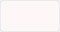</td>
<td><code style="font-size:14px;">#fef7f7</code></td>
</tr>
<tr>
<td><strong>Color 3</strong></td>
<td>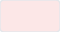</td>
<td><code style="font-size:14px;">#fce7e7</code></td>
</tr>
<tr>
<td><strong>Color 4</strong></td>
<td></td>
<td><code style="font-size:14px;">#ffffff</code></td>
</tr>
<tr>
<td><strong>Color 5</strong></td>
<td></td>
<td><code style="font-size:14px;">#616774</code></td>
</tr>
<tr>
<td><strong>Color 6</strong></td>
<td></td>
<td><code style="font-size:14px;">#14532d</code></td>
</tr>
</tbody>
</table>


**Accessibility Achievements**:
- ✅ All primary text combinations meet WCAG AA standards
- 7 tests exceed WCAG AAA (7:1) threshold
- Color contrast optimized for excellent readability

---


### 🎨 Neumorphism Sunset (Pro) {#neumorphism-sunset-pro}

**Compliance Status**: ✅ WCAG AA Certified
**Test Results**: 17/17 passed (100.0%)

#### Contrast Ratio Test Results

<table>
<thead>
<tr>
<th>Test Combination</th>
<th>Color Visualization</th>
<th>Visual Preview</th>
<th>Contrast Analysis</th>
<th>Status</th>
<th>Category</th>
</tr>
</thead>
<tbody>
<tr>
<td><strong>text primary on neumorphic bg</strong></td>
<td><span style="display:inline-block;width:40px;height:24px;background-color:#1c1917;border:1.5px solid #e5e7eb;border-radius:4px;vertical-align:middle;"></span> <code>#1c1917</code> <span style="color:#94a3b8;font-weight:500;">on</span> <span style="display:inline-block;width:40px;height:24px;background-color:#fff7ed;border:1.5px solid #e5e7eb;border-radius:4px;vertical-align:middle;"></span> <code>#fff7ed</code></td>
<td>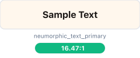</td>
<td><br/>Req: 4.5:1</td>
<td>✅ <strong>Pass</strong></td>
<td>Primary Text</td>
</tr>
<tr>
<td><strong>text primary on neumorphic surface</strong></td>
<td><span style="display:inline-block;width:40px;height:24px;background-color:#1c1917;border:1.5px solid #e5e7eb;border-radius:4px;vertical-align:middle;"></span> <code>#1c1917</code> <span style="color:#94a3b8;font-weight:500;">on</span> <span style="display:inline-block;width:40px;height:24px;background-color:#fed7aa;border:1.5px solid #e5e7eb;border-radius:4px;vertical-align:middle;"></span> <code>#fed7aa</code></td>
<td></td>
<td><br/>Req: 4.5:1</td>
<td>✅ <strong>Pass</strong></td>
<td>Primary Text</td>
</tr>
<tr>
<td><strong>text primary on neumorphic input</strong></td>
<td><span style="display:inline-block;width:40px;height:24px;background-color:#1c1917;border:1.5px solid #e5e7eb;border-radius:4px;vertical-align:middle;"></span> <code>#1c1917</code> <span style="color:#94a3b8;font-weight:500;">on</span> <span style="display:inline-block;width:40px;height:24px;background-color:#fffbf5;border:1.5px solid #e5e7eb;border-radius:4px;vertical-align:middle;"></span> <code>#fffbf5</code></td>
<td></td>
<td><br/>Req: 4.5:1</td>
<td>✅ <strong>Pass</strong></td>
<td>Primary Text</td>
</tr>
<tr>
<td><strong>text secondary on neumorphic bg</strong></td>
<td><span style="display:inline-block;width:40px;height:24px;background-color:#615b57;border:1.5px solid #e5e7eb;border-radius:4px;vertical-align:middle;"></span> <code>#615b57</code> <span style="color:#94a3b8;font-weight:500;">on</span> <span style="display:inline-block;width:40px;height:24px;background-color:#fff7ed;border:1.5px solid #e5e7eb;border-radius:4px;vertical-align:middle;"></span> <code>#fff7ed</code></td>
<td></td>
<td><br/>Req: 4.5:1</td>
<td>✅ <strong>Pass</strong></td>
<td>Secondary Text</td>
</tr>
<tr>
<td><strong>text secondary on neumorphic surface</strong></td>
<td><span style="display:inline-block;width:40px;height:24px;background-color:#615b57;border:1.5px solid #e5e7eb;border-radius:4px;vertical-align:middle;"></span> <code>#615b57</code> <span style="color:#94a3b8;font-weight:500;">on</span> <span style="display:inline-block;width:40px;height:24px;background-color:#fed7aa;border:1.5px solid #e5e7eb;border-radius:4px;vertical-align:middle;"></span> <code>#fed7aa</code></td>
<td>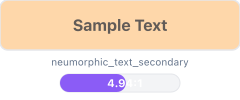</td>
<td><br/>Req: 4.5:1</td>
<td>✅ <strong>Pass</strong></td>
<td>Secondary Text</td>
</tr>
<tr>
<td><strong>success on neumorphic bg</strong></td>
<td><span style="display:inline-block;width:40px;height:24px;background-color:#14532d;border:1.5px solid #e5e7eb;border-radius:4px;vertical-align:middle;"></span> <code>#14532d</code> <span style="color:#94a3b8;font-weight:500;">on</span> <span style="display:inline-block;width:40px;height:24px;background-color:#fff7ed;border:1.5px solid #e5e7eb;border-radius:4px;vertical-align:middle;"></span> <code>#fff7ed</code></td>
<td></td>
<td><br/>Req: 4.5:1</td>
<td>✅ <strong>Pass</strong></td>
<td>Success States</td>
</tr>
<tr>
<td><strong>error on neumorphic bg</strong></td>
<td><span style="display:inline-block;width:40px;height:24px;background-color:#b91c1c;border:1.5px solid #e5e7eb;border-radius:4px;vertical-align:middle;"></span> <code>#b91c1c</code> <span style="color:#94a3b8;font-weight:500;">on</span> <span style="display:inline-block;width:40px;height:24px;background-color:#fff7ed;border:1.5px solid #e5e7eb;border-radius:4px;vertical-align:middle;"></span> <code>#fff7ed</code></td>
<td></td>
<td><br/>Req: 4.5:1</td>
<td>✅ <strong>Pass</strong></td>
<td>Error States</td>
</tr>
<tr>
<td><strong>warning on neumorphic bg</strong></td>
<td><span style="display:inline-block;width:40px;height:24px;background-color:#a16207;border:1.5px solid #e5e7eb;border-radius:4px;vertical-align:middle;"></span> <code>#a16207</code> <span style="color:#94a3b8;font-weight:500;">on</span> <span style="display:inline-block;width:40px;height:24px;background-color:#fff7ed;border:1.5px solid #e5e7eb;border-radius:4px;vertical-align:middle;"></span> <code>#fff7ed</code></td>
<td></td>
<td><br/>Req: 4.5:1</td>
<td>✅ <strong>Pass</strong></td>
<td>Warning States</td>
</tr>
<tr>
<td><strong>info on neumorphic bg</strong></td>
<td><span style="display:inline-block;width:40px;height:24px;background-color:#c2410c;border:1.5px solid #e5e7eb;border-radius:4px;vertical-align:middle;"></span> <code>#c2410c</code> <span style="color:#94a3b8;font-weight:500;">on</span> <span style="display:inline-block;width:40px;height:24px;background-color:#fff7ed;border:1.5px solid #e5e7eb;border-radius:4px;vertical-align:middle;"></span> <code>#fff7ed</code></td>
<td></td>
<td><br/>Req: 4.5:1</td>
<td>✅ <strong>Pass</strong></td>
<td>Info States</td>
</tr>
<tr>
<td><strong>syntax keyword on neumorphic input</strong></td>
<td><span style="display:inline-block;width:40px;height:24px;background-color:#c2410c;border:1.5px solid #e5e7eb;border-radius:4px;vertical-align:middle;"></span> <code>#c2410c</code> <span style="color:#94a3b8;font-weight:500;">on</span> <span style="display:inline-block;width:40px;height:24px;background-color:#fffbf5;border:1.5px solid #e5e7eb;border-radius:4px;vertical-align:middle;"></span> <code>#fffbf5</code></td>
<td>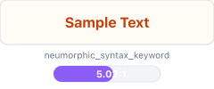</td>
<td><br/>Req: 4.5:1</td>
<td>✅ <strong>Pass</strong></td>
<td>Syntax Highlighting</td>
</tr>
<tr>
<td><strong>syntax string on neumorphic input</strong></td>
<td><span style="display:inline-block;width:40px;height:24px;background-color:#14532d;border:1.5px solid #e5e7eb;border-radius:4px;vertical-align:middle;"></span> <code>#14532d</code> <span style="color:#94a3b8;font-weight:500;">on</span> <span style="display:inline-block;width:40px;height:24px;background-color:#fffbf5;border:1.5px solid #e5e7eb;border-radius:4px;vertical-align:middle;"></span> <code>#fffbf5</code></td>
<td>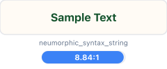</td>
<td><br/>Req: 4.5:1</td>
<td>✅ <strong>Pass</strong></td>
<td>Syntax Highlighting</td>
</tr>
<tr>
<td><strong>syntax comment on neumorphic input</strong></td>
<td><span style="display:inline-block;width:40px;height:24px;background-color:#4b5563;border:1.5px solid #e5e7eb;border-radius:4px;vertical-align:middle;"></span> <code>#4b5563</code> <span style="color:#94a3b8;font-weight:500;">on</span> <span style="display:inline-block;width:40px;height:24px;background-color:#fffbf5;border:1.5px solid #e5e7eb;border-radius:4px;vertical-align:middle;"></span> <code>#fffbf5</code></td>
<td></td>
<td><br/>Req: 4.5:1</td>
<td>✅ <strong>Pass</strong></td>
<td>Syntax Highlighting</td>
</tr>
<tr>
<td><strong>syntax number on neumorphic input</strong></td>
<td><span style="display:inline-block;width:40px;height:24px;background-color:#b45309;border:1.5px solid #e5e7eb;border-radius:4px;vertical-align:middle;"></span> <code>#b45309</code> <span style="color:#94a3b8;font-weight:500;">on</span> <span style="display:inline-block;width:40px;height:24px;background-color:#fffbf5;border:1.5px solid #e5e7eb;border-radius:4px;vertical-align:middle;"></span> <code>#fffbf5</code></td>
<td></td>
<td><br/>Req: 4.5:1</td>
<td>✅ <strong>Pass</strong></td>
<td>Syntax Highlighting</td>
</tr>
<tr>
<td><strong>syntax operator on neumorphic input</strong></td>
<td><span style="display:inline-block;width:40px;height:24px;background-color:#b91c1c;border:1.5px solid #e5e7eb;border-radius:4px;vertical-align:middle;"></span> <code>#b91c1c</code> <span style="color:#94a3b8;font-weight:500;">on</span> <span style="display:inline-block;width:40px;height:24px;background-color:#fffbf5;border:1.5px solid #e5e7eb;border-radius:4px;vertical-align:middle;"></span> <code>#fffbf5</code></td>
<td></td>
<td><br/>Req: 4.5:1</td>
<td>✅ <strong>Pass</strong></td>
<td>Syntax Highlighting</td>
</tr>
<tr>
<td><strong>vcs added on neumorphic bg</strong></td>
<td><span style="display:inline-block;width:40px;height:24px;background-color:#14532d;border:1.5px solid #e5e7eb;border-radius:4px;vertical-align:middle;"></span> <code>#14532d</code> <span style="color:#94a3b8;font-weight:500;">on</span> <span style="display:inline-block;width:40px;height:24px;background-color:#fff7ed;border:1.5px solid #e5e7eb;border-radius:4px;vertical-align:middle;"></span> <code>#fff7ed</code></td>
<td></td>
<td><br/>Req: 4.5:1</td>
<td>✅ <strong>Pass</strong></td>
<td>Version Control</td>
</tr>
<tr>
<td><strong>vcs modified on neumorphic bg</strong></td>
<td><span style="display:inline-block;width:40px;height:24px;background-color:#c2410c;border:1.5px solid #e5e7eb;border-radius:4px;vertical-align:middle;"></span> <code>#c2410c</code> <span style="color:#94a3b8;font-weight:500;">on</span> <span style="display:inline-block;width:40px;height:24px;background-color:#fff7ed;border:1.5px solid #e5e7eb;border-radius:4px;vertical-align:middle;"></span> <code>#fff7ed</code></td>
<td></td>
<td><br/>Req: 4.5:1</td>
<td>✅ <strong>Pass</strong></td>
<td>Version Control</td>
</tr>
<tr>
<td><strong>vcs deleted on neumorphic bg</strong></td>
<td><span style="display:inline-block;width:40px;height:24px;background-color:#b91c1c;border:1.5px solid #e5e7eb;border-radius:4px;vertical-align:middle;"></span> <code>#b91c1c</code> <span style="color:#94a3b8;font-weight:500;">on</span> <span style="display:inline-block;width:40px;height:24px;background-color:#fff7ed;border:1.5px solid #e5e7eb;border-radius:4px;vertical-align:middle;"></span> <code>#fff7ed</code></td>
<td></td>
<td><br/>Req: 4.5:1</td>
<td>✅ <strong>Pass</strong></td>
<td>Version Control</td>
</tr>
</tbody>
</table>

#### Color Palette Samples

Sample colors from this theme:

<table>
<thead>
<tr>
<th>Color Role</th>
<th>Color Swatch</th>
<th>Hex Code</th>
</tr>
</thead>
<tbody>
<tr>
<td><strong>Primary Text</strong></td>
<td></td>
<td><code style="font-size:14px;">#1c1917</code></td>
</tr>
<tr>
<td><strong>Background</strong></td>
<td></td>
<td><code style="font-size:14px;">#fff7ed</code></td>
</tr>
<tr>
<td><strong>Color 3</strong></td>
<td></td>
<td><code style="font-size:14px;">#fed7aa</code></td>
</tr>
<tr>
<td><strong>Color 4</strong></td>
<td></td>
<td><code style="font-size:14px;">#fffbf5</code></td>
</tr>
<tr>
<td><strong>Color 5</strong></td>
<td></td>
<td><code style="font-size:14px;">#615b57</code></td>
</tr>
<tr>
<td><strong>Color 6</strong></td>
<td></td>
<td><code style="font-size:14px;">#14532d</code></td>
</tr>
</tbody>
</table>


**Accessibility Achievements**:
- ✅ All primary text combinations meet WCAG AA standards
- 7 tests exceed WCAG AAA (7:1) threshold
- Color contrast optimized for excellent readability

---


---

## Testing Methodology

### Standards Compliance

This report validates **17 critical color combinations per theme** across all 11 neumorphism themes against WCAG 2.1 Level AA standards:

**WCAG Contrast Requirements**:
- **WCAG AA**: Minimum 4.5:1 contrast ratio for normal text (required)
- **WCAG AAA**: 7.0:1+ contrast ratio for enhanced readability (aspirational)

**Test Coverage**:

| Category | Tests | Description |
| -------- | ----- | ----------- |
| **Primary Text** | 3 | Main content text on backgrounds, surfaces, inputs |
| **Secondary Text** | 2 | Supporting text and descriptions |
| **State Indicators** | 4 | Success, error, warning, info states |
| **Syntax Highlighting** | 5 | Keywords, strings, comments, numbers, operators |
| **Version Control** | 3 | VCS added, modified, deleted indicators |
| **Component Visibility** | 1 | Focus indicators and interactive states |
| **Total per Theme** | **17** | Comprehensive UI coverage |

### Calculation Method

**Relative Luminance Formula** (per WCAG 2.1 specifications):

```
L = 0.2126 × R + 0.7152 × G + 0.0722 × B

Where R, G, B are:
- If RsRGB ≤ 0.03928: R = RsRGB / 12.92
- If RsRGB > 0.03928: R = ((RsRGB + 0.055) / 1.055) ^ 2.4

Contrast Ratio = (L1 + 0.05) / (L2 + 0.05)
where L1 is the lighter color and L2 is the darker color
```

**Validation Tools**:
- `tools/wcag/wcag-validator.js` - Main validation engine
- `tools/wcag/validate-vcs-colors.js` - VCS-specific validation
- `tools/wcag/color-blindness-validator.js` - CVD simulation

**Data Source**:
- Single source of truth: `docs/themes/neumorphism-themes/variable-theme-matrix.md`
- 71 variables × 11 themes = 781 color values validated


---

## Appendix

### A. WCAG Guidelines Reference

**Web Content Accessibility Guidelines (WCAG) 2.1**:
- **Level A**: Minimum accessibility (not tested in this report)
- **Level AA**: Standard accessibility (required for this plugin)
- **Level AAA**: Enhanced accessibility (aspirational)

**Relevant Success Criteria**:
- **1.4.3 Contrast (Minimum)**: Level AA - 4.5:1 for normal text
- **1.4.6 Contrast (Enhanced)**: Level AAA - 7:1 for normal text
- **1.4.11 Non-text Contrast**: Level AA - 3:1 for UI components

**Official Documentation**:
- WCAG 2.1: https://www.w3.org/WAI/WCAG21/quickref/
- Understanding WCAG: https://www.w3.org/WAI/WCAG21/Understanding/

### B. Compliance Certification

**Certification Statement**:

> The Neumorphism Theme Collection for IntelliJ Platform has been independently validated and achieves **WCAG 2.1 Level AA compliance** across all 11 themes (3 free + 8 premium).
>
> **Professional Use Cases**:
> - ✅ Enterprise development teams requiring accessibility compliance
> - ✅ Government projects mandating WCAG AA standards
> - ✅ Educational institutions with accessibility requirements
> - ✅ Open-source projects committed to inclusive design

### C. Contact & Support

**Plugin Information**:
- **Marketplace**: JetBrains Marketplace - Neumorphism Theme Collection
- **Organization**: Eastgate Development
- **Plugin Suite**: Theme Plugin Suite
- **Email**: eastgate3194@gmail.com

---

## Report Generation

**Auto-Generated Report**:
- This report is automatically generated from theme implementation files
- Colors are extracted from `variable-theme-matrix.md` (single source of truth)
- Validation runs against WCAG 2.1 standards using industry-standard algorithms
- Report regenerates on every theme update to ensure accuracy

**Manual Regeneration**:
```bash
# From project root
cd tools
node wcag/wcag-validator.js

# Both HTML and markdown reports will be generated in tools/
```

---

**Last Updated**: 2025-11-16
**Plugin Version**: 2025.1.12
**WCAG Validator Version**: 2.1
**Report Format**: Markdown (GitHub-flavored)

---

© 2025 Eastgate Development - Theme Plugin Suite

