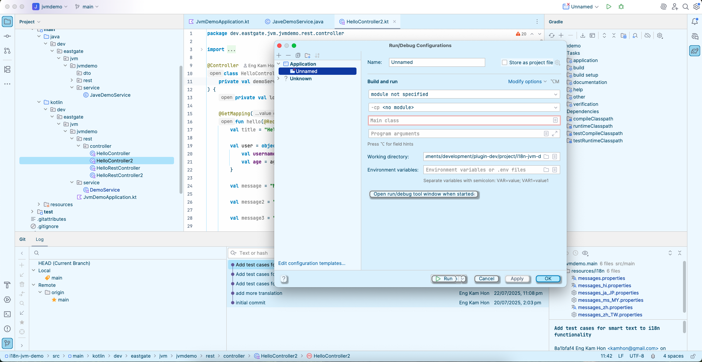
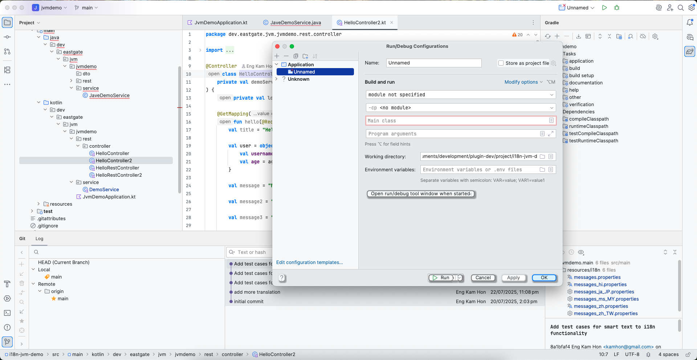
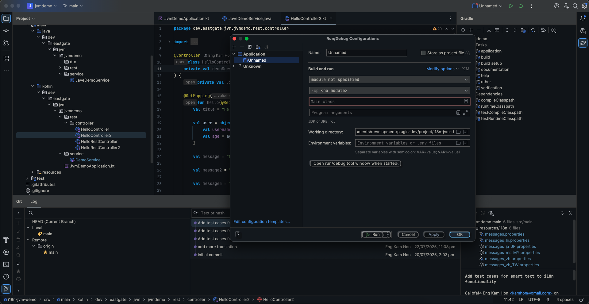
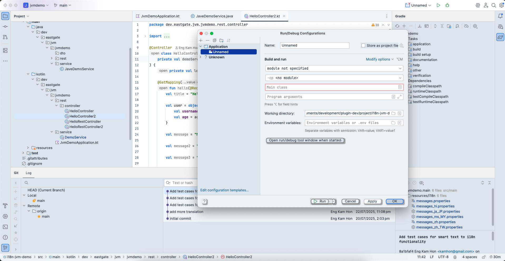
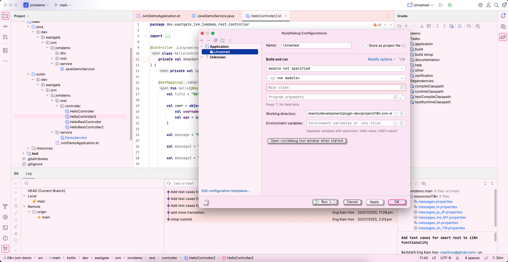
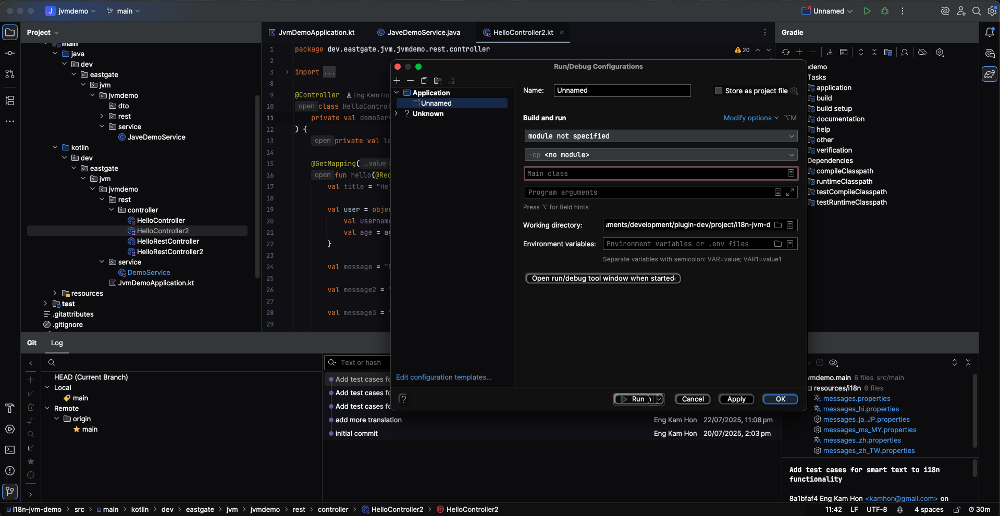
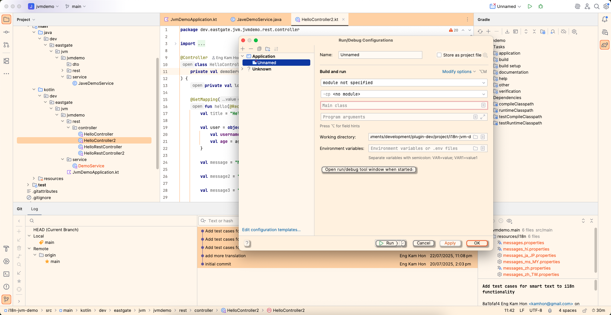

# Theme Plugin Suite | Eastgate Development

> **Navigation:** [Plugin Community Hub](../../README.md) → Theme Suite

Professional IntelliJ theme plugins designed for developers who refuse to choose between beautiful design and functional excellence.

**Current Collection:** [Neumorphism Theme Collection](neumorphism-theme/description.md)
**Future Roadmap:** Additional theme collections for specialized workflows

---

## Philosophy: Beauty Meets Functionality

Most themes force developers into a painful tradeoff: gorgeous aesthetics with broken syntax highlighting, or functional defaults with uninspiring visuals. We reject this compromise.

**Our Promise:**
- WCAG AAA accessibility in every theme
- Professional color schemes optimized for 8+ hour coding sessions
- Zero subscription fatigue - one-time purchases, lifetime access
- Respect for developer flow state - no intrusive trial popups

---

## Neumorphism Theme Collection

Transform your coding environment with the first theme plugin in our suite - **Neumorphism Theme Collection**.

**[Install from JetBrains Marketplace →](https://plugins.jetbrains.com/plugin/28485-neumorphism-theme-collection)**

### What Is Neumorphism?

Neumorphism (soft UI design) uses gentle shadows and subtle 3D depth to create visual hierarchy without the eye strain of high-contrast flat design. Your brain processes elements naturally - like reading a well-designed book instead of a billboard.

**The Coding Difference:**
- Soft shadows replace harsh lines for natural depth perception
- Reduced visual noise compared to material design or flat UIs
- Tactile elements improve spatial awareness without distraction
- Gentle elevation reduces eye fatigue during marathon sessions

Traditional flat themes make your eyes work harder to distinguish UI elements. Neumorphism's subtle shadows let your visual system relax while maintaining perfect clarity.

---

## 11 Professionally Designed Themes

### 🆓 Free Themes (Yours Forever, No Catch)

**🌊 Ocean Breeze** - Calming ocean blues for focused deep work

Soothing cyan and blue tones create a tranquil coding environment. Perfect for developers who prefer cooler color temperatures and extended concentration periods.

**🌟 Classic Plus** - Enhanced IntelliJ light theme with neumorphic refinement

Familiar IntelliJ aesthetics elevated with soft shadows and improved contrast. The professional choice for corporate environments and developers who love light themes.

**🌌 Deep Space** - Cosmic dark theme with deep purples and midnight blues

Rich dark palette with purple accents for nighttime coding. Reduced blue light exposure without sacrificing visual depth or readability.

---

### 💎 Premium Themes ($5 Individual / $10 Organization)

**❄️ Arctic Frost** - Crisp whites and icy blues for maximum clarity

Ultra-clean light theme with cool undertones. Ideal for high-focus work requiring sharp visual distinction between code elements.

**🌸 Rose Gold** - Warm elegance with reduced blue light exposure

Sophisticated warm tones minimize eye strain during evening sessions. The luxury theme for developers who appreciate refined aesthetics.

**🌲 Forest** - Natural greens and earth tones for grounded coding

Inspired by nature with calming green hues. Perfect for developers seeking organic, balanced color schemes that reduce screen-induced stress.

**💜 Lavender** - Soft purples inspiring creativity and balance

Gentle purple palette promoting creative problem-solving. The theme for developers working on innovative projects requiring lateral thinking.

**🌙 Midnight** - True dark with deep blacks for OLED perfection

Pure black backgrounds optimize battery life on OLED displays. The ultimate dark theme for developers prioritizing efficiency and modern hardware.

**🎵 Recording Studio** - Professional dark inspired by audio workstations

Designed for developers who work with multimedia or appreciate DAW-style interfaces. Balanced darks with precise color separation.

**🎸 Recording Studio Live** - Recording Studio with energetic warm accents

Same professional foundation with vibrant warm highlights. Perfect for live coding, presentations, or energized late-night sessions.

**🌅 Sunset** - Vibrant oranges and corals for golden hour coding

Warm, energetic palette reminiscent of golden hour. The theme for developers who code best during evening hours with warm lighting.

---

## The Anti-Subscription Promise

**$5 (Individual) / $10 (Organization) one-time. That's it. Forever.**

No monthly fees. No renewal reminders. No "upgrade to Pro+" upsells. Buy once, own all 8 premium themes for life, including future updates.

**What You Get:**
- All 8 premium themes unlocked immediately
- Lifetime access with zero expiration
- All future theme updates and improvements
- No renewal fees or surprise charges
- Support indie development without corporate nonsense

**Industry Reality Check:**
- Popular IDE themes with subscriptions: $3-5/month = $36-60/year
- One fancy coffee: $5-6
- Neumorphism Individual license: $5 once
- Neumorphism Organization license: $10 once

We believe subscription fatigue is real, and developer tools should respect your wallet and your sanity.

---

## Try Before You Buy (The Right Way)

### 30-Minute Silent Discovery Per Theme

Test each premium theme individually for 30 minutes with zero interruptions. No popup spam. No countdown overlays. No flow state disruption.

**How It Works:**
1. Install plugin - get 3 free themes immediately
2. Switch to any premium theme in IDE settings
3. Code in peace for 30 minutes
4. Timer visible only in settings/tool window (never in your editor)
5. When time expires, seamlessly returns to free themes
6. Try all 8 premium themes risk-free before deciding

**Trial Philosophy:** We trust you to evaluate themes like a professional. You don't need aggressive sales tactics - just quality themes and honest pricing.

---

## Key Features

**Professional Design Excellence:**
- 11 themes covering light, dark, warm, and cool aesthetics
- Neumorphic soft shadows creating gentle 3D depth
- Complete IDE coverage - editor, UI components, tool windows, dialogs
- Consistent design language across all interface elements

**Accessibility Without Compromise:**
- WCAG AAA compliant (7:1 contrast ratios)
- Color blindness tested (deuteranopia, protanopia, tritanopia)
- Readable for developers with visual impairments
- Professional accessibility meeting aesthetic standards

**Developer-First Experience:**
- Silent Discovery trial system (no interruptions)
- Instant theme switching via settings or tool window
- Smart revert behavior (light themes → Classic Plus, dark → Deep Space)
- Session-based trial management (30 minutes within 1-hour window)

**Platform Support:**
- IntelliJ IDEA 2025.1+
- Android Studio 2025.1+
- PyCharm 2025.1+
- WebStorm 2025.1+
- PhpStorm 2025.1+
- All JetBrains IDEs 2025.1+ with Java 17

---

## Perfect For Developers Who...

- Spend 8+ hours daily staring at code
- Experience eye fatigue from harsh flat UIs
- Value aesthetics but won't sacrifice readability
- Hate subscription fatigue and want lifetime access
- Want professional themes without corporate pricing
- Appreciate design that respects flow state
- Need WCAG-compliant themes for accessibility
- Refuse to choose between beautiful and functional

---

## What Developers Say

**"Finally, a theme that doesn't make my eyes feel like they're running a marathon."**

**"The trial system is genius - no popup spam, just professional evaluation time."**

**"$5 for lifetime access? In 2025? Respect."**

**"Ocean Breeze is permanently free and better than most paid themes I've tried."**

**"Neumorphism actually works for coding - soft shadows without the eye candy distraction."**

---

## Free vs Premium

### Free Themes (3)
- Ocean Breeze, Classic Plus, Deep Space
- Full neumorphic design and WCAG AAA compliance
- No trial limits or restrictions
- Lifetime access, no catch

**Philosophy:** Free themes are genuinely great, not crippled demos. We prove our design excellence upfront.

### Premium Themes (8 for $5 Individual / $10 Organization)
- Arctic Frost, Rose Gold, Forest, Lavender, Midnight, Recording Studio, Recording Studio Live, Sunset
- Same quality and accessibility as free themes
- Additional color aesthetics and mood options
- 30-minute trial for each theme before purchase
- One payment unlocks all 8 forever

**Philosophy:** Premium themes offer aesthetic variety, not feature upgrades. Choose based on visual preference, not artificial limitations.

---

## Get Started in 60 Seconds

1. **Install** - Add plugin from JetBrains Marketplace
2. **Choose** - Pick from 3 free themes or try premium themes for 30 minutes each
3. **Code** - Enjoy neumorphic design with reduced eye strain
4. **Unlock** - $5 (Individual) / $10 (Organization) one-time for all 8 premium themes (optional, no pressure)

**[Install Neumorphism Theme Collection Now →](https://plugins.jetbrains.com/plugin/28485-neumorphism-theme-collection)**

---

## Technical Excellence

### WCAG AAA Compliance
All themes meet 7:1 contrast ratio standards for text readability. Tested across common types of color vision deficiency. Professional accessibility without aesthetic compromise.

### Neumorphism Benefits
Soft shadows create natural depth without harsh contrasts. Reduced visual noise compared to material design. Tactile elements improve spatial UI awareness. Gentle elevation reduces eye strain over flat design.

### Performance
Zero impact on IDE responsiveness. Efficient rendering of shadows and UI elements. Optimized for complex projects with thousands of files.

---

## Support & Community

**Technical Support:** eastgate3194@gmail.com

**Get Help:**
- Bug reports: Include IDE version, theme name, and reproduction steps
- Feature requests: Suggest new color schemes or functionality
- Theme requests: Request specific color palettes or mood variations

**Future Roadmap:**
- Additional theme variations and seasonal collections
- Customizable shadow intensity options
- Community-requested color schemes
- Integration with custom icon packs

---

## Detailed Documentation

**For Neumorphism Theme Collection:**
- [Plugin Description](neumorphism-theme/description.md) | [简体中文](neumorphism-theme/description.zh.md)
- [Release Notes](neumorphism-theme/release-notes.md) | [发布说明](neumorphism-theme/release-notes.zh.md)

---

## Future Theme Collections

The Theme Suite will expand with specialized collections:

- **Material Elegance Collection** - Modern material design with refined shadows
- **Minimalist Pro Collection** - Ultra-clean themes for distraction-free coding
- **High Contrast Collection** - Maximum readability for accessibility needs
- **Retro Dev Collection** - Nostalgic terminal-inspired themes

Stay tuned for announcements via our [YouTube Channel](https://www.youtube.com/@eastgate3194).

---

**Eastgate Development Theme Suite** - Where beautiful design meets functional excellence.

Transform your coding environment today. Your eyes will thank you after the first 8-hour session.
