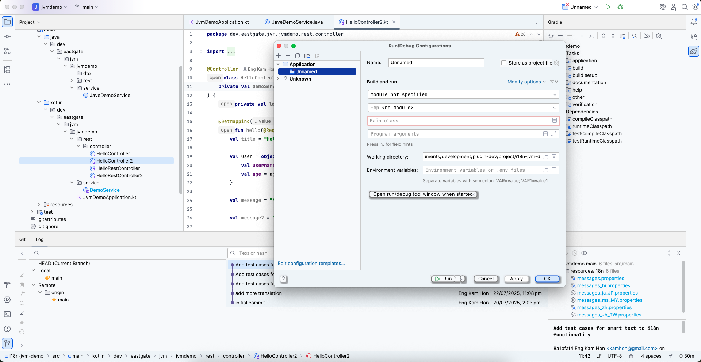

# Theme Plugin Suite | Eastgate Development

> **导航:** [Plugin Community Hub](../../README.md) → Theme Suite

为拒绝在美观设计和功能卓越之间做出选择的开发者设计的专业 IntelliJ 主题插件。

**当前系列:** [Neumorphism Theme Collection](neumorphism-theme/description.zh.md)
**未来路线图:** 面向专业工作流的其他主题系列

---

## 理念:美学与功能并存

大多数主题迫使开发者做出痛苦的权衡:华丽的美学但语法高亮损坏,或功能正常的默认主题但视觉平淡。我们拒绝这种妥协。

**我们的承诺:**
- 每款主题均符合 WCAG AAA 无障碍标准
- 针对 8 小时以上编码时长优化的专业配色方案
- 零订阅疲劳 - 一次性购买,终身访问
- 尊重开发者的心流状态 - 无侵入式试用弹窗

---

## Neumorphism Theme Collection

使用我们套件中的首款主题插件 - **Neumorphism Theme Collection** 来改造您的编码环境。

**[从 JetBrains Marketplace 安装 →](https://plugins.jetbrains.com/plugin/28485-neumorphism-theme-collection)**

### 什么是 Neumorphism?

Neumorphism(柔和 UI 设计)使用柔和的阴影和微妙的 3D 深度来创建视觉层次,而不会产生高对比度扁平设计的眼部疲劳。您的大脑可以自然地处理元素 - 就像阅读一本设计精美的书而不是广告牌。

**编码中的区别:**
- 柔和的阴影取代刺眼的线条,提供自然的深度感知
- 与 material design 或扁平 UI 相比,减少视觉噪音
- 触觉元素改善空间感知而不分散注意力
- 柔和的立体感在马拉松式编码期间减少眼部疲劳

传统的扁平主题使您的眼睛更费力地区分 UI 元素。Neumorphism 的微妙阴影让您的视觉系统放松,同时保持完美的清晰度。

---

## 11 款专业设计的主题

### 🆓 免费主题(永久免费,无套路)

**🌊 Ocean Breeze** - 平静的海洋蓝色,适合专注的深度工作

舒缓的青色和蓝色调创造宁静的编码环境。非常适合喜欢较冷色温和长时间集中注意力的开发者。

**🌟 Classic Plus** - 增强的 IntelliJ light 主题,带有 neumorphic 改进

熟悉的 IntelliJ 美学,通过柔和的阴影和改进的对比度得到提升。企业环境和热爱浅色主题的开发者的专业选择。

**🌌 Deep Space** - 深紫色和午夜蓝的宇宙暗色主题

丰富的暗色调色板,带有紫色点缀,适合夜间编码。减少蓝光暴露,同时不牺牲视觉深度或可读性。

---

### 💎 高级主题($5 个人版 / $10 组织版)

**❄️ Arctic Frost** - 清爽的白色和冰蓝色,实现最大清晰度

超干净的浅色主题,带有冷色调。适合需要代码元素之间清晰视觉区分的高专注度工作。

**🌸 Rose Gold** - 优雅的暖色调,减少蓝光暴露

精致的暖色调,在晚间编码时最大程度减少眼部疲劳。欣赏精致美学的开发者的奢华主题。

**🌲 Forest** - 自然的绿色和大地色调,适合踏实编码

受自然启发,带有平静的绿色色调。非常适合寻求有机、平衡配色方案以减少屏幕压力的开发者。

**💜 Lavender** - 柔和的紫色,激发创造力和平衡

温和的紫色调色板,促进创造性问题解决。适合从事创新项目、需要横向思维的开发者的主题。

**🌙 Midnight** - 真正的暗色,深黑色,OLED 完美

纯黑色背景优化 OLED 显示屏的电池寿命。注重效率和现代硬件的开发者的终极暗色主题。

**🎵 Recording Studio** - 受音频工作站启发的专业暗色主题

为从事多媒体工作或欣赏 DAW 风格界面的开发者设计。平衡的暗色调,精确的颜色分离。

**🎸 Recording Studio Live** - Recording Studio 带有充满活力的暖色点缀

相同的专业基础,带有鲜艳的暖色高光。非常适合现场编码、演示或充满活力的深夜编码。

**🌅 Sunset** - 充满活力的橙色和珊瑚色,适合黄金时段编码

温暖、充满活力的调色板,让人联想到黄金时段。在温暖的灯光下,晚上编码效果最佳的开发者的主题。

---

## 无订阅承诺

**$5(个人版)/ $10(组织版)一次性购买。就这样。永久。**

无月费。无续订提醒。无"升级到 Pro+"的推销。一次购买,终身拥有全部 8 款高级主题,包括未来更新。

**您将获得:**
- 立即解锁全部 8 款高级主题
- 终身访问,零过期时间
- 所有未来主题更新和改进
- 无续订费用或意外收费
- 支持独立开发,无企业套路

**行业现实对比:**
- 订阅制热门 IDE 主题:$3-5/月 = $36-60/年
- 一杯高档咖啡:$5-6
- Neumorphism 个人许可证:$5 一次性
- Neumorphism 组织许可证:$10 一次性

我们认为订阅疲劳是真实存在的,开发者工具应该尊重您的钱包和理智。

---

## 正确的试用方式

### 每款主题 30 分钟静默体验

以零打扰方式单独测试每款高级主题 30 分钟。无弹窗垃圾信息。无倒计时覆盖层。无心流状态中断。

**工作原理:**
1. 安装插件 - 立即获得 3 款免费主题
2. 在 IDE 设置中切换到任何高级主题
3. 安静编码 30 分钟
4. 计时器仅在设置/工具窗口中可见(编辑器中从不显示)
5. 时间到期时,无缝返回免费主题
6. 在决定购买前,零风险试用全部 8 款高级主题

**试用理念:** 我们信任您像专业人士一样评估主题。您不需要激进的销售策略 - 只需高质量主题和诚实定价。

---

## 核心功能

**专业设计卓越性:**
- 11 款主题,涵盖浅色、暗色、暖色和冷色美学
- Neumorphic 柔和阴影创造温和的 3D 深度
- 完整的 IDE 覆盖 - 编辑器、UI 组件、工具窗口、对话框
- 所有界面元素的一致设计语言

**无障碍性,无妥协:**
- 符合 WCAG AAA 标准(7:1 对比度)
- 色盲测试(红绿色盲、红色盲、蓝黄色盲)
- 为有视觉障碍的开发者提供可读性
- 符合美学标准的专业无障碍性

**开发者优先体验:**
- 静默体验试用系统(无中断)
- 通过设置或工具窗口即时切换主题
- 智能回退行为(浅色主题 → Classic Plus,暗色 → Deep Space)
- 基于会话的试用管理(1 小时窗口内 30 分钟)

**平台支持:**
- IntelliJ IDEA 2025.1+
- Android Studio 2025.1+
- PyCharm 2025.1+
- WebStorm 2025.1+
- PhpStorm 2025.1+
- 所有 JetBrains IDE 2025.1+ 支持 Java 17

---

## 非常适合这些开发者...

- 每天盯着代码 8 小时以上
- 因刺眼的扁平 UI 而出现眼部疲劳
- 重视美学但不会牺牲可读性
- 讨厌订阅疲劳,想要终身访问
- 想要专业主题但不想支付企业定价
- 欣赏尊重心流状态的设计
- 需要符合 WCAG 标准的无障碍主题
- 拒绝在美观和功能之间做选择

---

## 开发者评价

**"终于有一款主题不会让我的眼睛感觉像在跑马拉松。"**

**"试用系统太棒了 - 没有弹窗垃圾信息,只有专业的评估时间。"**

**"$5 终身访问?在 2025 年?敬佩。"**

**"Ocean Breeze 是永久免费的,比我试过的大多数付费主题都好。"**

**"Neumorphism 真的适合编码 - 柔和的阴影,没有华而不实的干扰。"**

---

## 免费 vs 高级

### 免费主题(3 款)
- Ocean Breeze、Classic Plus、Deep Space
- 完整的 neumorphic 设计和 WCAG AAA 合规性
- 无试用限制或约束
- 终身访问,无套路

**理念:** 免费主题是真正优秀的,而不是残缺的演示版。我们预先证明我们的设计卓越性。

### 高级主题(8 款,$5 个人版 / $10 组织版)
- Arctic Frost、Rose Gold、Forest、Lavender、Midnight、Recording Studio、Recording Studio Live、Sunset
- 与免费主题相同的质量和无障碍性
- 额外的色彩美学和氛围选项
- 购买前每款主题 30 分钟试用
- 一次付款即可永久解锁全部 8 款

**理念:** 高级主题提供美学多样性,而不是功能升级。根据视觉偏好选择,而不是人为限制。

---

## 60 秒开始使用

1. **安装** - 从 JetBrains Marketplace 添加插件
2. **选择** - 从 3 款免费主题中挑选,或每款高级主题试用 30 分钟
3. **编码** - 享受 neumorphic 设计,减少眼部疲劳
4. **解锁** - $5(个人版)/ $10(组织版)一次性购买全部 8 款高级主题(可选,无压力)

**[立即安装 Neumorphism Theme Collection →](https://plugins.jetbrains.com/plugin/28485-neumorphism-theme-collection)**

---

## 技术卓越性

### WCAG AAA 合规性
所有主题均符合文本可读性的 7:1 对比度标准。针对常见的色觉缺陷类型进行测试。专业无障碍性,无美学妥协。

### Neumorphism 优势
柔和的阴影创造自然深度,无刺眼对比。与 material design 相比,减少视觉噪音。触觉元素改善空间 UI 感知。与扁平设计相比,柔和的立体感减少眼部疲劳。

### 性能
对 IDE 响应速度零影响。高效渲染阴影和 UI 元素。针对数千个文件的复杂项目进行优化。

---

## 支持与社区

**技术支持:** eastgate3194@gmail.com

**获取帮助:**
- Bug 报告:包括 IDE 版本、主题名称和复现步骤
- 功能请求:建议新的配色方案或功能
- 主题请求:请求特定的调色板或氛围变化

**未来路线图:**
- 其他主题变化和季节性系列
- 可自定义阴影强度选项
- 社区请求的配色方案
- 与自定义图标包集成

---

## 详细文档

**Neumorphism Theme Collection:**
- [Plugin Description](neumorphism-theme/description.md) | [简体中文](neumorphism-theme/description.zh.md)
- [Release Notes](neumorphism-theme/release-notes.md) | [发布说明](neumorphism-theme/release-notes.zh.md)

---

## 未来主题系列

Theme Suite 将通过专业系列扩展:

- **Material Elegance Collection** - 带有精致阴影的现代 material design
- **Minimalist Pro Collection** - 用于无干扰编码的超干净主题
- **High Contrast Collection** - 无障碍需求的最大可读性
- **Retro Dev Collection** - 怀旧的终端风格主题

通过我们的 [YouTube 频道](https://www.youtube.com/@eastgate3194) 关注公告。

---

**Eastgate Development Theme Suite** - 美观设计与功能卓越的结合之地。

立即改造您的编码环境。您的眼睛会在第一个 8 小时编码后感谢您。
