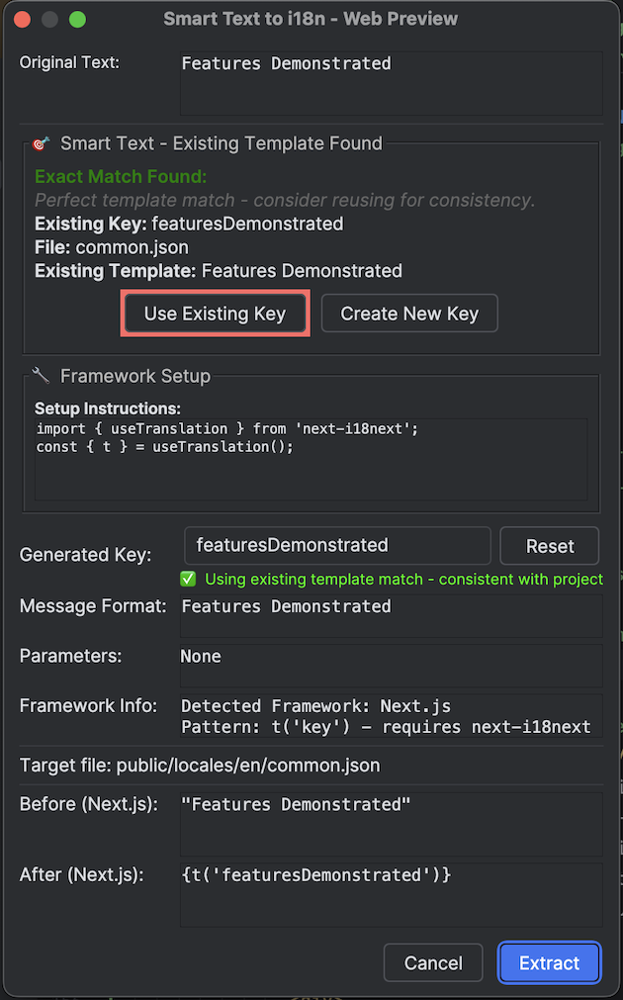

# 智能文本转 i18n 魔法教程 - 永远改变您的前端 i18n 工作流程

> 🌐 **Language / 语言**: [🇺🇸 English](smart-text-to-i18n-tutorial.md) | [🇨🇳 简体中文](smart-text-to-i18n-tutorial.zh.md)

## 😫 每个前端开发者的 i18n 噩梦

想象一下这个熟悉的场景...

您正在开发一个现代的 React/Vue/Angular 应用程序，您的产品经理说：*"我们需要在下周全球发布之前对这个组件进行国际化。"*

您查看您优美的 TypeScript 代码，发现几十个硬编码字符串：

```tsx
// 带有硬编码噩梦的 React 组件
export function FeatureSection() {
    const [itemCount, setItemCount] = useState(0);
    
    return (
        <div className="bg-white rounded-lg p-6">
            <h2 className="text-2xl font-semibold mb-4">
                🔢 Pluralization Demo               {/* 😱 硬编码！ */}
            </h2>
            <p className="text-lg mb-2">
                Features Demonstrated:             {/* 😱 又一个！ */}
            </p>
            <button className="px-3 py-1 bg-green-500 text-white rounded">
                Add Item                           {/* 😱 还有一个！ */}
            </button>
        </div>
    );
}
```

> 📝 **注意**: 此插件支持 **React**、**Vue**、**Angular** 和 **Next.js**，具有智能框架检测和适当的导入处理。

**传统的手动过程：**
1. 📝 找到硬编码字符串
2. 🤔 想一个好的 i18n 键名
3. 📂 导航到您的 JSON 翻译文件
4. ✍️ 手动添加键值对
5. 🔄 返回到您的组件代码
6. 📦 导入 useTranslation/i18n 钩子
7. ➕ 向组件添加翻译钩子
8. 🔄 用 t() 调用替换字符串
9. 🧪 测试一切仍然有效
10. 🔄 更新所有嵌套的 JSON 结构
11. 😵 **对每个字符串重复此过程**

**结果**: 本应 30 分钟的任务变成了 3 小时的复制-粘贴-导航-导入-测试噩梦。

---

## ✨ 改变一切的魔法时刻

如果我告诉您有一个**单一键盘快捷键**可以自动完成所有这些，您会怎么想？

**遇见智能文本转 i18n - 每个前端开发者都在等待的功能。**

*完美适用于现代 React、Vue、Angular 和 Next.js 开发，具有智能框架检测。*

---

## 🎯 观看魔法发生

### 之前：噩梦代码

**React/Next.js 示例：**
```tsx
export function HomePage() {
    const [itemCount, setItemCount] = useState(0);
    
    return (
        <div className="container mx-auto px-4 py-8">
            <h1 className="text-4xl font-bold mb-4">
                Features Demonstrated:
            </h1>
            <div className="bg-blue-50 rounded p-4">
                <p className="text-lg mb-2">
                    🔢 Pluralization Demo
                </p>
                <button className="px-3 py-1 bg-green-500 text-white rounded">
                    Add Item
                </button>
            </div>
        </div>
    );
}
```

### 魔法时刻
1. **将光标放置**在字符串 `"Features Demonstrated:"` 的任何位置
2. **按 Alt+Shift+]**
3. **观看魔法发生...**

### 之后：专业的 i18n 代码（自动生成！）

**React/Next.js 与 useTranslation：**
```tsx
import { useTranslation } from 'next-i18next';

export function HomePage() {
    const { t } = useTranslation('common');
    const [itemCount, setItemCount] = useState(0);
    
    return (
        <div className="container mx-auto px-4 py-8">
            <h1 className="text-4xl font-bold mb-4">
                {t('featuresDemonstrated')}
            </h1>
            <div className="bg-blue-50 rounded p-4">
                <p className="text-lg mb-2">
                    🔢 Pluralization Demo
                </p>
                <button className="px-3 py-1 bg-green-500 text-white rounded">
                    Add Item
                </button>
            </div>
        </div>
    );
}
```

### 您的 JSON 文件（自动更新！）
```json
// public/locales/en/common.json
{
    "featuresDemonstrated": "Features Demonstrated:",
    // ... 其他键
}
```

---

## 🚀 特定框架的魔法示例

### React 与 react-i18next

**之前：**
```tsx
function WelcomeMessage() {
    return (
        <div>
            <h1>Welcome to our platform!</h1>
            <p>Please verify your email address.</p>
        </div>
    );
}
```

**Alt+Shift+] 魔法之后：**
```tsx
import { useTranslation } from 'react-i18next';

function WelcomeMessage() {
    const { t } = useTranslation();
    
    return (
        <div>
            <h1>{t('welcomeToOurPlatform')}</h1>
            <p>{t('pleaseVerifyYourEmailAddress')}</p>
        </div>
    );
}
```

### Vue.js 与 vue-i18n

**之前：**
```vue
<template>
    <div class="greetings">
        <h1>{{ msg }}</h1>
        <h3>
            You've successfully created a project with Vite + Vue 3. What's next?
        </h3>
    </div>
</template>
```

**Alt+Shift+] 魔法之后：**
```vue
<template>
    <div class="greetings">
        <h1>{{ msg }}</h1>
        <h3>
            {{ $t('youveSuccessfullyCreatedAProject') }}
        </h3>
    </div>
</template>
```

**自动生成的 JSON：**
```json
// src/locales/en.json
{
    "youveSuccessfullyCreatedAProject": "You've successfully created a project with Vite + Vue 3. What's next?"
}
```

### Angular 与 Angular i18n

**之前：**
```html
<div class="content">
    <h1>Pluralization Examples:</h1>
    <button (click)="addItem()">Add New Item</button>
</div>
```

**Alt+Shift+] 魔法之后：**
```html
<div class="content">
    <h1>{{ 'pluralizationExamples' | translate }}</h1>
    <button (click)="addItem()">{{ 'addNewItem' | translate }}</button>
</div>
```

**自动生成的 JSON：**
```json
// src/assets/i18n/en.json
{
    "pluralizationExamples": "Pluralization Examples:",
    "addNewItem": "Add New Item"
}
```

### Next.js 与 next-intl

**之前：**
```tsx
export default function IntlDemo() {
    return (
        <div>
            <h2>🔧 Next.js + next-intl Demo</h2>
            <p>Architecture:</p>
        </div>
    );
}
```

**Alt+Shift+] 魔法之后：**
```tsx
import { useTranslations } from 'next-intl';

export default function IntlDemo() {
    const t = useTranslations();
    
    return (
        <div>
            <h2>{t('nextjsNextIntlDemo')}</h2>
            <p>{t('architecture')}</p>
        </div>
    );
}
```

---

## 🎬 逐步魔法详解

### 步骤 1：定位光标
将光标放置在硬编码字符串的**任何位置**：
```tsx
<h1>Features Demonstrated:</h1>
     ^光标在这里（或字符串中的任何位置）
```

### 步骤 2：调用魔法
按 **Alt+Shift+]** 并观看预览对话框立即出现！

### 步骤 3：查看转换
插件会显示：
- ✅ **原始代码**：您当前的硬编码字符串
- ✅ **生成的键**：智能驼峰式键生成
- ✅ **新代码**：特定框架的替换，带有适当的导入
- ✅ **文件更新**：带有新键的 JSON 文件结构


*显示前后转换和所有魔法细节的综合预览对话框*

### 步骤 4：确认魔法
点击 **"应用"** 并见证：
- 🎯 **自动导入注入**：`import { useTranslation } from 'react-i18next'`
- 🎯 **钩子添加**：`const { t } = useTranslation();`
- 🎯 **字符串替换**：`{t('featuresDemonstrated')}`
- 🎯 **JSON 文件更新**：适当的嵌套结构保持

---

## 🧠 魔法背后的智能

### 框架检测
插件自动检测您的项目类型：
- **React**：在 package.json 中检测 `react` 和 `react-i18next` → 使用 `useTranslation` 钩子
- **Next.js**：检测 `next` 和 `next-i18next` → 使用适当的 Next.js 模式
- **Vue**：检测 `vue` 和 `vue-i18n` → 使用 `$t()` 方法
- **Angular**：检测 `@angular/core` → 使用 `translate` 管道
- **Nuxt**：检测 `nuxt` → 使用 Nuxt i18n 组合式函数

### 智能导入处理
- **缺失导入**：自动添加所需的导入语句
- **现有导入**：检测并重用现有的翻译钩子
- **钩子检测**：如果组件中不存在翻译钩子，则添加它

### 智能键生成
```tsx
"Features Demonstrated:" → "featuresDemonstrated"
"You've successfully created" → "youveSuccessfullyCreated"
"🔢 Pluralization Demo" → "pluralizationDemo"
```

### JSON 结构保持
维护您现有的 JSON 结构：
```json
{
    "homepage": {
        "title": "Welcome",
        "features": {
            "fast": "Lightning Fast"
        }
    },
    "newKey": "New Value"  // 添加时不破坏结构
}
```

---

## 🎯 真实世界的生产力影响

### 时间节省分析
- **手动方法**：每个字符串 2-3 分钟 × 50 个字符串 = 2.5 小时
- **智能文本魔法**：每个字符串 5 秒 × 50 个字符串 = 4 分钟
- **节省时间**：每个组件约 2.4 小时（快 95%！）

### 错误减少
- **❌ 手动错误**：键不匹配、导入错误、语法错误
- **✅ 魔法精确**：完美的键生成、自动导入、语法验证

### 一致性保证
- **❌ 手动变化**：团队间不同的键命名风格
- **✅ 魔法标准**：一致的驼峰式、可预测的模式

---

## 🛠️ 特定框架的设置要求

### React/Next.js 项目
**所需依赖：**
```bash
npm install react-i18next i18next
# 或对于 Next.js
npm install next-i18next
```

**文件结构：**
```
src/
  components/
    MyComponent.tsx     ← 您的组件文件
public/
  locales/
    en/
      common.json       ← 翻译文件
    es/
      common.json
```

### Vue.js 项目
**所需依赖：**
```bash
npm install vue-i18n@9
```

**文件结构：**
```
src/
  components/
    HelloWorld.vue      ← 您的组件文件
  locales/
    en.json            ← 翻译文件
    es.json
```

### Angular 项目
**所需依赖：**
```bash
ng add @angular/localize
npm install @ngx-translate/core @ngx-translate/http-loader
```

**文件结构：**
```
src/
  app/
    app.component.html  ← 您的模板文件
  assets/
    i18n/
      en.json          ← 翻译文件
      es.json
```

### 插件配置

**配置智能文本转 i18n 设置：**
```bash
右键点击 JSON 文件 → 项目设置 → 智能文本转 i18n
```


*带有框架特定选项的综合智能文本转 i18n 设置面板*

配置选项如：
- **键生成样式**：驼峰命名法、短横线命名法或下划线命名法
- **框架检测**：覆盖自动检测
- **导入样式**：选择首选的导入模式
- **文件处理**：JSON 结构和格式化首选项

---

## 💡 最大化魔法的专业技巧

### 1. 选择文本以获得精确性
不要只是光标定位，**选择您想要提取的确切文本**：
```tsx
<h1>Select this entire string for conversion</h1>
    ├─────────────────────────────────────┤  ← 选择
```

### 2. 多选择批量魔法
按住 **Ctrl**（Mac 上的 Cmd）并选择多个字符串，然后按一次 **Alt+Shift+]**！

### 3. 智能键命名
插件生成智能键，但您可以在预览对话框中自定义它们：
- **自动**：`youveSuccessfullyCreated`
- **自定义**：`welcome.projectCreated`

### 4. 应用前预览
始终查看预览对话框以确保：
- ✅ 正确的框架检测
- ✅ 适当的导入处理
- ✅ 预期的键生成
- ✅ JSON 文件位置

---

## 🔥 高级魔法场景

### 嵌套组件属性
**之前：**
```tsx
<Button 
    variant="primary"
    onClick={() => alert("Operation completed successfully!")}
>
    Save Changes
</Button>
```

**魔法之后：**
```tsx
<Button 
    variant="primary"
    onClick={() => alert(t('operationCompletedSuccessfully'))}
>
    {t('saveChanges')}
</Button>
```

### JSX 属性
**之前：**
```tsx
<input 
    type="text" 
    placeholder="Enter your email address"
    aria-label="Email input field"
/>
```

**魔法之后：**
```tsx
<input 
    type="text" 
    placeholder={t('enterYourEmailAddress')}
    aria-label={t('emailInputField')}
/>
```

### 模板字面量
**之前：**
```tsx
const message = `Welcome ${userName}, you have ${count} new messages.`;
```

**魔法之后（支持变量）：**
```tsx
const message = t('welcomeUserMessages', { userName, count });
```

**生成的带有 ICU 语法的 JSON：**
```json
{
    "welcomeUserMessages": "Welcome {userName}, you have {count} new messages."
}
```

---

## 🚨 常见场景和解决方案

### ❓ "插件检测不到我的框架"
**解决方案**：确保您的 package.json 包含框架依赖：
```json
{
    "dependencies": {
        "react": "^18.0.0",
        "react-i18next": "^12.0.0"
    }
}
```

### ❓ "导入未被添加"
**解决方案**：检查您的组件是否为函数组件或具有适当语法的类组件。

### ❓ "JSON 文件未更新"
**解决方案**：确保翻译文件存在并具有适当的 JSON 语法。如果缺失，插件会创建它。

### ❓ "键已存在错误"
**解决方案**：插件检测现有键并显示选项：
- 使用现有键
- 创建新的唯一键
- 替换现有值

---

## 🎊 革命性的结果

### 智能文本转 i18n 之前
```tsx
// 😱 硬编码噩梦
export function FeatureDemo() {
    return (
        <div>
            <h1>Features Demonstrated:</h1>
            <p>🔢 Pluralization Demo</p>
            <button>Add Item</button>
            <span>Next.js + next-i18next Demo</span>
        </div>
    );
}
```

### Alt+Shift+] 魔法 30 秒后
```tsx
// ✨ 专业 i18n 完美
import { useTranslation } from 'next-i18next';

export function FeatureDemo() {
    const { t } = useTranslation('common');
    
    return (
        <div>
            <h1>{t('featuresDemonstrated')}</h1>
            <p>{t('pluralizationDemo')}</p>
            <button>{t('addItem')}</button>
            <span>{t('nextjsNextI18nextDemo')}</span>
        </div>
    );
}
```

**加上自动生成的 JSON：**
```json
{
    "featuresDemonstrated": "Features Demonstrated:",
    "pluralizationDemo": "🔢 Pluralization Demo",
    "addItem": "Add Item",
    "nextjsNextI18nextDemo": "Next.js + next-i18next Demo"
}
```

---

## 🏆 今天就掌握魔法

1. **安装** i18n Translate Pro: Web 从 JetBrains 市场
2. **打开** 任何 React/Vue/Angular/Next.js 项目
3. **找到** 硬编码字符串
4. **按** Alt+Shift+]
5. **观看** 魔法转换您的代码
6. **庆祝** 节省了数小时的手动工作！

---

## 🎯 准备好转换您的 i18n 工作流程了吗？

**停止** 复制-粘贴-导航噩梦。
**开始** Alt+Shift+] 革命。

*您未来的自己（和您的截止日期）会感谢您的。*

---

> 💡 **下一步是什么？** 一旦您体验了智能文本转 i18n 魔法，您再也不会想要手动提取字符串了。查看我们的[翻译指南](user-guide.zh.md)，了解如何使用 AI 驱动的精确度将您提取的键翻译成 200+ 种语言！

> 🤝 **需要帮助？** 加入我们的社区讨论或查看我们的[常见问题](description.zh.md)了解常见问题和高级使用模式。